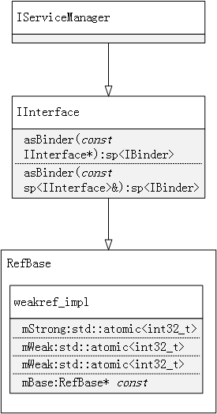
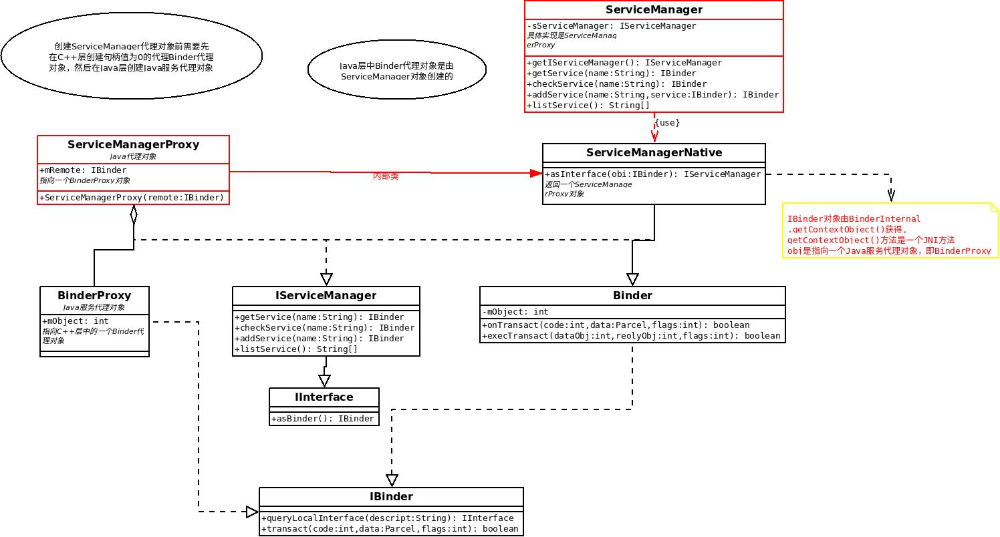

`BINDER_LOOPER_STATE_ENTERED` 和 `BC_REGISTER_LOOPER` 的区别：

```c++
case BC_REGISTER_LOOPER:
			binder_debug(BINDER_DEBUG_THREADS,
				     "%d:%d BC_REGISTER_LOOPER\n",
				     proc->pid, thread->pid);
			binder_inner_proc_lock(proc);
			if (thread->looper & BINDER_LOOPER_STATE_ENTERED) {
				thread->looper |= BINDER_LOOPER_STATE_INVALID;
				binder_user_error("%d:%d ERROR: BC_REGISTER_LOOPER called after BC_ENTER_LOOPER\n",
					proc->pid, thread->pid);
			} else if (proc->requested_threads == 0) {
				thread->looper |= BINDER_LOOPER_STATE_INVALID;
				binder_user_error("%d:%d ERROR: BC_REGISTER_LOOPER called without request\n",
					proc->pid, thread->pid);
			} else {
				proc->requested_threads--;
				proc->requested_threads_started++;
			}
			thread->looper |= BINDER_LOOPER_STATE_REGISTERED;
			binder_inner_proc_unlock(proc);
			break;
		case BC_ENTER_LOOPER:
			binder_debug(BINDER_DEBUG_THREADS,
				     "%d:%d BC_ENTER_LOOPER\n",
				     proc->pid, thread->pid);
			if (thread->looper & BINDER_LOOPER_STATE_REGISTERED) {
				thread->looper |= BINDER_LOOPER_STATE_INVALID;
				binder_user_error("%d:%d ERROR: BC_ENTER_LOOPER called after BC_REGISTER_LOOPER\n",
					proc->pid, thread->pid);
			}
			thread->looper |= BINDER_LOOPER_STATE_ENTERED;
			break;
```


直接看native层的实现：

`frameworks/native/cmds/servicemanager/service_manager.c`

```c++

int main()
{
    struct binder_state *bs;
	
    //打开binder驱动，并map  128K的kernel memory
    bs = binder_open(128*1024);
    if (!bs) {
        ALOGE("failed to open binder driver\n");
        return -1;
    }

    //成为整个系统中唯一的上下文管理器，其实也就是service管理器
    if (binder_become_context_manager(bs)) {
        ALOGE("cannot become context manager (%s)\n", strerror(errno));
        return -1;
    }

    //去除selinux相关代码

    //进入循环
    binder_loop(bs, svcmgr_handler);

    return 0;
}

```


看看`binder_loop`的工作:

`frameworks/native/cmds/servicemanager/binder.c`

```c++
void binder_loop(struct binder_state *bs, binder_handler func)
{
    int res;
    struct binder_write_read bwr;
    uint32_t readbuf[32];

    bwr.write_size = 0;
    bwr.write_consumed = 0;
    bwr.write_buffer = 0;

    //Register a spawned looper thread with the device.   内核注释。
    readbuf[0] = BC_ENTER_LOOPER;
    binder_write(bs, readbuf, sizeof(uint32_t));

    for (;;) {
        bwr.read_size = sizeof(readbuf);
        bwr.read_consumed = 0;
        bwr.read_buffer = (uintptr_t) readbuf;

        //从驱动获取进程需要处理的任务
        res = ioctl(bs->fd, BINDER_WRITE_READ, &bwr);

        if (res < 0) {
            ALOGE("binder_loop: ioctl failed (%s)\n", strerror(errno));
            break;
        }

        //解析并处理binder数据
        res = binder_parse(bs, 0, (uintptr_t) readbuf, bwr.read_consumed, func);
        if (res == 0) {
            ALOGE("binder_loop: unexpected reply?!\n");
            break;
        }
        if (res < 0) {
            ALOGE("binder_loop: io error %d %s\n", res, strerror(errno));
            break;
        }
    }
}
```


上面的`func` 即 `svcmgr_handler`

```c++

int svcmgr_handler(struct binder_state *bs,
                   struct binder_transaction_data *txn,
                   struct binder_io *msg,
                   struct binder_io *reply)
{
    struct svcinfo *si;
    uint16_t *s;
    size_t len;
    uint32_t handle;
    uint32_t strict_policy;
    int allow_isolated;

	
    if (txn->target.ptr != BINDER_SERVICE_MANAGER)
        return -1;

    if (txn->code == PING_TRANSACTION)
        return 0;

    // Equivalent to Parcel::enforceInterface(), reading the RPC
    // header with the strict mode policy mask and the interface name.
    // Note that we ignore the strict_policy and don't propagate it
    // further (since we do no outbound RPCs anyway).
    strict_policy = bio_get_uint32(msg);
    s = bio_get_string16(msg, &len);
    if (s == NULL) {
        return -1;
    }

    if ((len != (sizeof(svcmgr_id) / 2)) ||
        memcmp(svcmgr_id, s, sizeof(svcmgr_id))) {
        fprintf(stderr,"invalid id %s\n", str8(s, len));
        return -1;
    }


    switch(txn->code) {
    case SVC_MGR_GET_SERVICE:
    case SVC_MGR_CHECK_SERVICE:
        s = bio_get_string16(msg, &len);
        if (s == NULL) {
            return -1;
        }
        handle = do_find_service(s, len, txn->sender_euid, txn->sender_pid);
        if (!handle)
            break;
        bio_put_ref(reply, handle);
        return 0;

    case SVC_MGR_ADD_SERVICE:
        s = bio_get_string16(msg, &len);
        if (s == NULL) {
            return -1;
        }
        handle = bio_get_ref(msg);
        allow_isolated = bio_get_uint32(msg) ? 1 : 0;
        if (do_add_service(bs, s, len, handle, txn->sender_euid,
            allow_isolated, txn->sender_pid))
            return -1;
        break;

    case SVC_MGR_LIST_SERVICES: {
        uint32_t n = bio_get_uint32(msg);

        if (!svc_can_list(txn->sender_pid, txn->sender_euid)) {
            ALOGE("list_service() uid=%d - PERMISSION DENIED\n",
                    txn->sender_euid);
            return -1;
        }
        si = svclist;
        while ((n-- > 0) && si)
            si = si->next;
        if (si) {
            bio_put_string16(reply, si->name);
            return 0;
        }
        return -1;
    }
    default:
        ALOGE("unknown code %d\n", txn->code);
        return -1;
    }

    bio_put_uint32(reply, 0);
    return 0;
}

```


根据`code`字段确定`binder_transaction_data`传输的内容到底是什么。

```c++
struct binder_transaction_data {
	/* The first two are only used for bcTRANSACTION and brTRANSACTION,
	 * identifying the target and contents of the transaction.
	 */
	union {
		/* target descriptor of command transaction */
		__u32	handle;
		/* target descriptor of return transaction */
		binder_uintptr_t ptr;
	} target;
	binder_uintptr_t	cookie;	/* target object cookie */
	__u32		code;		/* transaction command */

	/* General information about the transaction. */
	__u32	        flags;
	pid_t		sender_pid;
	uid_t		sender_euid;
	binder_size_t	data_size;	/* number of bytes of data */
	binder_size_t	offsets_size;	/* number of bytes of offsets */

	/* If this transaction is inline, the data immediately
	 * follows here; otherwise, it ends with a pointer to
	 * the data buffer.
	 */
	union {
		struct {
			/* transaction data */
			binder_uintptr_t	buffer;
			/* offsets from buffer to flat_binder_object structs */
			binder_uintptr_t	offsets;
		} ptr;
		__u8	buf[8];
	} data;
};
```




