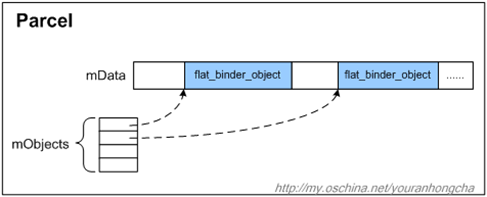
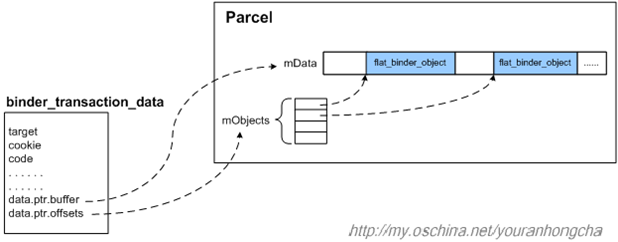

# 通信协议


## binder_driver_command_protocol

Binder请求码，由用户层程序向Binder驱动发送。以**`BC_`**开头。

| 命令码                               | 参数类型                         | 作用                        |
| ------------------------------------ | -------------------------------- | --------------------------- |
| `BC_TRANSACTION`                     | `struct binder_transaction_data` | Client向binder驱动发送数据  |
| `BC_REPLY`                           | `struct binder_transaction_data` | Server向binder驱动发送数据  |
| `BC_FREE_BUFFER`                     | `binder_uintptr_t`               | 释放内存                    |
| `BC_INCREFS`、`BC_ACQUIRE0`          | `int`                            | `binder_ref`弱引用计数操作  |
| `BC_RELEASE`、`BC_DECREFS`           | `int`                            | `binder_ref`强引用计数操作  |
| `BC_INCREFS_DONE`、`BC_ACQUIRE_DONE` | `binder_ptr_cookie`              | `binder_node`强引用计数操作 |
| `BC_REGISTER_LOOPER`                 | \                                | 创建新的looper线程          |
| `BC_ENTER_LOOPER`                    | \                                | 应用线程进入looper          |
| `BC_EXIT_LOOPER`                     | \                                | 应用线程退出looper          |
|                                      |                                  |                             |
|                                      |                                  |                             |
|                                      |                                  |                             |

 

1. `BC_TRANSACTION`

    查看binder驱动，发现其仅在`binder_thread_write`函数中被使用。因此该命令码应该是由用户空间程序传输数据到内核空间时使用。

    ```c++
    case BC_REPLY:
    case BC_TRANSACTION: {
    	struct binder_transaction_data tr;
    	if (copy_from_user(&tr, ptr, sizeof(tr)))
    		return -EFAULT;
    	ptr += sizeof(tr);
    	binder_transaction(proc, thread, &tr, cmd == BC_REPLY, 0);
    	break;
    }
    ```

    


## binder_driver_return_protocol

Binder响应码，由Binder驱动返回给用户层程序。用户层程序包括Client端和Server端。命令码以**`BR_`**开头

```c++
enum binder_driver_return_protocol {
	BR_ERROR = _IOR('r', 0, __s32),
	/*
	 * int: error code
	 */

	BR_OK = _IO('r', 1),
	/* No parameters! */

	BR_TRANSACTION = _IOR('r', 2, struct binder_transaction_data),
	BR_REPLY = _IOR('r', 3, struct binder_transaction_data),
	/*
	 * binder_transaction_data: the received command.
	 */

	BR_DEAD_REPLY = _IO('r', 5),
	/*
	 * The target of the last transaction (either a bcTRANSACTION or
	 * a bcATTEMPT_ACQUIRE) is no longer with us.  No parameters.
	 */

	BR_TRANSACTION_COMPLETE = _IO('r', 6),
	/*
	 * No parameters... always refers to the last transaction requested
	 * (including replies).  Note that this will be sent even for
	 * asynchronous transactions.
	 */

	BR_INCREFS = _IOR('r', 7, struct binder_ptr_cookie),
	BR_ACQUIRE = _IOR('r', 8, struct binder_ptr_cookie),
	BR_RELEASE = _IOR('r', 9, struct binder_ptr_cookie),
	BR_DECREFS = _IOR('r', 10, struct binder_ptr_cookie),
	/*
	 * void *:	ptr to binder
	 * void *: cookie for binder
	 */

	BR_ATTEMPT_ACQUIRE = _IOR('r', 11, struct binder_pri_ptr_cookie),
	/*
	 * not currently supported
	 * int:	priority
	 * void *: ptr to binder
	 * void *: cookie for binder
	 */

	BR_NOOP = _IO('r', 12),
	/*
	 * No parameters.  Do nothing and examine the next command.  It exists
	 * primarily so that we can replace it with a BR_SPAWN_LOOPER command.
	 */

	BR_SPAWN_LOOPER = _IO('r', 13),
	/*
	 * No parameters.  The driver has determined that a process has no
	 * threads waiting to service incoming transactions.  When a process
	 * receives this command, it must spawn a new service thread and
	 * register it via bcENTER_LOOPER.
	 */

	BR_DEAD_BINDER = _IOR('r', 15, binder_uintptr_t),
	/*
	 * void *: cookie
	 */
	BR_CLEAR_DEATH_NOTIFICATION_DONE = _IOR('r', 16, binder_uintptr_t),
	/*
	 * void *: cookie
	 */

	BR_FAILED_REPLY = _IO('r', 17),
	/*
	 * The the last transaction (either a bcTRANSACTION or
	 * a bcATTEMPT_ACQUIRE) failed (e.g. out of memory).  No parameters.
	 */
};
```


# 


# 核心数据结构

## binder_proc

```c++
struct binder_proc {
    //通过该节点将其保存到binder_procs中。
	struct hlist_node proc_node;	
    //红黑树节点，保存进程的所有线程。binder_thread
	struct rb_root threads;
	struct rb_root nodes;
	struct rb_root refs_by_desc;
	struct rb_root refs_by_node;
	struct list_head waiting_threads;
    //进程信息
	int pid;
	struct task_struct *tsk;
	struct hlist_node deferred_work_node;
    //记录defer work 的类型。  RELEASE 和 FLUSH
	int deferred_work;
	bool is_dead;

	struct list_head todo;
	struct binder_stats stats;
	struct list_head delivered_death;
	int max_threads;
	int requested_threads;
	int requested_threads_started;
	int tmp_ref;
	struct binder_priority default_priority;
	struct dentry *debugfs_entry;
	struct binder_alloc alloc;
    //&binder_dev->context
	struct binder_context *context;
	spinlock_t inner_lock;
	spinlock_t outer_lock;
};
```

 

由其命名可知，`binder_proc`是进程相关的。在binder驱动中，其在`binder_open`中被创建，结合framework层中的`ProcessState`(单例模式，并且由其打开binder驱动)，`binder_proc`用于记录进程相关的信息，一个进程对应一个`binder_proc`对象。

1. 进程信息

    ```c++
    int pid;					//proc->pid = current->group_leader->pid;
    struct task_struct *tsk;  	//proc->tsk = current->group_leader;
    ```

2. 进程打开binder驱动节点时，会将`binder_proc`加入哈希列表`binder_procs`中。

    ```c++
    mutex_lock(&binder_procs_lock);
    hlist_add_head(&proc->proc_node, &binder_procs);
    mutex_unlock(&binder_procs_lock);
    ```

3. 2个自旋锁

    ```c++
    //protects binder_ref
    spinlock_t inner_lock;	
    /*
     * protects the thread and node lists
     * proc->threads, proc->waiting_threads, proc->nodes
     * proc->todo, thread->todo, proc->delivered_death, node->async_todo
    /*
    spinlock_t outer_lock;	
    ```

    

## binder_thread

```c++
struct binder_thread {
    //binder process for this thread
	struct binder_proc *proc;
	struct rb_node rb_node;
	struct list_head waiting_thread_node;
	int pid;
	int looper;              /* only modified by this thread */
	bool looper_need_return; /* can be written by other thread */
	struct binder_transaction *transaction_stack;
	struct list_head todo;
	struct binder_error return_error;
	struct binder_error reply_error;
	wait_queue_head_t wait;
	struct binder_stats stats;
	atomic_t tmp_ref;
	bool is_dead;
	struct task_struct *task;
};
```


### binder_thread创建过程

从`binder_get_thread`开始，首先调用`binder_get_thread_ilocked(proc, NULL)`来查找`proc->threads`,如果红黑树中已经存在当前线程(通过`current->pid`来查找)对应的`binder_thread`则直接返回，否则，就新建一个`binder_thread`，初始化完成后返回。


## binder_node

```c++
struct binder_node {
	int debug_id;
	spinlock_t lock;
	struct binder_work work;
	union {
		struct rb_node rb_node;
		struct hlist_node dead_node;
	};
	struct binder_proc *proc;
	struct hlist_head refs;
	int internal_strong_refs;
	int local_weak_refs;
	int local_strong_refs;
	int tmp_refs;
	binder_uintptr_t ptr;    	//userspace pointer for node
	binder_uintptr_t cookie;	//userspace cookie for node	
	struct {
		/*
		 * bitfield elements protected by
		 * proc inner_lock
		 */
		u8 has_strong_ref:1;
		u8 pending_strong_ref:1;
		u8 has_weak_ref:1;
		u8 pending_weak_ref:1;
	};
	struct {
		/*
		 * invariant after initialization
		 */
		u8 sched_policy:2;
		u8 inherit_rt:1;
		u8 accept_fds:1;
		u8 min_priority;
	};
	bool has_async_transaction;
	struct list_head async_todo;
};
```

看定义还是感觉比较复杂额。

### binder_node 创建过程

```c++
static struct binder_node *binder_new_node(struct binder_proc *proc,
					   struct flat_binder_object *fp)
{
	struct binder_node *node;
	struct binder_node *new_node = kzalloc(sizeof(*node), GFP_KERNEL);
	if (!new_node)
		return NULL;
	binder_inner_proc_lock(proc);
	node = binder_init_node_ilocked(proc, new_node, fp);
	binder_inner_proc_unlock(proc);
	if (node != new_node)
		/*
		 * The node was already added by another thread
		 */
		kfree(new_node);
	return node;
}
```

`binder_init_node_ilocked`和`binder_get_thread_ilocked`类似。

```c++

static struct binder_node *binder_init_node_ilocked(
						struct binder_proc *proc,
						struct binder_node *new_node,
						struct flat_binder_object *fp)
{
	struct rb_node **p = &proc->nodes.rb_node;
	struct rb_node *parent = NULL;
	struct binder_node *node;
	binder_uintptr_t ptr = fp ? fp->binder : 0;
	binder_uintptr_t cookie = fp ? fp->cookie : 0;
	__u32 flags = fp ? fp->flags : 0;
	s8 priority;

	assert_spin_locked(&proc->inner_lock);
	//从proc->nodes中查找，找到就直接返回。否则在继续下一步。
    //通过node->ptr来查找。
    ...
	node = new_node
	node->tmp_refs++;
	rb_link_node(&node->rb_node, parent, p);
	rb_insert_color(&node->rb_node, &proc->nodes);
	node->cookie = cookie;
	node->work.type = BINDER_WORK_NODE;
	priority = flags & FLAT_BINDER_FLAG_PRIORITY_MASK;
	node->sched_policy = (flags & FLAT_BINDER_FLAG_SCHED_POLICY_MASK) >>
		FLAT_BINDER_FLAG_SCHED_POLICY_SHIFT;
	node->min_priority = to_kernel_prio(node->sched_policy, priority);
	node->accept_fds = !!(flags & FLAT_BINDER_FLAG_ACCEPTS_FDS);
	node->inherit_rt = !!(flags & FLAT_BINDER_FLAG_INHERIT_RT);
	...
	return node;
}
```


```c++
binder_uintptr_t ptr;    	//userspace pointer for node
binder_uintptr_t cookie;	//userspace cookie for node	
```

这两个属性，对于理解应用层binder有帮助。先看看她具体是干嘛的。

再整个binder驱动中，只有两个地方创建了新的`binder_node`对象。

1. `binder_ioctl_set_ctx_mgr`。 (service manager进程创建)。

2. `binder_translate_binder`

    以`BC_TRANSACTION`为例。

    

    


## binder_transaction_data


```c++
struct binder_transaction_data {
	/* The first two are only used for bcTRANSACTION and brTRANSACTION,
	 * identifying the target and contents of the transaction.
	 */
	union {
		/* target descriptor of command transaction */
		__u32	handle;
		/* target descriptor of return transaction */
		binder_uintptr_t ptr;
	} target;
	binder_uintptr_t	cookie;	/* target object cookie */
	__u32		code;		/* transaction command */

	/* General information about the transaction. */
	__u32	        flags;
	pid_t		sender_pid;
	uid_t		sender_euid;
	binder_size_t	data_size;	/* number of bytes of data */
	binder_size_t	offsets_size;	/* number of bytes of offsets */

	/* If this transaction is inline, the data immediately
	 * follows here; otherwise, it ends with a pointer to
	 * the data buffer.
	 */
	union {
		struct {
			/* transaction data */
			binder_uintptr_t	buffer;
			/* offsets from buffer to flat_binder_object structs */
			binder_uintptr_t	offsets;
		} ptr;
		__u8	buf[8];
	} data;
};

```

1. `binder_transaction_data.target` 和 `binder_transaction_data.cookie`

    仅在命令码为`BR_TRANSACTION`和`BC_TRANSACTION`时使用，用于标志接受数据的target和传输的数据内容(cookie)。

    `target.handle`BC命令码的target，`target.ptr`表示BR命令码的target。

2. `code`: 指示传输的数据类型，由应用层来决定，应用层根据code来解析命令。以Service Manager为例。

    ```c++
    struct binder_transaction_data *txn = ...;
    switch(txn->code) {
        case SVC_MGR_GET_SERVICE:
        case SVC_MGR_CHECK_SERVICE:
           ...
            return 0;
    
        case SVC_MGR_ADD_SERVICE:
           ...
            break;
    
        case SVC_MGR_LIST_SERVICES: {
           ...
        }
    }
    ```

3. `data_size` 和 `offests_size`

    结合`IPCThreadState::writeTransactionData`可知：

    `data_size` 表示的是一个`Parcel`持有的数据的大小。

    `offsets_size`表示的是 传输的binder对象的总大小。

    ```c++
    tr.data_size = data.ipcDataSize();
    tr.offsets_size = data.ipcObjectsCount()*sizeof(binder_size_t);
    ```

4. `data`

    结合`IPCThreadState::writeTransactionData`可知：

    `data.ptr.buffer` 表示传输数据的起始地址。

    `ata.ptr.offsets`表示传输的bindre对象的在buffer中的偏移地址。

    ```c++
    tr.data.ptr.buffer = data.ipcData();
    tr.data.ptr.offsets = data.ipcObjects();
    ```

    
    


# file_operations

## `binder_open`

在进程调用`open("/dev/binder", O_RDWR)`后，即会调用`binder_open`。

该函数内部会创建一个`binder_proc`对象，并将其加入到全局哈希列表`binder_procs`中。最后，会将该`binder_proc`在debugfs中反应出来。(`/sys/kernel/debug/binder/proc/pid`)


## `binder_release`
`binder_open`的逆过程。

```c++
static int binder_release(struct inode *nodp, struct file *filp)
{
    //通过filp->private_data获取到相应的binder_proc对象。
    //binder_open: filp->private_data = proc;
	struct binder_proc *proc = filp->private_data;
	//将binder_proc从debugfs中移除
	debugfs_remove(proc->debugfs_entry);
    //执行删除工作。
	binder_defer_work(proc, BINDER_DEFERRED_RELEASE);
	return 0;
}
```

`binder_defer_work`将会`binder_proc`加入到`binder_deferred_list`中，随后，将`binder_deferred_work`加入到工作队列`binder_deferred_workqueue`中。

`binder_deferred_work`是一个静态变量。


最终，会调用`binder_deferred_func`执行清理操作。


`binder_deferred_release`工作流程如下：

1. 将`binder_proc`从`binder_procs`移除。
2. 判断当前`binder_proc`是否是context manager。是就`context->binder_context_mgr_node = NULL;`
3. 调用`binder_thread_release`释放所有`binder_thread`
4. 调用`binder_node_release`释放所有`binder_node`
5. 调用`binder_free_proc`释放`binde_proc`


## `binder_ioctl`


## `binder_poll`


## `binder_mmap`


## `binder_flush`


