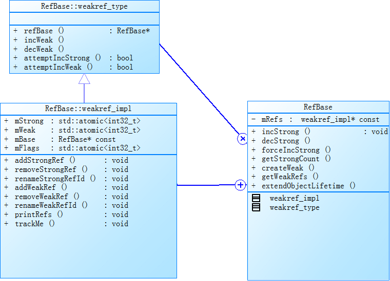

# RefBase sp 及 wp

## RefBase

首先看`RefBase`的定义。

```c++
class RefBase
    {
    public:
        void            incStrong(const void* id) const;
        void            decStrong(const void* id) const;
        void            forceIncStrong(const void* id) const;
    
        class weakref_type
        {
        public:
            RefBase*            refBase() const;

            void                incWeak(const void* id);
            void                decWeak(const void* id);

            // acquires a strong reference if there is already one.
            bool                attemptIncStrong(const void* id);

            // acquires a weak reference if there is already one.
            // This is not always safe. see ProcessState.cpp and BpBinder.cpp
            // for proper use.
            bool                attemptIncWeak(const void* id);
        };

        weakref_type*   createWeak(const void* id) const;

        weakref_type*   getWeakRefs() const;

      
        typedef RefBase basetype;

    protected:
        RefBase();
        virtual                 ~RefBase();

        //! Flags for extendObjectLifetime()
        enum {
            OBJECT_LIFETIME_STRONG  = 0x0000,
            OBJECT_LIFETIME_WEAK    = 0x0001,
            OBJECT_LIFETIME_MASK    = 0x0001
        };

        void            extendObjectLifetime(int32_t mode);

        //! Flags for onIncStrongAttempted()
        enum {
            FIRST_INC_STRONG = 0x0001
        };

        virtual void            onFirstRef();
        virtual void            onLastStrongRef(const void* id);
        virtual bool            onIncStrongAttempted(uint32_t flags, const void* id);
        virtual void            onLastWeakRef(const void* id);

    private:
        friend class weakref_type;
        class weakref_impl;

        RefBase(const RefBase& o);
        RefBase&        operator=(const RefBase& o);

    private:
        friend class ReferenceMover;

        static void renameRefs(size_t n, const ReferenceRenamer& renamer);

        static void renameRefId(weakref_type* ref,
                                const void* old_id, const void* new_id);

        static void renameRefId(RefBase* ref,
                                const void* old_id, const void* new_id);

        weakref_impl* const mRefs;
    };

class RefBase::weakref_impl : public RefBase::weakref_type
{
public:
	std::atomic<int32_t>    mStrong;
	std::atomic<int32_t>    mWeak;
				
	RefBase* const          mBase;
	std::atomic<int32_t>    mFlags;


	weakref_impl(RefBase* base)
		: mStrong(INITIAL_STRONG_VALUE)
		, mWeak(0)
		, mBase(base)
		, mFlags(0)
		{
		}

	void addStrongRef(const void* /*id*/) { }
	void removeStrongRef(const void* /*id*/) { }
	void renameStrongRefId(const void* /*old_id*/, const void* /*new_id*/) { }
	void addWeakRef(const void* /*id*/) { }
	void removeWeakRef(const void* /*id*/) { }
	void renameWeakRefId(const void* /*old_id*/, const void* /*new_id*/) { }
	void printRefs() const { }
	void trackMe(bool, bool) { }
};
```


`RefBase` 内部只有一个成员`mRefs`，其类型为`weakref_impl`。

### `weakref_impl`

其有4个成员变量。

1. `mStrong`

    强引用计数

2. `mWeak`

    弱引用计数

3. `mBase`

    指向其外部类对象的指针。通过这个指针，就能获取到其所指向的外部类对象。

4. `mFlags`


由其定义可知，其成员函数都没有做任何事情。对引用计数的操作都是通过其父类`weakref_type`中的方法来实现的。`weakref_impl`并没有重写了这些方法。

虽然`weakref_impl`的成员变量中有`mStrong`，但是其并不管理强引用计数。`mStrong`由`RefBase`直接管理。


#### 弱引用计数增减

1. `incWeak`

    ```c++
    void RefBase::weakref_type::incWeak(const void* id)
    {
        //转型为`weakref_impl`
    	weakref_impl* const impl = static_cast<weakref_impl*>(this);
        //donothing
    	impl->addWeakRef(id);
        //完成实际的增加引用计数的操作。
    	const int32_t c __unused = impl->mWeak.fetch_add(1, std::memory_order_relaxed);
    }
    ```

2. `decWeak`

    ```c++
    void RefBase::weakref_type::decWeak(const void* id)
    {
    	weakref_impl* const impl = static_cast<weakref_impl*>(this);
        //do nothing
    	impl->removeWeakRef(id);
        //引用计数减1
    	const int32_t c = impl->mWeak.fetch_sub(1, std::memory_order_release);
    	ALOG_ASSERT(c >= 1, "decWeak called on %p too many times", this);
    	if (c != 1) return;
       
    	//c == 1,说明当前的impl->mWeak == 0,执行清理操作。
    	atomic_thread_fence(std::memory_order_acquire);
    
    	int32_t flags = impl->mFlags.load(std::memory_order_relaxed);
    	if ((flags&OBJECT_LIFETIME_MASK) == OBJECT_LIFETIME_STRONG) {
             // This is the regular lifetime case. The object is destroyed
             // when the last strong reference goes away. Since weakref_impl
             // outlive the object, it is not destroyed in the dtor, and
             // we'll have to do it here.
    		if (impl->mStrong.load(std::memory_order_relaxed)
                 == INITIAL_STRONG_VALUE) {
                 // Special case: we never had a strong reference, so we need to
                 // destroy the object now.
                 delete impl->mBase;
    		} else {
                 // ALOGV("Freeing refs %p of old RefBase %p\n", this, impl->mBase);
    			delete impl;
    		}
    	} else {
             // This is the OBJECT_LIFETIME_WEAK case. The last weak-reference
             // is gone, we can destroy the object.
    		impl->mBase->onLastWeakRef(id);
    		delete impl->mBase;
    	}
    }
    
    ```


### 类图

