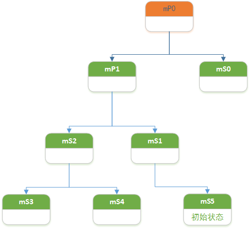

# State

`enter`和`exit`类似于构造函数和析构函数，分别用于初始化和清理状态。

子类通过实现`processMessage`来处理指定的消息。

```java
public class State implements IState {
    protected State() {
    }

    @Override
    public void enter() {
    }

    
    @Override
    public void exit() {
    }

    @Override
    public boolean processMessage(Message msg) {
        return false;
    }
    @Override
    public String getName() {
        String name = getClass().getName();
        int lastDollar = name.lastIndexOf('$');
        return name.substring(lastDollar + 1);
    }
}

```


# StateMachine

当状态机被创建时，通过`addState`可以建立一个具备层次关系的状态树。通过`setInitialState`可以指定一个初始状态。`start`函数会初始化并启动状态机，状态机启动后的第一个动作就是调用初始状态的`enter`函数。

`sendMessage`用于发送message。当状态机接收到Message时，会调用当前状态的`processMessage`来处理消息。`transitionTo`用于切换当前状态。


状态机中的每一个状态都有0/1个父状态。当Message不能被当前状态处理时，就会使用其父状态处理。如果没有状态能够处理该Message。`unhandledMessage`就会被调用。


当状态机完成所有的处理后，可以选择调用`transitionToHaltingState`。

> WifiController中，并没有调用该函数，那就不管它了

通过调用`quit`或`quitNow`来停止状态机。当前状态及其父状态的`exit`函数也会被执行。


当状态在同一个层次时：

​			

即，需要从CS2切换到CS1时，那么CS2的`exit`函数会被调用，随后调用CS1的`enter`函数。更通用的说明就是，为了确认`exit`和`enter`的调用路径，首先要找到离当前状态最近的公共父状态。随后逐级调用`exit`和`enter`函数。(公共父状态的`enter`和`exit`不会被调用)。如果没有公共的父状态，就是退出所有状态，再进入新的状态。


`sendMessageAtFrontOfQueue` 会将当前发送的消息放到消息队列的头部(`sendMessage`是放在尾部)。

在转换到新的状态前，`deferMessage`会将消息保存到一个列表中。当切换到下一个状态后，这些消息会放在消息队列的前面。即将message延迟到下一个状态处理。


## 示例




状态机启动后，active状态列表是: mP0、mP1、mS1、mS5。

当状态机接收到message时，由mS5来处理。

1. mS5不能处理该消息(`processMessage`返回`fasle`or `NOT_HANDLED`)

    由其父状态mS1处理，以此类推

2. mS5能处理该消息，并且状态机的状态应该发生改变（切换到mS4）

    mS5的`processMessage`应该调用`transitionTo(mS4) `并且返回`true`or `HANDLED`。状态机能在`processMessage`返回后立即找到他们的common parent`mP1`。

    接下来的call path 就是

    ```java
    mS5.exit();
    mS1.exit();
    mS2.enter();
    mS4.enter();
    ```

    此时，新的active状态列表是: mP0、mP1、mS2、mS4。当下一个message到达时，就会调用`mS4.processMessage`

    

关于状态机的使用，可以查看`rameworks/base/core/java/com/android/internal/util/StateMachine.java`中关于`StateMachine`的注释。


> 其实，StateMachine中大多数函数都是对`SmHandler`中的同名函数的包装。


# SmHandler


继承至`Handler`，实现了


## 重要函数源码

### addState

```java
private final StateInfo addState(State state, State parent) {
    StateInfo parentStateInfo = null;
    if (parent != null) {
        //private HashMap<State, StateInfo> mStateInfo = new HashMap<State, StateInfo>();
        parentStateInfo = mStateInfo.get(parent);
        if (parentStateInfo == null) {												//[1]
            // Recursively add our parent as it's not been added yet.
            parentStateInfo = addState(parent, null);
        }
    }
    StateInfo stateInfo = mStateInfo.get(state);
    if (stateInfo == null) {					//[2]
        stateInfo = new StateInfo();
        mStateInfo.put(state, stateInfo);
    }

    // Validate that we aren't adding the same state in two different hierarchies.
    if ((stateInfo.parentStateInfo != null)
            && (stateInfo.parentStateInfo != parentStateInfo)) {
        throw new RuntimeException("state already added");
    }
    stateInfo.state = state;
    stateInfo.parentStateInfo = parentStateInfo;
    stateInfo.active = false;
    return stateInfo;
}

```

- [1] 判断父状态是否在`mStateInfo`如果中，如果父状态不在，就递归地将没有在`mStateInfo`中的状态添加进来。

- [2] 将状态添加到`mStateInfo`中，并创建一个`StateInfo`对象。

    ```java
    private class StateInfo 
                State state;
    
                StateInfo parentStateInfo;
    
                boolean active;
    }
    ```

    通过`StateInfo`，将状态机中的状态构建成一个树结构。


### setInitialState

```java
       /** @see StateMachine#setInitialState(State) */
private final void setInitialState(State initialState) {
	mInitialState = initialState;
}
```

