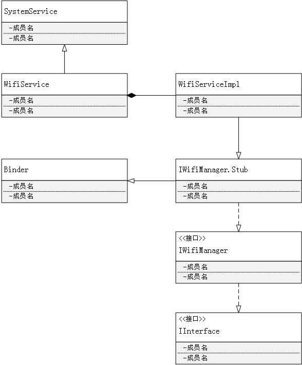

# 概述

WifiService是Framework中负责Wifi功能的核心服务，其借助wpa_supplicant(WPAS)来管理和控制WIFI功能。实际上WPAS才是Wifi模块的真正核心，但是WifiService作为Framework中wifi功能的总入口，其重要性不言而喻。


WifiService的类图如下：




本文从两个方向分析WIfiService。

1. WifiService的创建及初始化
2. 介绍Settings中打开Wifi-> scan-> connect的流程。

# WifiService 的创建及初始化

WifiService在SystemServer进程中创建。

`frameworks/base/services/java/com/android/server/SystemServer.java`

```java
public final class SystemServer {
    private static final String WIFI_SERVICE_CLASS =
            "com.android.server.wifi.WifiService";
    
    private SystemServiceManager mSystemServiceManager;
	private void run() {
    	...
        startOtherServices(); 
        ...
    }
    
    /**
     * Starts a miscellaneous grab bag of stuff that has yet to be refactored
     * and organized.
     */
    private void startOtherServices() {
    	...
        mSystemServiceManager.startService(WIFI_SERVICE_CLASS);
        ... 
    }
}
```

可见，WifiService 的创建工作最终交由`SystemServiceManager`来完成的。

`frameworks/base/services/core/java/com/android/server/SystemServiceManager.java`

```java
public class SystemServiceManager {
	public SystemService startService(String className) {
        final Class<SystemService> serviceClass;
        serviceClass = (Class<SystemService>)Class.forName(className);
        return startService(serviceClass);
    }
    
    public <T extends SystemService> T startService(Class<T> serviceClass) {
		final String name = serviceClass.getName();
        final T service;
        Constructor<T> constructor = serviceClass.getConstructor(Context.class);
        service = constructor.newInstance(mContext);
        // Register it.
        mServices.add(service);
        // Start it.
        service.onStart();
        return service;
    }
}
```

`SystemServiceManager.startService(wifiServiceClass)`通过反射，创建了WifiService对象，并将其添加到系统服务中。


## WifiService构造函数

`frameworks/opt/net/wifi/service/java/com/android/server/wifi/WifiService.java`

```java
public final class WifiService extends SystemService {
    final WifiServiceImpl mImpl;

    public WifiService(Context context) {
        super(context);
        mImpl = new WifiServiceImpl(context);
    }
    
    @Override
    public void onStart() {
        Log.i(TAG, "Registering " + Context.WIFI_SERVICE);
        publishBinderService(Context.WIFI_SERVICE, mImpl);
    }
}
```

WifiService所有的工作都在`WifiServiceImpl`中完成。`SystemServiceManager`在创建了WifiService对象后，调用了`WifiService.onStart()`。该函数的实际作用就是将wifiService添加到Service  Manager中。这里涉及到Binder和`Service Manager`。暂且不谈，有兴趣可以查看`frameworks/native/cmds/servicemanager/service_manager.c`。了解添加过程。

继续看`WifiServiceImpl`的构造函数：

`frameworks\opt\net\wifi\service\java\com\android\server\wifi\WifiServiceImpl.java`

```java
public class WifiServiceImpl extends IWifiManager.Stub {

    public WifiServiceImpl(Context context) {
        mContext = context;
        mWifiInjector = WifiInjector.getInstance();
        mFacade = new FrameworkFacade();
        HandlerThread wifiThread = new HandlerThread("WifiService");
        wifiThread.start();
        mWifiMetrics = mWifiInjector.getWifiMetrics();
        mTrafficPoller = new WifiTrafficPoller(mContext, wifiThread.getLooper(),
                WifiNative.getWlanNativeInterface().getInterfaceName());
        mUserManager = UserManager.get(mContext);
        HandlerThread wifiStateMachineThread = new HandlerThread("WifiStateMachine");
        wifiStateMachineThread.start();
        mCountryCode = new WifiCountryCode(
                WifiNative.getWlanNativeInterface(),
                SystemProperties.get(BOOT_DEFAULT_WIFI_COUNTRY_CODE),
                mFacade.getStringSetting(mContext, Settings.Global.WIFI_COUNTRY_CODE),
                mContext.getResources().getBoolean(
                        R.bool.config_wifi_revert_country_code_on_cellular_loss));
        mWifiStateMachine = new WifiStateMachine(mContext, mFacade,
            wifiStateMachineThread.getLooper(), mUserManager, mWifiInjector,
            new BackupManagerProxy(), mCountryCode);
        mSettingsStore = new WifiSettingsStore(mContext);
        mWifiStateMachine.enableRssiPolling(true);
        mBatteryStats = BatteryStatsService.getService();
        mPowerManager = context.getSystemService(PowerManager.class);
        mAppOps = (AppOpsManager)context.getSystemService(Context.APP_OPS_SERVICE);
        mCertManager = new WifiCertManager(mContext);

        mNotificationController = new WifiNotificationController(mContext,
                wifiThread.getLooper(), mWifiStateMachine, mFacade, null);

        mWifiLockManager = new WifiLockManager(mContext, mBatteryStats);
        mClientHandler = new ClientHandler(wifiThread.getLooper());
        mWifiStateMachineHandler = new WifiStateMachineHandler(wifiThread.getLooper());
        mWifiController = new WifiController(mContext, mWifiStateMachine,
                mSettingsStore, mWifiLockManager, wifiThread.getLooper(), mFacade);
        // Set the WifiController for WifiLastResortWatchdog
        mWifiInjector.getWifiLastResortWatchdog().setWifiController(mWifiController);
    }
}
```


`WifiServiceImpl`的构造函数主要工作就是创建了一些核心对象，其中`WifiStateMachine`最为重要。


### WifiStateMachine

