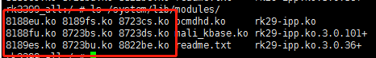
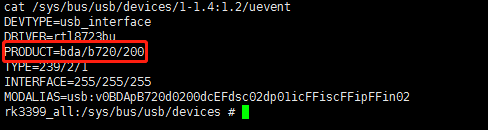
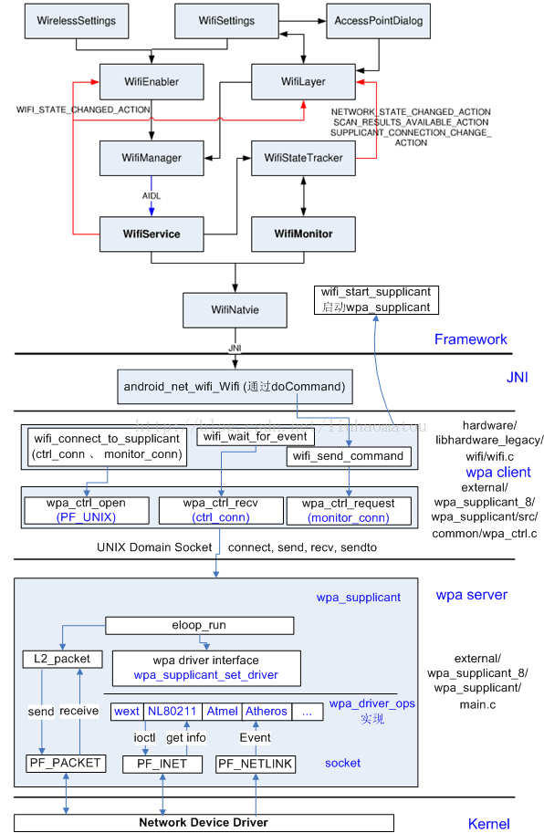

# 加载wifi驱动
`WifiNative::loadDriverNative`

​	`wifi_load_driver`            === > `hardware/libhardware_legacy/wifi/wifi.c`


## 如何找到需要加载的驱动

在`/system/lib/moudles`目录下，存放着wifi芯片的驱动程序。




RK3399 中，wifi芯片通过USB总线连接到CPU。该函数会通过遍历`/sys/bus/usb/devices`下所有device的`uevent`节点来获取设备信息。

以`rtl8723bu`(vid = 0x0bda  pid =0xb720)为例:



通过读取`PRODUCT=`行来获取USB设备的 Vendor ID 和 Product ID。

`hardware/libhardware_legacy/wifi/rk_wifi_ctrl.c`

```c++
int get_wifi_device_id(const char *bus_dir, const char *prefix);
```

该函数负责找到系统当前可用的wifi chip名称。拿到名称后，就知道加载哪个驱动了。


## 安装驱动

直接show code，通过系统调用`__NR_finit_module`来完成驱动加载。

```c++
static int insmod(const char *filename, const char *options)
{
    int fd = open(filename, O_RDONLY | O_NOFOLLOW | O_CLOEXEC);
    if (fd == -1) {
        ALOGE("insmod: open(\"%s\") failed: %s", filename, strerror(errno));
        return -1;
    }
    int rc = syscall(__NR_finit_module, fd, options, 0);
    if (rc == -1) {
        ALOGE("finit_module for \"%s\" failed: %s", filename, strerror(errno));
    }
    close(fd);
    return rc;
}
```


驱动安装完后，调用`check_wireless_ready`检查网络状态。超时时间为20s。

> 内核4.4 	读取  /proc/net/dev 节点
>
> 内核3.10   读取 /proc/net/wireless 节点
>
> 通过判断节点是否包含 wlan0 或者 p2p0来判断驱动是否加载成功。


# WifiService如何操作wifi chip

Android平台通过**wpa_supplicant**来操作Wifi。

wpa_supplicant相当于一个中间层，由它来操作驱动程序和wifi chip交互。

WifiService通过socket和他建立连接，通过命令来和它进行交互，完成wifi相关的操作。


## WPA基本使用

1. 和WPA建立连接

    ```shell
    rk3399_all:/ # wpa_cli                                                         
    wpa_cli v2.6-devel-7.1.2
    
    Using interface 'wlan0'
    
    Interactive mode
    
    > 
    ```

2. 扫描wifi热点

    ```shell
    scan
    ```

3. 获取wifi扫描结果

    ```shell
    > scan_results 
    bssid / frequency / signal level / flags / ssid
    06:69:6c:aa:5d:50	2462	-44	[WPA-PSK-CCMP][WPA2-PSK-CCMP][ESS]	HIK-Office
    78:a1:06:a5:8e:ce	2462	-46	[WPS][ESS]	TP-LINK_8ECE
    06:69:6c:e7:45:9d	2462	-50	[WPA-PSK-CCMP][WPA2-PSK-CCMP][ESS]	HIK-Office
    bc:46:99:b5:a2:ee	2412	-70	[WPA-PSK-CCMP][WPA2-PSK-CCMP][ESS]	TP-LINK_A2EE
    b6:46:99:b5:a2:ee	2412	-72	[ESS]	TPGuest_A2EE
    06:69:6c:e7:32:38	2412	-58	[WPA-PSK-CCMP][WPA2-PSK-CCMP][ESS]	HIK-Office
    06:69:6c:e7:1d:e8	2437	-68	[WPA-PSK-CCMP][WPA2-PSK-CCMP][ESS]	HIK-Office
    de:55:83:ab:87:3d	2442	-72	[WPA2-PSK-CCMP][ESS]	OPPO A83
    06:69:6c:e7:52:fe	2412	-65	[ESS]	HIKVISION
    06:69:6c:e7:54:48	2437	-70	[WPA-PSK-CCMP][WPA2-PSK-CCMP][ESS]	HIK-Office
    06:69:6c:e7:50:a6	2462	-73	[WPA-PSK-CCMP][WPA2-PSK-CCMP][ESS]	HIK-Office
    0a:69:6c:e7:52:fe	2412	-67	[WPA-PSK-CCMP][WPA2-PSK-CCMP][ESS]	HIK-Office
    d0:d7:83:8b:b6:f4	2412	-78	[WPA2-PSK-CCMP][ESS]	zhangxinlink
    70:3d:15:1e:a3:ae	2412	-80	[WPA2-PSK-CCMP][ESS]	Huawei_H60_5f9b
    06:69:6c:e7:47:3c	2462	-67	[WPA-PSK-CCMP][WPA2-PSK-CCMP][ESS]	HIK-Office
    48:7d:2e:da:11:14	2412	-80	[WPA-PSK-CCMP][WPA2-PSK-CCMP][ESS]	CRESTRON-12V
    06:69:6c:aa:60:7a	2412	-78	[WPA-PSK-CCMP][WPA2-PSK-CCMP][ESS]	HIK-Office
    06:69:6c:e7:52:ea	2437	-66	[WPA-PSK-CCMP][WPA2-PSK-CCMP][ESS]	HIK-Office
    00:e0:2d:0a:0d:9e	2437	-82	[WPA2-PSK-CCMP][WPS][ESS]	HIKmayalu
    06:69:6c:e7:3d:d2	2412	-81	[WPA-PSK-CCMP][WPA2-PSK-CCMP][ESS]	HIK-Office
    06:69:6c:e7:52:f4	2412	-76	[WPA-PSK-CCMP][WPA2-PSK-CCMP][ESS]	HIK-Office
    34:d7:12:9b:35:05	2452	-86	[WPA2-PSK-CCMP][ESS]	Smartisan personal hotspot
    06:69:6c:e7:52:04	2412	-67	[WPA-PSK-CCMP][WPA2-PSK-CCMP][ESS]	HIK-Office
    06:69:6c:e7:3e:31	2462	-70	[WPA-PSK-CCMP][WPA2-PSK-CCMP][ESS]	HIK-Office
    84:76:37:9d:2e:d6	2462	-86	[WPA2-PSK-CCMP][ESS]	nova 5 Pro
    a4:f0:5e:ec:ea:e9	2412	-72	[WPA2-PSK-CCMP][ESS]	hikhotpot
    06:69:6c:e7:3d:9b	2462	-74	[WPA-PSK-CCMP][WPA2-PSK-CCMP][ESS]	HIK-Office
    06:69:6c:e7:52:27	2462	-78	[WPA-PSK-CCMP][WPA2-PSK-CCMP][ESS]	HIK-Office
    
    ```

4. 添加网络

    ```shell
    > add_network 
    2  #这个2是wpa_supplicant给我们返回的一个值，代表了这个网络，以后我们需要操作这个网络就要使用这个值。
    ```

5. 设置ssid和密码

    ```shell
    > set_network 2 ssid "HIIK-Office" 
    OK
    > set_network 2 psk "HIKhik@2017"
    ```

6. 网络连接断开以及切换

    ```shell
    > list_networks   
    network id / ssid / bssid / flags
    0	HIK-Office	any	[CURRENT]
    1	TP-LINK_8ECE	any	[DISABLED]
    2	HIIK-Office		any	[DISABLED]   
    3		any	[DISABLED]    #add_network, 没有set_network
    
    > enable_network 0 
    OK
    > disable_network 0
    OK
    > select_network 0
    OK  #会连接到 network id 为0的网络。 包含enable_network的功能
    ```

    

## WifiService如何操作Wifi

其实，WifiService和 wpa_cli是一样，都是作为WPA的client程序，通过socket和WPA连接，并通过socket来进行交互。

WifiService最终通过WiFiNative来同WPA交互。




### JNI层的实现

源码路径`frameworks/opt/net/wifi/service/jni/com_android_server_wifi_WifiNative.cpp`


# wpa_supplicant启动

```C++
service wpa_supplicant /system/bin/wpa_supplicant \
	-iwlan0 -Dnl80211 -c/data/misc/wifi/wpa_supplicant.conf \
	-I/system/etc/wifi/wpa_supplicant_overlay.conf \
	-e/data/misc/wifi/entropy.bin -O/data/misc/wifi/sockets \
	-g@android:wpa_wlan0
	class main
	socket wpa_wlan0 dgram 660 wifi wifi
	disabled
	oneshot
```

1. 根据参数构建`struct wpa_params` 和 `wpa_interface`.

    ```c++
    struct wpa_params params;
    struct wpa_interface *ifaces, *iface;
    params.ifname = "wlan0";
    params.driver = "nl80211";
    iface->confname = "/data/misc/wifi/wpa_supplicant.conf";
    iface->confanother = "/system/etc/wifi/wpa_supplicant_overlay.conf";
    params.entropy_file = "/data/misc/wifi/entropy.bin";
    params.override_ctrl_interface = "/data/misc/wifi/sockets";
    params.ctrl_interface = "android:wpa_wlan0";
    
    ```

2. `wpa_supplicant_init`

    ```c++
    
    struct wpa_global * wpa_supplicant_init(struct wpa_params *params)
    {
    	struct wpa_global *global;
    	int ret, i;
    
    
    #ifndef CONFIG_NO_WPA_MSG
    	wpa_msg_register_ifname_cb(wpa_supplicant_msg_ifname_cb);
    #endif /* CONFIG_NO_WPA_MSG */
    
    	...
    
        //注册eap相关的函数。
    	ret = eap_register_methods();
    	if (ret) {
    		wpa_printf(MSG_ERROR, "Failed to register EAP methods");
    		if (ret == -2)
    			wpa_printf(MSG_ERROR, "Two or more EAP methods used "
    				   "the same EAP type.");
    		return NULL;
    	}
    
    	global = os_zalloc(sizeof(*global));
    	if (global == NULL)
    		return NULL;
    	dl_list_init(&global->p2p_srv_bonjour);
    	dl_list_init(&global->p2p_srv_upnp);
    	global->params.daemonize = params->daemonize;
    	global->params.wait_for_monitor = params->wait_for_monitor;
    	global->params.dbus_ctrl_interface = params->dbus_ctrl_interface;
    	
    	if (params->ctrl_interface)
    		global->params.ctrl_interface =
    			os_strdup(params->ctrl_interface);
    	
    	if (params->override_ctrl_interface)
    		global->params.override_ctrl_interface =
    			os_strdup(params->override_ctrl_interface);
    
    
    	if (eloop_init()) {
    		wpa_printf(MSG_ERROR, "Failed to initialize event loop");
    		wpa_supplicant_deinit(global);
    		return NULL;
    	}
    
    	random_init(params->entropy_file);
    
    	global->ctrl_iface = wpa_supplicant_global_ctrl_iface_init(global);
    	if (global->ctrl_iface == NULL) {
    		wpa_supplicant_deinit(global);
    		return NULL;
    	}
    
    	if (wpas_notify_supplicant_initialized(global)) {
    		wpa_supplicant_deinit(global);
    		return NULL;
    	}
    
    	for (i = 0; wpa_drivers[i]; i++)
    		global->drv_count++;
    	if (global->drv_count == 0) {
    		wpa_printf(MSG_ERROR, "No drivers enabled");
    		wpa_supplicant_deinit(global);
    		return NULL;
    	}
    	global->drv_priv = os_calloc(global->drv_count, sizeof(void *));
    	if (global->drv_priv == NULL) {
    		wpa_supplicant_deinit(global);
    		return NULL;
    	}
    
    #ifdef CONFIG_WIFI_DISPLAY
    	if (wifi_display_init(global) < 0) {
    		wpa_printf(MSG_ERROR, "Failed to initialize Wi-Fi Display");
    		wpa_supplicant_deinit(global);
    		return NULL;
    	}
    #endif /* CONFIG_WIFI_DISPLAY */
    
    	eloop_register_timeout(WPA_SUPPLICANT_CLEANUP_INTERVAL, 0,
    			       wpas_periodic, global, NULL);
    
    	return global;
    }
    ```

    


WifiEnabler.onSwitchChanged

​	WifiManager.setWifiEnabled(boolean)

​		WifiService::WifiServiceImpl::setWifiEnabled

​			WifiController:: sendMessage(CMD_WIFI_TOGGLED);


WifiController 状态机


- `DefaultState`
    - `ApStaDisabledState`
    - `StaEnabledState`
        - `DeviceActiveState`
        - `DeviceInactiveState`
            - `ScanOnlyLockHeldState`
            - `FullLockHeldState`
            - `FullHighPerfLockHeldState`
            - `NoLockHeldState`
    - `StaDisabledWithScanState`
    - `ApEnabledState`
    - `EcmState`


以下几个状态机对`CMD_WIFI_TOGGLED`进行了处理。

1. `ApStaDisabledState`

    ```java
    if (! mSettingsStore.isWifiToggleEnabled()) {
    	if (mSettingsStore.isScanAlwaysAvailable()) {
    		transitionTo(mStaDisabledWithScanState);
    	} else {
    		transitionTo(mApStaDisabledState);
    	}
    }
    ```

2. `StaDisabledWithScanState`

    ```java
    if (mSettingsStore.isWifiToggleEnabled()) {
    	if (doDeferEnable(msg)) {
    		if (mHaveDeferredEnable) {
    			mDeferredEnableSerialNumber++;
    		}
    		mHaveDeferredEnable = !mHaveDeferredEnable;
    		break;
    	}
    	if (mDeviceIdle == false) {
    		transitionTo(mDeviceActiveState);
    	} else {
    		checkLocksAndTransitionWhenDeviceIdle();
    	}
    }
    ```

    


# EAP