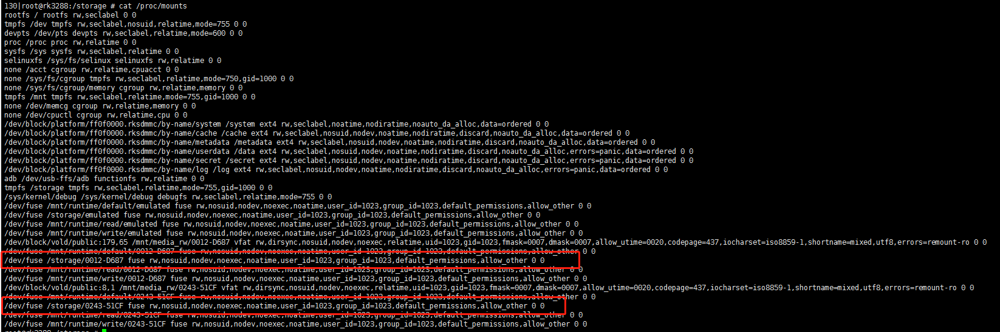

# 背景

在半成品自动化测试程序中(android app)，需要对USB接口进行测试。测试逻辑是在U盘插入以后，对U盘进行读写。成功识别到U盘并读写OK则判断USB接口正常，否则判断USB接口为损坏。

程序中，存在多个测试模块，有些模块在JNI层完成很方便，比如IIC模块、GPIO模块。有些模块在android java层完成比较方便，比如wifi、音频播放等。

android中可以通过广播来获取U盘的热插拔事件，通过`StorageManager`、`StorageVolume `和`VolumeInfo`来获取U盘的挂载路径。对于这种方式，个人觉得有些麻烦代码。为了让程序便于维护，代码编写时，尽可能多的将模块的测试逻辑放在了JNI层完成（维护本程序的人都不是很熟悉android程序开发）。

U盘模块测试逻辑划分到JNI层后，问题来了，android linux中，如何获取U盘的热插拔事件和挂载路径。方案如下：

1. 通过netlink机制来监听内核`hotplug`信息，通过对信息进行筛选来判断是否是U盘插入。然后结合`/proc/mounts`来获取U盘路径。
2. 在本软件适用的平台中，所有存储设备都挂载在`/storage`下，通过轮询遍历该目录，判断是否有U盘插入。

这两种方案，在实际编码过程中，都感觉有些吃力，总觉得不太妥当。

方案1需要编写部分代码对内核信息进行过滤，并且还要在/proc/mounts中去寻找U盘的挂载路径，当存在tf卡时，无法准备识别U盘路径和TF卡路径。如图，红框两个分别对应TF卡和U盘，除了名称不一致，无其他区别，无法区分(足够了解linux的文件系统应该就能找到区分方式吧，毕竟android framework已经实现了，有时间看看其源码)。



方案2，轮询时，需要保存`/storage`目录下已经存在的目录，当轮询到有新增目录时，即为新的u盘插入。该方案较方案1代码量少，也满足测试需求。但是总觉得有点low，，，，，。


最终，一次无意间发现了 `inotify`。它完美的解决了我的问题。其提供的API精简，使用方便。本文就介绍其api的功能和其简单的使用方式。

# inotify简介

它是一个内核用于通知用户空间程序文件系统变化的机制。其优点是用法简单、反应灵敏。

# inotify API

`inotify` 提供一个简单的 API，使用最小的文件描述符，并且允许细粒度监控。与 `inotify` 的通信是通过系统调用实现。可用的函数如下所示：

1. `inotify_init`和`inotify_init1`

    是用于创建一个 inotify 实例的系统调用，并返回一个指向该实例的文件描述符。与 `inotify_init` 相似，并带有附加标志。

    ```c++
    #include <sys/inotify.h>
    
    int inotify_init(void);
    int inotify_init1(int flags);
    ```

    `flags`：

    	- 0 ： `inotify_init1`等同于`inotify_init`
    	- `IN_NONBLOCK`：返回的文件描述符状态为`O_NONBLOCK`，也可以使用`fcntl`函数设置。
    	- `IN_CLOEXEC`：返回的文件描述符状态为`O_CLOEXEC`，也可以使用`fcntl`函数设置。

2. `inotify_add_watch`

    增加或修改对文件或者目录的监控，并指定需要监控哪些事件。

    函数执行成功返回watch descriptor，否则返回-1，并设置`errno`。

    ```c++
    #include <sys/inotify.h>
    /**
     * @fd: inotify_init返回值
     * @pathname：需要监听的文件或文件夹的 路径
     * @mask： 见下表
     */
    int inotify_add_watch(int fd, const char *pathname, uint32_t mask);
    ```

    

    | mask                 | 描述                                                         |
    | -------------------- | ------------------------------------------------------------ |
    | **IN_ACCESS**        | 被监控项目或者被监控目录中的条目被访问过。例如，一个打开的文件被读取。 |
    | **IN_MODIFY**        | 被监控项目或者被监控目录中的条目被修改过。例如，一个打开的文件被修改。 |
    | **IN_ATTRIB**        | 被监控项目或者被监控目录中条目的元数据被修改过。例如，时间戳或者许可被修改。 |
    | **IN_CLOSE_WRITE**   | 一个打开的，等待写入的文件或目录被关闭。                     |
    | **IN_CLOSE_NOWRITE** | 一个以只读方式打开的文件或目录被关闭                         |
    | **IN_CLOSE**         | 一个掩码，可以很便捷地对前面提到的两个关闭事件（IN_CLOSE_WRITE |
    | **IN_OPEN**          | 文件或目录被打开。                                           |
    | **IN_MOVED_FROM**    | 被监控项目或者被监控目录中的条目被移出监控区域。该事件还包含一个 cookie 来实现 IN_MOVED_FROM 与 IN_MOVED_TO 的关联。 |
    | **IN_MOVED_TO**      | 文件或目录被移入监控区域。该事件包含一个针对 IN_MOVED_FROM 的 cookie。如果文件或目录只是被重命名，将能看到这两个事件，如果它只是被移入或移出非监控区域，将只能看到一个事件。如果移动或重命名一个被监控项目，监控将继续进行。参见下面的 IN_MOVE-SELF。 |
    | **IN_MOVE**          | 可以很便捷地对前面提到的两个移动事件（IN_MOVED_FROM          |
    | **IN_CREATE**        | 在被监控目录中创建了子目录或文件。                           |
    | **IN_DELETE**        | 被监控目录中有子目录或文件被删除。                           |
    | **IN_DELETE_SELF**   | 被监控项目本身被删除。监控终止，并且将收到一个 IN_IGNORED 事件 |
    | **IN_MOVE_SELF**     | 监控项目本身被移动。                                         |

    

3. `inotify_rm_watch`

    从监控列表中移出监控项目。

    ```c++
     #include <sys/inotify.h>
    /**
     * @fd: inotify_init返回值
     * @wd：inotify_add_watch返回值
     */
    int inotify_rm_watch(int fd, int wd);
    ```

    

4. `read`

    读取包含一个或者多个事件信息的缓存。

    ```c++
    #include <unistd.h>
    ssize_t read(int fd, void *buf, size_t count);
    ```

    当有事件触发时，read读取到的数据需要在如下结构体中。

    ```c++
    struct inotify_event {
    	int      wd;       /* Watch descriptor */
    	uint32_t mask;     /* Mask of events */
    	uint32_t cookie;   /* Unique cookie associating related
                                         events (for rename(2)) */
    	uint32_t len;      /* Size of name field */
    	char     name[];   /* Optional null-terminated name */
    };
    
    ```

    

5. `close`

    关闭文件描述符，并且移除所有在该描述符上的所有监控。当关于某实例的所有文件描述符都关闭时，资源和下层对象都将释放，以供内核再次使用。


# 实际使用

> 本示例中，使用的是阻塞IO。

```c++
/*硬编码1s超时，根据实际场景可灵活配置*/
int event_check_timeout(int fd)
{
    fd_set rfds;
    FD_ZERO (&rfds);
    FD_SET (fd, &rfds);
    
    struct timeval tv;
    tv.tv_sec = 1;
    tv.tv_usec = 0;
    return select (FD_SETSIZE, &rfds, NULL, NULL, &tv);
}


int inotifyFd = inotify_init();
if (inotifyFd < 0) {
    LOGE("inotify_init() error! %d", errno);
    return false;
}

//我们只需要监听`IN_CREATE`事件，U盘插入时，会在该目录挂载在该目录。
int watchFd = inotify_add_watch(inotifyFd, "/storage", IN_CREATE);
if (watchFd < 0) {
    LOGE("inotify_add_watch()  error! %d", errno);
    return false;
}
//4096
char buffer[FIXED_BUFFER_SIZE];
if (event_check_timeout(inotifyFd) > 0) {
	//read.这里的处理逻辑可能会存在丢失数据的情况，项目内使用时需要正确处理
	auto size = read(inotifyFd, buffer, FIXED_BUFFER_SIZE);
    int offest = 0;
    while (size - offest >= sizeof(struct inotify_event)) {
		struct inotify_event *event = (struct inotify_event *)(buffer + offest);
        offest += offsetof(struct inotify_event, name) + event->len;
        //handle event;
        if (event->mask & IN_CREATE) {
			LOGI("-----------%s---------%d---%d--", event->name, strlen(event->name), event->len);
			//...
        	//到这里，我们就已经拿到了U盘路径。
        }
    }
}
```


