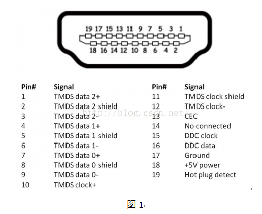

## HDMI 接口类型和引脚定义

### 类型
1. type-A: 目前最通用的HDMI接口(19pins)
2. type-B: 双通道HDMI接口，工业用途(29pins)
3. type-C: Mini HDMI接口，和type-A性能一致，体积更小
4. type-D: Micro HDMI接口，相对于type-c更加紧凑

### type-A接口

#### 引脚图

- pin1-12

    每一个标准的HDMI接口，都包含了3组用于传输数据的TMDS传输通道以及一个独立的TMDS时钟通道(用于保证传输时所需的统一时序)。

> 在一个时钟周期内，每个TMDS通道能传输10bits的数据流。而这10bits的数据可以由若干种不同的编码格式组成。

- pin13

    CEC, 全称Consumer Electronics Control。消费类电子控制。用于控制支持CEC功能的电子设备。

    [参考资料](http://www.360doc.com/content/14/0506/21/6973384_375317504.shtml)

- pin15-16

    DDC，显示数据通道(Display Data Channel),是用于读取表示接收端显示器的清晰度等显示能力的扩展显示标识数据(EDID)的信号线。搭载HDCP（High-bandwidth Digital Content Protection，高带宽数字内容保护技术）的发送、接收设备之间也利用DDC线进行密码键的认证。

- pin19

    热插拔信号。

    当HDMI主机检测到HPD引脚电压大于2V表示显示器与主机连接。

    当HDMI主机检测到HPD引脚电压小于0.8V表示显示器与主机断开。

## HDMI与分辨率

1. 像素时钟 PCLK

    以1920x1080p/60hz为例：1920*1080*60=124.4MHz
    以1280x720p/60hz为例：1280*720*60=55.3MHz

2. 带宽

    1s内传输的数据量（bit）

    以3840*2160/60p分辨率，色深8bits为例。

    RGB 3色就是 24bits。

    3840 * 2160 * 60 * 24 = 11.94Gbps 

    HDMI1.4的PCLK最大为340MHz，即最大带宽是：

    340MHz * 10bit * 3(3个数据通道) = 10.2Gbps。

    由于HDMI采用的是8bit/10bit的编码方式，实际效率是理论值的80%。所以10.2Gbps能传输的最大视频带宽是 10.2 * 0.8 = 8.1Gbps.

    