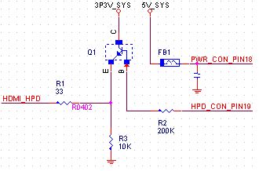

> HPD 
>
> Hot Plug Detection，热插拔检测


## 检测原理



如上图，当计算机通过HDMI接口与显示器相连接时，主机通过HDMI的第18脚（PWR_CON_PIN18）将＋5V电压加到显示器的DDC存储器（EDID数据存储器）向DDC存储器供电，确保即使显示器不开机，计算机主机也能通过HDMI接口读取EDID数据。 主机开机后产生 5V_SYS并通过第18脚向显示器供电，此时显示器接收到5V电压后通过内部电路使HDMI接口第19脚HPD转变为高电平，并驱动Q1使CE导通，致使HPD_GPU也转变为高电平，主机（显卡控制器）检测到HPD为高电平时，判断显示器通过HDMI与主机连接，并通过HDMI接口的第15、16脚 DDC通道（I2C）读取显示器中的EDID数据，并使主机显卡中的TMDS信号发送电路开始工作。 
当显示器与主机之间的HDMI连接断开时，主机一侧的HDP信号为低电平，主机显卡中的TMDS信号发送电路停止工作。


## 内核代码实现

### HDMI 插拔状态

```c
enum hdmi_hotpulg_status {
    /* HDMI is disconnected */
	HDMI_HPD_REMOVED = 0,
	/* HDMI is connected, but HDP is low or TMDS link is not pull up to 3.3V. */
    HDMI_HPD_INSERT,	
    /* HDMI is connected, all singnal is normal  */
	HDMI_HPD_ACTIVED	
};
```


5.6.2 Step A: Hot Plug Detection
The Hot Plug Detect information notifies the HDMI TX controller when the cable is plugged
into a Sink (Receiver) device and when the device is ready to receive video content.
The Hot-Plug Detection indication is a +5V signal on the HDMI cable. The HDMI TX PHY
performs level-shifting to a low-level digital signal.
For this step, registers are used on the HDMI TX PHY.
To check the Hot Plug Detect status, the following steps have to be followed:

1. Power-on the HDMI TX PHY HPD Detector. Write 1'b1 in the phy_conf0.enhpdrxsense bit
field register.
2. Check the HPD status bit.
3. Read the phy_stat0.HPD bit field register.
    ■ If HPD = 0, the Hot Plug signal is low (no Sink (Receiver) detected).
    ■ If HPD = 1, the Hot Plug signal is high (Sink (Receiver) detected).
    Note: Some receivers may turn off the Hot-Plug Detect indication when the HDMI input is not
    selected, even when the cable is plugged in.
    You can control this function by using the interrupt signal and proper registers from the
    HDMI transmitter with few operations. 