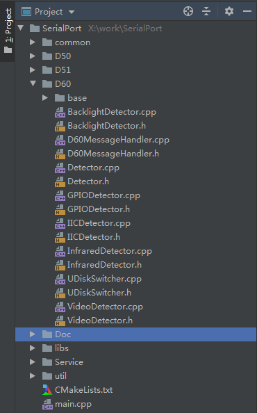
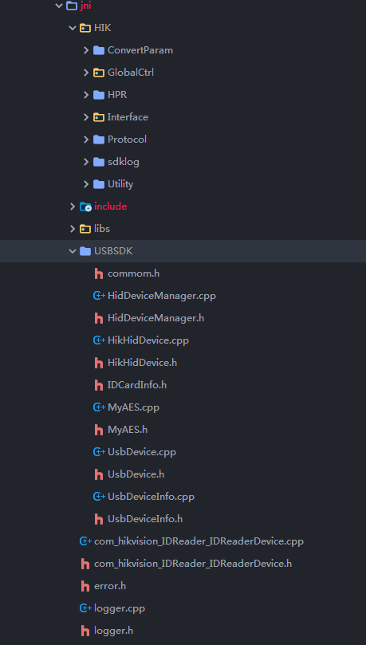
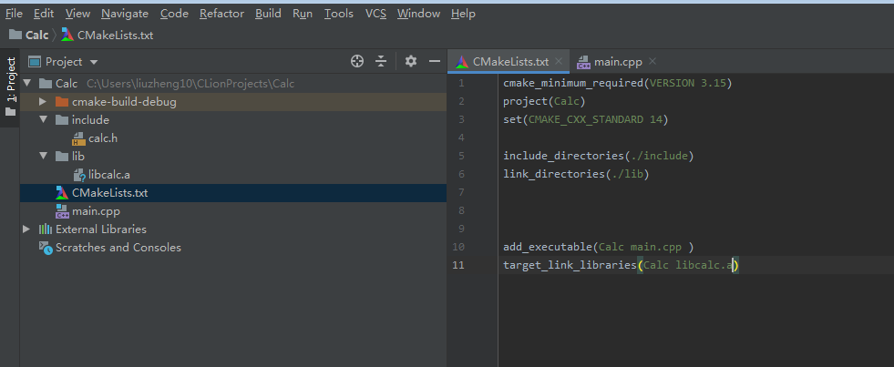

# CMake 简介

CMake是一款开源的、跨平台的工具，用于build、test 以及 打包软件。

其通过解析 独立于 平台和编译器的 配置文件(CMakeLists.txt)，生成一个基于本机编译环境的workspace以及Makefile。(对于linux通常就是生成Makefile文件；对于windows可以生成 基于 MSVC的makefile.vc文件，需要配合nmake使用)。

其使用流程如下：

1. 编写CMakeLists.txt

2. cmake  CMakeLists.txt

3. make && make install 

通常，我们会在项目路径下创建一个build目录，然后执行：

```shell
cd ./build
cmake ../CMakeLists.txt
make && make install
```

最终，生成的成果物以及中间文件都会在build目录下。如果直接在项目根目录下执行，会导致源码以及生成物混杂，造成目录结构混乱。

# CMake 语法

CMake支持变量定义以及流程控制。

## 变量

CMake中，创建一个变量的方式有很多种。如下为最常用的一种

```cmake
set(VAR [value] [CACHE TYPEDOCSTRING [FORCE]])
eg:
	set(a 1) # 创建一个 变量 a，值为 1， 如果a存在则只赋值，不存在则创建并赋初值。
```

其余的方式，在后面的**命令**章节再做说明。

另外，CMake中有许多预定义的变量。通过为预定义的变量赋值来构建正确的编译环境。下面的表格展示了常用的预定义变量以及其意义。

| 预定义变量名  | 意义 |
| ---- | ---- |
|   CMAKE_CXX_FLAGS   |   指定g++  flag信息，通常用于选定C++标准版本    |
| CMAKE_CXX_COMPILER | 用于指定c++编译工具链。交叉编译时用于指定工具链。 |
| CMAKE_CURRENT_SOURCE_DIR | 当前CMakeLists.txt所在的目录 |
| CMAKE_LIBRARY_OUTPUT_DIRECTORY | 设置生成的库文件输出的路径 |
|  |  |
|  |  |

系统信息预定义变量

| 预定义变量名           | 意义                                      |
| ---------------------- | ----------------------------------------- |
| CMAKE_MAJOR_VERSION    | cmake主版本号,如2.8.6中的2                |
| CMAKE_MINOR_VERSION    | cmake次版本号,如2.8.6中的8                |
| CMAKE_PATCH_VERSION    | cmake补丁等级,如2.8.6中的6                |
| CMAKE_SYSTEM           | 系统名称,例如Linux-2.6.22                 |
| CMAKE_SYSTEM_NAME      | 不包含版本的系统名,如Linux                |
| CMAKE_SYSTEM_VERSION   | 系统版本,如2.6.22                         |
| CMAKE_SYSTEM_PROCESSOR | 处理器名称,如 x86_64                      |
| UNIX                   | 在所有的类UNIX平台为TRUE,包括OS X和cygwin |
| WIN32                  | 在所有的win32平台为TRUE,包括cygwin        |

> 通过这些预定义变量，我们能够更好的编写跨平台的cmake脚本。

## 命令

1. `cmake_minimum_required`       Option

    该语句一般放在CMakeLists.txt的第一行，用于指定CMake的最低版本。其作用主要是当使用了高版本特性时，提示用户升级到支持新特性的版本。

    ```cmake
    cmake_minimum_required (VERSION 2.6)
    ```

2. `project`

    用于指定工程的名称。执行该指令后，cmake会自动创建两个变量:`<projectname>_BINARY_DIR`和`< projectname >_SOURCE_DIR`。生成的变量的默认值就是`CMAKE_CURRENT_SOURCE_DIR`。前者用于指定二进制文件保存路径，后者指定源代码路径。

    >  最终生成的可执行文件或库文件不一定是该名称。
    
    ```c++
    project(CMakeTest)
    ```
    
3. `set`

    在前面已经介绍过其使用方式。其作用是为已存在的变量赋值或者创建一个新的变量。

4. `include_directories`

    将指定目录加入编译器的头文件搜索路径中。最终指定目录将会被添加到gcc的`-I`参数后面。

    ```cmake
    include_directories([AFTER|BEFORE] [SYSTEM] dir1 [dir2 ...])
    eg:
    	include_directories(./include) #将当前目录下的include目录添加到编译器的头文件搜索路径中
    ```

    

5. `link_directories` 
    和`include_directories`类似，不过其用于指定链接器的搜索路径。最终指定目录会被添加到gcc的`-L`参数后面

  ```cmake
   link_directories(directory1 directory2 ...)
   eg:
   	link_directories(./libs) #将当前目录下的libs目录添加到Linker的搜索路径中。
  ```

6. `aux_source_directory`

    查找指定目录下的所有源文件，并将源文件列表存储到一个变量中。

    ```cmake
    aux_source_directory(<dir> <variable>)
    eg:
    	aux_source_directory(. SRC_LIST) #将当前目录下的所有源文件的路径列表存储在变量SRC_LIST中。
    ```

7. `add_executable`

    将指定的源文件编译生成一个可执行程序。

    ```cmake
    add_executable(<name> [WIN32] [MACOSX_BUNDLE]
                   [EXCLUDE_FROM_ALL]
                   source1 [source2 ...])
                   
    eg:
    	aux_source_directory(. SRC_LIST) 
    	add_executable(CMakeTest ${SRC_LIST})  # gcc SRC_LIST -o CMakeTest
    ```

8. `add_library`

    该命令通常用于生成静态库或动态库。

    ```cmake
    add_library(<name> [STATIC | SHARED | MODULE]
                [EXCLUDE_FROM_ALL]
                source1 [source2 ...])
    #<name> 指定库名称
    #STATIC 生成静态库
    #SHARED 生成动态库： 自动链接，运行时加载
    #MODULE 生成module， 通过dlopen加载
    
    eg:
    	aux_source_directory(. SRC_LIST)  
    	add_library(native-lib  SHARED ${SRC_LIST}) #会生成一个名为libnative-lib.so的动态库
    ```

9. `find_library`

    用于查找指定的库并将其路径保存到一个变量中。

    其查找顺序为:  

    - 指定的path

    - `CMAKE_LIBRARY_PATH`

        需要在系统环境变量中导入`CMAKE_LIBRARY_PATH`

    - 系统默认库。`/usr/lib` 、`/usr/local/lib`

    ```cmake
    find_library (<VAR> name1 [path1 path2 ...])
    
    eg:
    	find_library(log-lib log path) # 查找log库，并将其绝对路径保存到变量log-lib中。
    ```

10. `target_link_libraries`

    设置生成物需要link的库。

    ```cmake
    target_link_libraries(<target> ... <item>... ...)
    
    eg:
    	find_library(log-lib log path) 
    	target_link_libraries(CMakeTest ${log-lib}) #CMakeTest需要链接到log库。
    ```

此外，CMake还有很多命令，这里就不一一介绍，实际使用时，参考官方文档。

## 流程控制

1. 条件

    ```cmake
    if(expression)
      # then section.
      COMMAND1(ARGS ...)
      COMMAND2(ARGS ...)
      ...
    elseif(expression2)
      # elseif section.
      COMMAND1(ARGS ...)
      COMMAND2(ARGS ...)
      ...
    else(expression)
      # else section.
      COMMAND1(ARGS ...)
      COMMAND2(ARGS ...)
      ...
    endif(expression)
    ```
    
    | expression              | 意义                                                         |
    | ----------------------- | ------------------------------------------------------------ |
    | variable                | 当if命令参数的值不是：0、FALSE、OFF、NO、NOTFOUND、*-NOTFOUND、IGNORE时，表达式的值为真，注意不区分大小写variable可以不用${}包围 |
    | not  variable           | 上面取反.variable可以不用${}包围                             |
    | variable1 and variable2 | 逻辑与，所有逻辑操作支持用括号来提升优先级。 类似地，也有逻辑或 or |
    | num1 queal num2         | 数字相等比较，其它操作符包括less、greater                    |
    | str1 strequal str2      | 字典序相等比较，其它操作符包括strless、strgreater            |
    | exists file-name        | 如果指定的文件或者目录存在                                   |
    | ...                     | 还有好多，参考官方文档。                                     |
    
    
    
2. 循环

    ```cmake
    while(<condition>)
      <commands>
    endwhile()
    ```
    用的少。
    
3. foreach

    ```cmake
    foreach(<loop_var> <items>)
      <commands>
    endforeach()
    
    foreach(<loop_var> RANGE <stop>)
     <commands>
    endforeach()
    
    foreach(<loop_var> RANGE <start> <stop> [<step>])
     <commands>
    endforeach()
    ```

    示例:

    ```cmake
    #打印当前路径下的所有源文件信息
    aux_source_directory(. SRC_LIST)
    foreach(src_file ${SRC_LIST})
         message(STATUS ${src_file})
    endforeach()
    
    #范围语法
    foreach(var RANGE 10)
     message(STATUS ${var})
    endforeach()
    
    #范围步进语法
    foreach(var RANGE 0 100 10)
     message(STATUS ${var})
    endforeach()
    ```
# 示例

## 生成可执行文件

项目目录结构如下：



CMakeLists.txt：

```cmake
cmake_minimum_required(VERSION 2.8.4)  	#设置最小的cmake版本	
project(SerialPort)  					#设置项目名


set(CMAKE_CXX_FLAGS "-std=c++0x")  		#设置c++标准库版本
add_definitions(
        -DDSP
        -DMULTI_SCREEN_DEV
        -DZYNQ_DEV
        -DTEST
)										#添加宏定义
	

link_directories(libs)					#设置linker搜索目录
set(CMAKE_C_COMPILER arm-xilinx-linux-gnueabi-gcc)			# 指定交叉编译时gcc的版本
set(CMAKE_CXX_COMPILER arm-xilinx-linux-gnueabi-g++)		# 指定交叉编译时g++的版本

# 将不同目录下的源文件列表保存到不同的变量中
aux_source_directory(. SRC_LIST)
aux_source_directory(./D60 SRC_LIST1)
aux_source_directory(./D60/base SRC_LIST1_1)
aux_source_directory(./D50 SRC_LIST2)
aux_source_directory(./D51 SRC_LIST3)
aux_source_directory(./Service SRC_LIST4)
aux_source_directory(./util SRC_LIST5)
aux_source_directory(./common SRC_LIST6)

# 将源文件生成指定的可执行程序
add_executable(SerialPort ${SRC_LIST} ${SRC_LIST1}  ${SRC_LIST1_1} ${SRC_LIST2} ${SRC_LIST3} ${SRC_LIST4} ${SRC_LIST5} ${SRC_LIST6})

# 设置可执行程序依赖的动态库。该库命令必须在 add_executable之后。
target_link_libraries(SerialPort dadsp rt)

```


## 生成动态库

项目结构如图:



CMakeLists.txt:

```cmake
cmake_minimum_required(VERSION 3.4.1)
project(JniLib CXX)

#设置生成的so动态库最后输出的路径
set(CMAKE_LIBRARY_OUTPUT_DIRECTORY ${PROJECT_SOURCE_DIR}/src/main/jniLibs/${ANDROID_ABI})

include_directories(src/main/jni/include)  #设置编译器头文件搜索路径
link_directories(src/main/jni/libs)     
add_definitions (-Wno-format-security)  # 解决 [-Werror,-Wformat-security] 错误
file(GLOB SRC		
        src/main/jni/*.h
        src/main/jni/*.cpp
        src/main/jni/USBSDK/*.cpp
        src/main/jni/USBSDK/*.h
        src/main/jni/HIK/HPR/*.cpp
        src/main/jni/HIK/ConvertParam/*.cpp
        src/main/jni/HIK/GlobalCtrl/*.cpp
        src/main/jni/HIK/sdklog/*.cpp
        src/main/jni/HIK/Utility/*.cpp
        src/main/jni/HIK/Protocol/*.cpp
        ) #将源文件保存到指定变量
add_library(JniLib SHARED ${SRC})  #将源文件编译成动态库
target_link_libraries(JniLib usb1.0 log ssl crypto)  #link指定的库文件。
```


相应的，生成执行程序和库文件的不同点就是使用`add_library`还是`add_executable`。

生成静态库还是动态库的取决于`add_library`中的第二个参数是`STATIC`还是`SHARED`。


# 项目中导入第三方库

## 动态库

动态库导入比较简单，使用`link_directories`指定动态库目录后，在`target_link_libraries` 后加入需要link的库文件名称即可（去除lib前缀 以及 .so后缀）。

## 静态库

1. `link_directories` 静态库所在路径后，再在`target_link_libraries`中直接引用需要的静态库。

    


2. 使用`add_library`和`set_target_properties`来添加静态库

    ```cmake
    cmake_minimum_required(VERSION 3.4.1)
    
    include_directories(./include)
    
    
    
    add_library(
                 native-lib
    
                 SHARED
    
                 native-lib.cpp )
    
    
    #添加自己所需的静态库 库多的话，可以使用下面的方式添加
    add_library(calc    #库名字 去掉了 lib 与 .a
            STATIC   #必须的
            IMPORTED #必须的
            )
    set_target_properties(
            calc
            PROPERTIES IMPORTED_LOCATION
            ${CMAKE_CURRENT_SOURCE_DIR}/libs/libcalc.a #库在的路径，以cmakeList.txt所在的路径起
    )
    
    find_library(
                  log-lib
                  log )
    target_link_libraries( 
                           native-lib
                           ${log-lib}
                            calc
            )
    ```

    `set_target_properties`中指定静态库路径时，使用相对路径会导致导入失败，原因呢，不清楚。所以，最好使用绝对路径。

## Android Studio使用 CMake来管理Native代码

在建立好项目目录结构后，在项目路径下创建并编辑好CMakeLists.txt文件。

在模块的build.gradle文件中添加如下代码:

```shell
android {
	...
	defaultConfig {
		...
        externalNativeBuild {
        	cmake {
                abiFilters 'armeabi-v7a','arm64-v8a'	  #[2]
             }
         }	
	}
	...
	externalNativeBuild {
        cmake {
        	path file('CMakeLists.txt')    			 #[1] 
        }
    }
}
```

[1] 指定CMakeLists.txt的路径。这样，NDK可自动编译Native代码并生成库文件。同时可以对Native代码提供高亮以及跳转支持。

[2] 指定需要生成那几个平台的库文件。 默认情况下，cmake 会输出 4 种 ABI（"armeabi-v7a" , "arm64-v8a", "x86", "x86_64"）。根据项目需要，最小化abiFilters字段，可以缩短编译时间并且减少apk的文件大小。

