## 前言

在**内核工匠**这个公众号上看到了一篇关于binder的文章，觉得写得不错，剖析得挺全面的。复制总结一下。

## 什么是Binder

Binder是android platform上的一种 IPC Framework。其整体框架如下:

Binder渗透到了安卓系统的各个软件层次：在应用层，利用Framework中的binder Java接口，开发者可以方便的申请系统服务提供的服务、实现自定义Service组件并开放给其他模块等。由于Native层的binder库使用的是C++，因此安卓框架中的Binder模块会通过JNI接口进入C/C++世界。在最底层，Linux内核提供了binder驱动，完成进程间通信的功能。

Binder对安卓非常重要，绝大多数的进程通信都是通过Binder完成。Binder采用了C/S的通信形式：

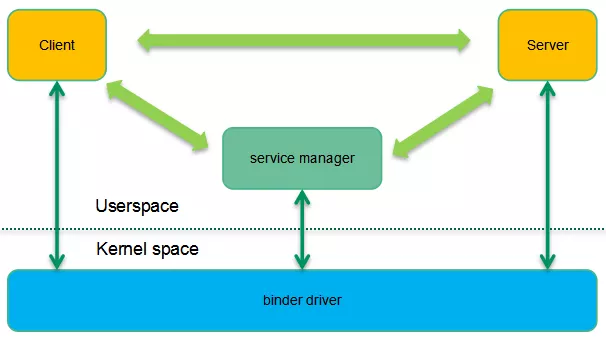

从进程角度看，参与Binder通信的实体有三个：

1. Binder Client
2. Binder Server
3. Service Manager

Binder Server中的service组件对外提供服务，所以其需要向Service Manager注册自己。

Binder Clinet需要Binder Server的service时，需要通过Service Manager去查询，并获取到Service的Handle。

它们之间的通信就是通过Binder Driver完成的。

## 为什么是Binder

安卓应用程序开发是基于组件的，也就是说通过四大组件（Activity、Service、Broadcast Receiver和Content Provider），开发者可以象搭积木一样的轻松开发应用程序，而无需关心底层实现。然而安卓这种面向对象的应用框架环境却是基于传统的Linux内核构建的，这使得安卓在进程间通信方面遇到了新的挑战，这也就是为何谷歌摒弃了传统的内核IPC机制（管道、命名管道、domain socket、UDP/TCP socket、system V IPC，share memory等），建立了全新的binder通信形式。

### Android 需要一个IPC 框架

为了提高软件生产效率，安卓的应用框架希望能够模糊进程边界，即在A组件调用B组件的方法的时候，程序员不需要考虑是否跨进程。即便是在不同的进程中，对B组件的服务调用仍然象本地函数调用一样简单。传统Linux内核的IPC机制是无法满足这个需求的，安卓需要一个复杂的IPC framework能够支持线程池管理、自动跟踪引用计数等有挑战性的任务。

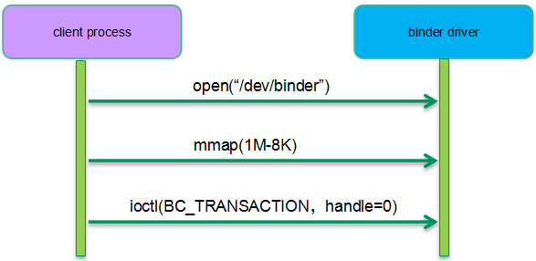

当然，基于目前Linux内核的IPC机制，也可以构建复杂的IPC framework，不过传统的内核IPC机制并没有考虑面向对象的应用框架，因此很多地方实现起来有些水土不服。上图给了一个简单的例子：在一个地址空间中跟踪对象的引用计数非常简单，可以在该对象内部构建一个引用计数，每当有本进程对象引用service组件对象的时候，引用计数加一，不再引用的时候减一，没有任何对象引用service组件对象的时候，该对象可以被销毁。不过，当引用该service组件的代理对象来自其他进程空间（例如binder client的组件代理对象）的时候，事情就不那么简单了，这需要一个复杂的IPC framework来小心的维护组件对象的引用计数，否则在server端销毁了一个组件对象，而实际上有可能在client端还在远程调度该service组件提供的服务。

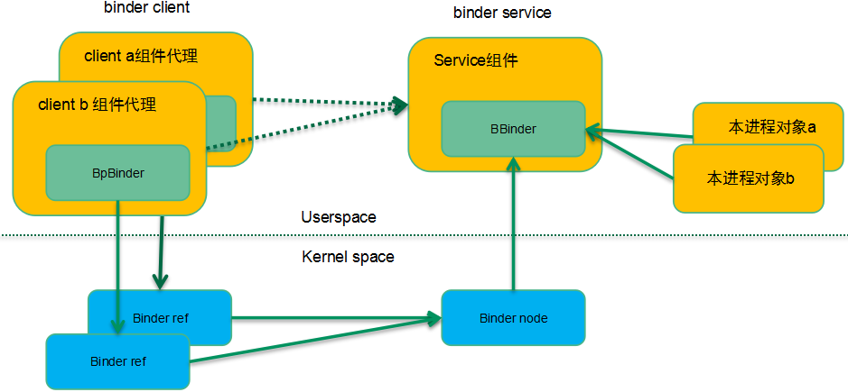

为了解决这个问题，binder驱动构建了binder ref和binder node数据对象，分别对应到上层软件中的service组件代理和service组件对象，同时也设计了相应的binder通信协议来维护引用计数，解决了传统的IPC机制很难解决的跨进程对象生命周期问题。

### Android需要的是高效IPC机制

我们再看一下性能方面的需求：由于整个安卓系统的进程间通信量比较大，我们希望能有一个性能卓越的IPC机制。大部分传统IPC机制都需要两次拷贝容易产生性能问题。而binder只进行了一次拷贝，性能优于大部分的传统IPC机制，除了share memory。当然，从内存拷贝的角度看，share memory优于binder，但实际上如果基于share memory设计安卓的IPC framework，那么还是需要构建复杂的同步机制，这也会抵消share memory部分零拷贝带来性能优势，因此Binder并没有选择共享内存方案，而是在简单和性能之间进行了平衡。在binder机制下，具体的内存拷贝如下图所示：

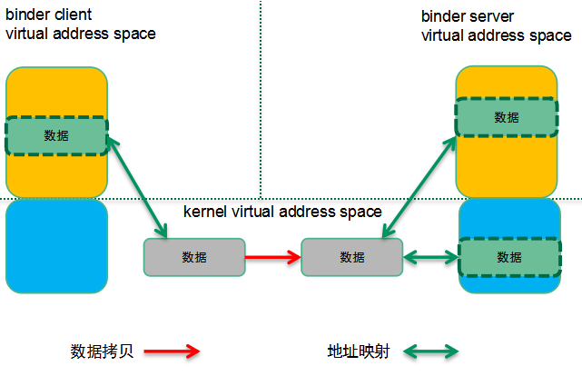

binder server会有专门二段用于binder通信的虚拟内存区间，一段在内核态，一段在用户空间。这两段虚拟地址空间映射到同样的物理地址上，当拷贝数据到binder server的内核态地址空间，实际上用户态也就可以直接访问了。当Binder client要把一个数据块传递到binder server（通过binder transaction）的时候，实际上会在binder server的内核虚拟地址空间中分配一块内存，并把binder client的用户地址空间的数据拷贝到binder server的内核空间。因为binder server的binder内存区域被同时映射到用户空间和内核空间，因此就可以省略一次数据考虑，提高了性能。

并不是说安卓不使用共享内存机制，实际上当进程之间要传递大量的数据的时候（例如APP的图形数据要传递到surfaceflinger进行实际的显示）还是使用了share memory机制（Ashmem）。安卓使用文件描述符来标示一块匿名共享内存，binder机制可以把文件描述符从一个进程传递到另外的进程，完成文件的共享。一个简单的示意图如下：

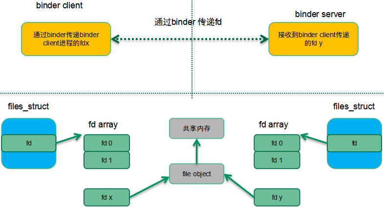

在上图中，binder client传递了fdx（binder client有效的描述符）到binder server，实际上binder驱动会通过既有的内核找到对应的file object对象，然后在binder server端找到一个空闲的fd y（binder server进程有效），让其和binder client指向同一个对象。这个binder client传递了fd x到binder server，在server端变成fd y并实现了和client进程中fd x指向同一个文件的目标。而传统的IPC机制（除了socket）没有这种机制。

### Android需要稳定的IPC机制

数据传输形态（非共享内存）的IPC机制有两种形态：byte stream和message-based。如果使用字节流形态的方式（例如PIPE或者socket），那么对于reader一侧，我们需要在内核构建一个ring buffer，把writer写入的数据拷贝到reader的这个环形缓冲区。而在reader一侧的，如何管理这个ring buffer是一个头疼的事情。因此binder采用了message-based的形态，并形成了如下的缓冲区管理方式：

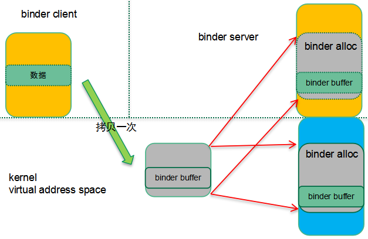

需要进行Binder通信的两个进程传递结构化的message数据，根据message的大小在内核分配同样大小的binder缓冲区（从binder内存区中分配，内核用binder alloc对象来抽象），并完成用户空间到内核空间的拷贝。Binder server在用户态的程序直接可以访问到binder buffer中的message数据。

从内存管理的角度来看，这样的方案是一个稳定性比较高的方案。每个进程可以使用的binder内存是有限制的，一个进程不能使用超过1M的内存，杜绝了恶意APP无限制的通过IPC使用内存资源。此外，如果撰写APP的工程师不那么谨慎，有些传统的Linux IPC机制容易导致内存泄露，从而导致系统稳定性问题。同样的，如果对通信中的异常（例如server进程被杀掉）没有有良好的处理机制，也会造成稳定性问题。Binder通信机制提供了death-notification机制，优雅的处理了通信两端异常退出的异常，增强了系统的稳定性。

### Android 需要安全的IPC机制

从安全性（以及稳定性）的角度，各个安卓应用在自己的sandbox中运行并用一个系统唯一的id来标示该应用（uid）。由于APP和系统服务进程是完全隔离的，安卓设计了transaction-based的进程间通信机制：binder，APP通过binder请求系统服务。由于binder driver隔离了通信的两段进程。因此实际上在binder driver中是最好的一个嵌入安全检查的地方，具体可以参考下面的安全检查机制示意图：

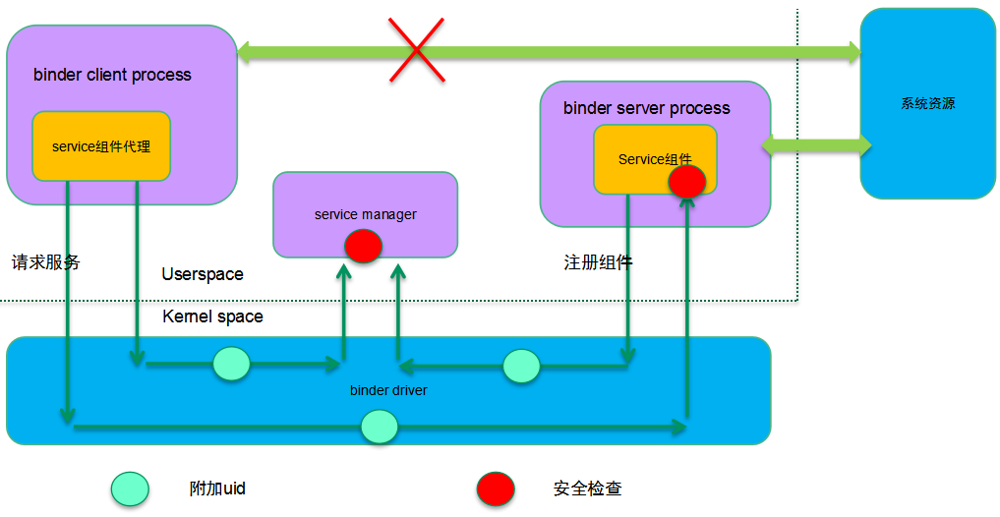

安卓是一个开放的系统，因此安全性显得尤为重要。在安卓世界，uid用来标示一个应用，在内核（而非用户空间）中附加UID/PID标识并在具体提供服务的进程端进行安全检查，主要体现在下面两个方面：

1. 系统提供了唯一的上下文管理者：service manager并且只有信任的uid才能注册service组件。
2. 系统把特定的资源权限赋权给Binder server（service组件绑定的进程），当binder client请求服务的时候对uid进行安全检查。

传统的IPC机制在内核态并不支持uid/pid的识别，通过上层的通信协议增加发起端的id并不安全，而且传统的IPC机制没有安全检查机制，这种情况下任何人都可以撰写恶意APP并通过IPC访问系统服务，获取用户隐私数据。

解决了what和why之后，我们后续的章节将主要讲述binder的软件框架和通信框架，在了解了蓝图之后，我们再深入到binder是如何在各种场景下工作的。随着binder场景解析，我们也顺便描述了binder驱动中的主要数据结构。

## Binder软件框架和通信框架

### 软件架构

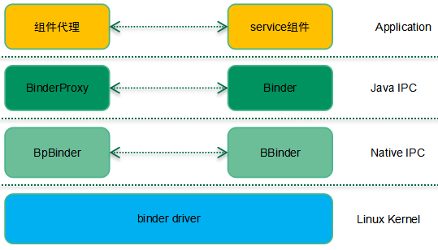

所有的通信协议都是分层的，binder也不例外，只不过简单一些。Binder通信主要有三层：应用层，IPC层，内核层。如果使用Java写应用，那么IPC层次要更丰富一些，需要通过Java layer、jni和Native IPC layer完成所有的IPC通信过程。如果使用C++在Native层写应用，那么基本上BpBinder和BBinder这样的Native IPC机制就足够了，这时候，软件结构退化成（后续我们基本上是基于这个软件结构描述）：

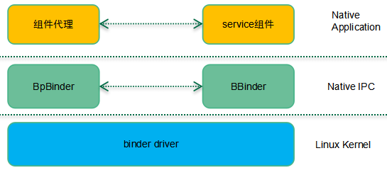

对于应用层而言，互相通信的实体交互的是类似start activity、add service这样的应用相关的协议数据，通信双方并不知道底层实现，感觉它们之间是直接通信似得。而实际上，应用层数据是通过Native IPC层、kerenl层的封装，解析，映射完成了最后的通信过程。在Native IPC层，BpBinder和BBinder之间通信之间的封包有自己的格式，IPC header会标记通信的起点和终点（binder ref或者binder node）、通信类型等信息，而应用层数据只是IPC层的payload。同样的，表面上是BpBinder和BBinder两个实体在交互IPC数据，实际上需要底层binder driver提供通信支持。

### 通信框架

分别位于binder client和server中的应用层实体进行数据交互的过程交过transaction，当然，为了保证binder transaction能够正确、稳定的完成，binder代理实体、binder实体以及binder driver之间需要进行非常复杂的操作，因此，binder通信定义了若干的通信协议码，下面表格列出了几个常用的binder实体或者binder代理实体发向binder driver的通信协议码：

| Binder Command Code | Desc |
| ---- | ---- |
| `BC_TRANSACTION` | Binder 代理实体请求数据通信服务 |
| `BC_REPLY` | Binder实体完成了服务请求后的回应 |
| `BC_INCREFS` | 管理binder ref的引用计数 |
| `BC_DECREFS` | 管理binder ref的引用计数 |
| ... | .... |

下面的表格列出了几个常用的binder driver发向binder实体或者binder代理实体的通信协议码：

| Binder Response Code      | Desc                                                         |
| ------------------------- | ------------------------------------------------------------ |
| `BR_TRANSACTION`          | Binder driver收到transaction请求，将其转发给binder实体对象   |
| `BR_REPLY`                | Binder driver通知binder代理实体，server端已经完成服务请求，返回结果。 |
| `BR_TRANSACTION_COMPLETE` | Binder driver通知binder代理实体，它发出的transaction请求已经收到。或者，Binder driver通知binder实体，它发出的transaction reply已经收到。 |
| ...                       | ...                                                          |

Binder通信的形态很多种，有些只涉及binder server中的实体对象和binder driver的交互。例如：`BC_REGISTER_LOOPER`。不过使用最多、过程最复杂的还是传递应用数据的binder transaction过程，具体如下：

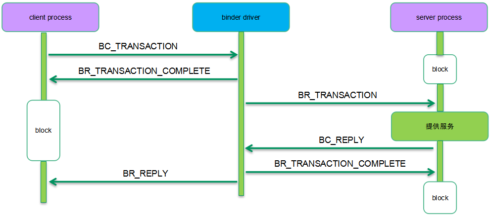

Binder client和server之间的进程间通信实际上是通过binder driver中转的。在这样的通信框架中，client/server向binder driver发送transaction/reply是直接通过ioctl完成的，而相反的方向，binder driver向client/server发送的transaction/reply则有些复杂，毕竟在用户空间的client/server不可能不断的轮询接收数据。正因为如此，在binder通信中有了binder work的概念，具体的方式如下：

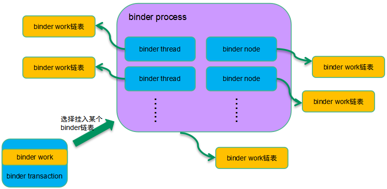

对于binder transaction这个场景，Binder work对象是嵌入在transaction对象内的，binder driver在把transaction（服务请求）送达到target的时候需要做两个动作：

1. 选择一个合适的binder work链表把本transaction相关的work挂入链表。
2. 唤醒target process或者target thread

对于异步binder通信，work是挂入binder node对应的work链表。如果是同步binder通信，那么要看是否能够找到空闲的binder thread，如果找到那么挂入线程的work todo list，否则挂入binder process的链表。

### 应用层通信数据格式

本身应用层的数据应该是通信两端的实体自己的事情，不过由于需要交互binder实体对象信息，因此这里也简单描述其数据格式，如下：

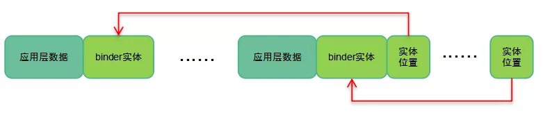

Binder Client和server之间通信的基本单元是应用层的数据+相关的binder实体对象数据，这个基本的单元可以是1个或者多个。为了区分开各个基本的单元，在应用层数据缓冲区的尾部有一个数组保存了各个binder实体对象的位置。每一个binder实体用`flat_binder_object`来抽象，主要的成员包括：

| member                  | desc                                                         |
| ----------------------- | :----------------------------------------------------------- |
| `header`                | 说明该binder实体的类型，可能的类型包括：1. 本地binder实体对象 2. 远端binder实体对象（handle)。 3.文件描述符。 |
| binder_uintptr_t binder | 描述本地binder实体对象                                       |
| __u32 handle            | 描述远端binder实体对象                                       |
| binder_uintptr_t cookie | 描述本地binder实体对象                                       |

我们这里可以举一个简单的例子：假设我们写了一个APP，实现了一个xxx服务组件，在向service manager注册的时候就需要发起一次transaction，这时候缓冲区的数据就包括了上面图片中的应用层数据和一个xxx服务组件对应的binder实体对象。这时候应用层数据中会包括“xxx service”这样的字符串信息，这是方便其他client可以通过这个字符串来寻址到本service组件必须要的信息。除了应用层数据之外，还需要传递xxx service组件对应的binder实体。上面的例子说的是注册service组件的场景，因此传递的是本地binder实体对象。如果场景切换成client端申请服务的场景，这时候没有本地对象，因此需要传递的是远端的binder实体对象，即`handle`。因此`flat_binder_object`描述的是transaction相关的binder实体对象，可能是本地的，也可能是远端的。

### Binder 帧数据格式

Binder IPC层的数据格式如下：

Binder IPC层看到的帧数据单元是协议码+协议码数据，一个完整的帧数据是由一个或者多个帧数据单元组成。协议码区域就是上文中描述的BC_XXX和BR_XXX，不同的协议码有不同的协议码数据，同样的我们采用binder transaction为例说明协议码数据区域。BR_TRANSACTION、BR_REPLY、BC_TRANSACTION和BC_REPLY这四个协议码的数据都是binder_transaction_data，和应用层的数据关系如下：

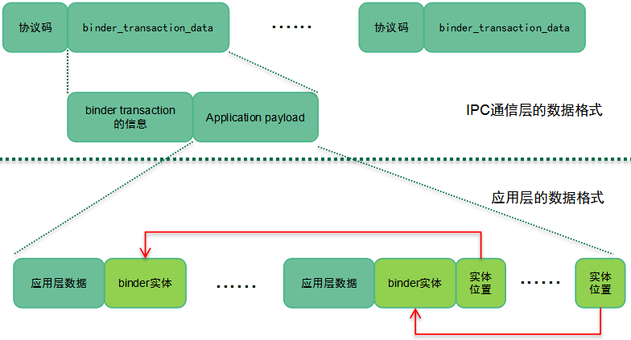

Binder transaction信息包括：本次通信的目的地、sender pid和uid等通用信息，此外还有一些成员描述应用层的数据buffer信息，具体大家可以参考源代码。顺便提一句的是这里的sender pid和uid都是内核态的binder driver附加的，用户态的程序无法自己标记，从而保证了通信的安全性。