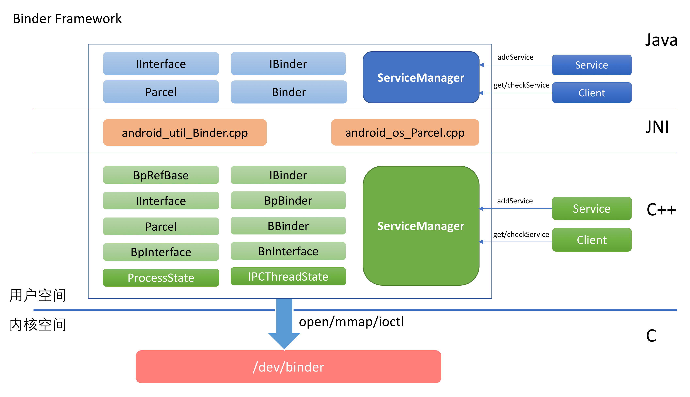

## 什么是Binder
Binder是Android系统中大量使用的IPC机制。无论是Application对service的request，还是service自身对外提供服务，都需要使用到Binder。

在Linux环境中，传统的IPC机制包括：
- 管道
- 消息队列
- 共享内存
- 信号量
- 套接字
等。

Binder相对于这些传统IPC的优势在于：
1. 性能：管道，消息队列，套接字都需要两次数据拷贝，而Binder只需要一次。共享内存是个例外，但是其安全性不及Binder
2. 安全：传统IPC形式，无法得到对方的身份标识（UID/GID)，而在使用Binder IPC时，这些身份标示是跟随调用过程而自动传递的。Server端很容易就可以知道Client端的身份，非常便于做安全检查
3. Binder本身是C/S架构的，这一点更符合Android系统的架构

## Binder的架构
Binder整体架构如下所示：
