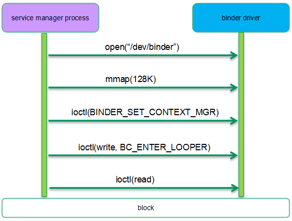
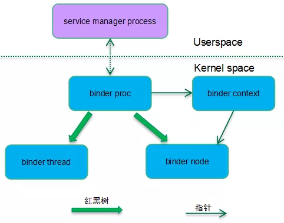

[原文链接](https://mp.weixin.qq.com/s/IAXYGUhy6IPVGA1uQrd_oQ)

通过几个典型的binder通信过程来呈现其实现细节。

## 流程
Service Manager 和 Binder驱动的交互如下：



Android启动过程中，Init进程会启动Service Manager进程。Service Manager 打开`/dev/binder`设备节点 ，此时，Binder驱动会创建一个`binder_proc`对象来管理Service Manager 进程相关的Binder资源(`binder_ref`、`binder_node`、`binder_thread`等)。为了方便Binder内存管理，还需要`mmap`128K的内存空间用于Binder通信。随后，Service Manager会把自己设置为Context Manager。然后通过`BC_ENTER_LOOPER`告知驱动自己已经准备好接收请求了。最后Service Manager就会进入到阻塞读的状态，来等待其他进程的请求。

完成上面的一系列操作之后，内核相关的数据结构如下所示：



由于Service manager也算是一个特殊的service组件，因此在内核态也有一个`binder_node`对象与之对应。service manager和其他的service组件不同的是它没有使用线程池模型，而是一个单线程的进程，因此它在内核态只有一个`binder_proc`和`binder_thread`。整个系统系统只有一个binder context，系统中所有的`binder_proc`都指向这个全局唯一的binder上下文对象。而找到了binder context也就找到了service manager对应的`binder_node`。

`binder_proc`使用了红黑树来管理其所属的binder thread和binder node，不过在Service manager这个场景中，binder proc只管理了一个binder thread和binder node，看起来似乎有些小题大做，不过在其他场景（例如system server）中，`binder_proc`会创建线程池，也可能注册多个service组件。


## 相关数据结构

### binder_proc

在内核中，每一个参与binder通信的进程都会用一个唯一的`binder_proc`对象来表示。其定义如下:

```c++

struct binder_proc {
	struct hlist_node proc_node; //挂载到 binder_procs 链表中，整个系统所有的binder_proc都会挂载到这里
	struct rb_root threads;		// 当前binder_proc的 binder_thread都挂载到这, tid 作为Key
	/*
	 * 一个binder进程可以注册多个service，所以一个binder_proc可以由有多个binder_node。
	 * 这些binder_node组成一颗红黑树。对于service manager而言，其只有一个binder_node。
	 */
	struct rb_root nodes;		
	struct rb_root refs_by_desc;	
	struct rb_root refs_by_node;
	struct list_head waiting_threads;	//当前binder_proc的空闲 binder_thread 都挂载到这

	struct list_head todo;				//需要该binder进程处理的 binder_work链表
	int max_threads;					//线程池中运行线程的最大数目
	struct binder_alloc alloc;			//管理binder内存分配的数据结构。
	struct binder_context *context;		//保存binder上下文管理者的信息。通过binder_context可以找到service manager对应的bind node。
    ...
};
```

和进程抽象类似，`binder_proc`也是管理binder资源的实体，但是真正执行binder通信的实体是`binder_thread`。`struct binder_thread`主要成员如下表所示：

```c++
struct binder_thread { 
	struct binder_proc *proc;   //binder process for this thread
	struct rb_node rb_node;		//element for proc->threads rbtree. 对应 binder_proc->threads
	struct list_head waiting_thread_node;	//element for @proc->waiting_threads list。 idle 时挂载
	int pid;								//thread id
	int looper;              				/* only modified by this thread */
	bool looper_need_return;				 /* can be written by other thread */
	struct binder_transaction *transaction_stack;	//binder_thread正在处理的 transaction
	struct list_head todo;							// list of work to do for this thread
	...
};
```

`binder_node`是用户空间service组件对象的内核态实体对象，`struct binder_node`主要成员如下表所示：

```c++
struct binder_node 
	struct binder_work work;
	union {
		struct rb_node rb_node;			//element for proc->nodes tree
		struct hlist_node dead_node;
	};
	struct binder_proc *proc;			//binder_proc that owns this node
	/**
	 *	list of references on this node
	 * 一个service组件可能会有多个client发情请求。每个client对binder_node都是一次
	 * 引用。这些引用都会记录在这个哈希表中。
	 */
	struct hlist_head refs;			
	//ptr 和 cookie 指向用户控件service组件的信息
	binder_uintptr_t ptr;
	binder_uintptr_t cookie;
	struct {
		/*
		 * invariant after initialization
		 */
		u8 sched_policy:2;
		u8 inherit_rt:1;
		u8 accept_fds:1;
		u8 min_priority;
	};	//这些属性定义了该service组件在处理transaction的时候优先级的设定。
	bool has_async_transaction; //是否有异步通信需要处理
	struct list_head async_todo;	//异步binder通信的队列
	...
};
```

