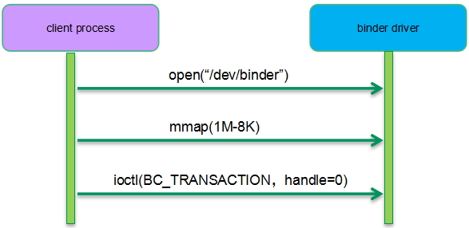

[原文链接](https://mp.weixin.qq.com/s/IAXYGUhy6IPVGA1uQrd_oQ)

通过几个典型的binder通信过程来呈现其实现细节。

## 启动service manager
### 流程
Service Manager 和 Binder驱动的交互如下：


Android启动过程中，Init进程会启动Service Manager进程。Service Manager 打开`/dev/binder`设备节点 ，此时，Binder驱动会创建一个`binder_proc`对象来管理Service Manager 进程相关的Binder资源(`binder_ref`、`binder_node`、`binder_thread`等)。为了方便Binder内存管理，还需要`mmap`128K的内存空间用于Binder通信。随后，Service Manager会把自己设置为Context Manager。然后通过`BC_ENTER_LOOPER`告知驱动自己已经准备好接收请求了。最后Service Manager就会进入到阻塞读的状态，来等待其他进程的请求。

完成上面的一系列操作之后，内核相关的数据结构如下所示：


由于Service manager也算是一个特殊的service组件，因此在内核态也有一个`binder_node`对象与之对应。service manager和其他的service组件不同的是它没有使用线程池模型，而是一个单线程的进程，因此它在内核态只有一个`binder_proc`和`binder_thread`。整个系统系统只有一个binder context，系统中所有的`binder_proc`都指向这个全局唯一的binder上下文对象。而找到了binder context也就找到了service manager对应的`binder_node`。

`binder_proc`使用了红黑树来管理其所属的binder thread和binder node，不过在Service manager这个场景中，binder proc只管理了一个binder thread和binder node，看起来似乎有些小题大做，不过在其他场景（例如system server）中，`binder_proc`会创建线程池，也可能注册多个service组件。


### 相关数据结构

#### binder_proc

在内核中，每一个参与binder通信的进程都会用一个唯一的`binder_proc`对象来表示。其定义如下:

```c++

struct binder_proc {
	struct hlist_node proc_node; //挂载到 binder_procs 链表中，整个系统所有的binder_proc都会挂载到这里
	struct rb_root threads;		// 当前binder_proc的 binder_thread都挂载到这, tid 作为Key
	/*
	 * 一个binder进程可以注册多个service，所以一个binder_proc可以由有多个binder_node。
	 * 这些binder_node组成一颗红黑树。对于service manager而言，其只有一个binder_node。
	 */
	struct rb_root nodes;		
	struct rb_root refs_by_desc;	
	struct rb_root refs_by_node;
	struct list_head waiting_threads;	//当前binder_proc的空闲 binder_thread 都挂载到这

	struct list_head todo;				//需要该binder进程处理的 binder_work链表
	int max_threads;					//线程池中运行线程的最大数目
	struct binder_alloc alloc;			//管理binder内存分配的数据结构。
	struct binder_context *context;		//保存binder上下文管理者的信息。通过binder_context可以找到service manager对应的bind node。
    ...
};
```

#### binder_thead

和进程抽象类似，`binder_proc`也是管理binder资源的实体，但是真正执行binder通信的实体是`binder_thread`。`struct binder_thread`主要成员如下表所示：

```c++
struct binder_thread { 
	struct binder_proc *proc;   //binder process for this thread
	struct rb_node rb_node;		//element for proc->threads rbtree. 对应 binder_proc->threads
	struct list_head waiting_thread_node;	//element for @proc->waiting_threads list。 idle 时挂载
	int pid;								//thread id
	int looper;              				/* only modified by this thread */
	bool looper_need_return;				 /* can be written by other thread */
	struct binder_transaction *transaction_stack;	//binder_thread正在处理的 transaction
	struct list_head todo;							// list of work to do for this thread
	...
};
```

#### binder_node

`binder_node`是用户空间service组件对象的内核态实体对象，`struct binder_node`主要成员如下表所示：

```c++
struct binder_node 
	struct binder_work work;
	union {
		struct rb_node rb_node;			//element for proc->nodes tree
		struct hlist_node dead_node;
	};
	struct binder_proc *proc;			//binder_proc that owns this node
	/**
	 *	list of references on this node
	 * 一个service组件可能会有多个client发情请求。每个client对binder_node都是一次
	 * 引用。这些引用都会记录在这个哈希表中。
	 */
	struct hlist_head refs;			
	//ptr 和 cookie 指向用户控件service组件的信息
	binder_uintptr_t ptr;
	binder_uintptr_t cookie;
	struct {
		/*
		 * invariant after initialization
		 */
		u8 sched_policy:2;
		u8 inherit_rt:1;
		u8 accept_fds:1;
		u8 min_priority;
	};	//这些属性定义了该service组件在处理transaction的时候优先级的设定。
	bool has_async_transaction; //是否有异步通信需要处理
	struct list_head async_todo;	//异步binder通信的队列
	...
};
```

## Client如何找到Service Manager

### 流程

为了完成Service组件的注册，client需要获取到service manager组件。在client这个binder进程中，我们使用handle来标记service组件。Service Manager比较特殊，对于任何一个Binder进程而言，handle为0都是表示标志service mananger。对于binder驱动而言，寻找Service Manager实际上就是寻找其对应的binder node。下面是一个binder client向service manager请求注册服务的过程示例，我们重点关注binder驱动如何定位service manager：



client首先需要打开binder驱动，内核会创建该进程对应的`binder_proc`对象，并建立`binder_proc`和`binder_context`的关系（这样通过`binder_proc`就能直接获取到service manager对应的`binder_node`）。随后，client会调用`mmap`映射(1M - 8K)的binder内存空间。之所以映射这么怪异的内存size主要是为了有效的利用虚拟地址空间（VMA之间有4K的gap）。完成上面两步操作之后，client process就可以通过`ioctl`向service manager发起transaction请求了，同时告知目标对象handle等于0。

实际上这个阶段的主要工作还是在用户空间，主要是service mananger组件代理`BpServiceManager`以及`BpBinder`的创建过程。一般的通信过程需要为组件代理对象分配一个句柄，但是service manager访问比较特殊，对于每一个进程，等于0的句柄都保留给了service manager，因此这里就不需要分配句柄这个过程了。


### 路由过程

在Binder C/S通信结构中，client 中的 `BpBinder`找到Binder Server中的`BBinder`过程如下：

1. client用户空间中的service组件代理`BpBinder`用handle表示要访问的Server中的service组件(`BBinder`);
2. 对于每一个handle，client内核空间都是用`binde_ref`与之对应。
3. `binder_ref`指向一个`binder_node`对象
4. `binder_node`对象对应一个binder server进程的service组件

在我们这个场景中，`binder_ref`是在client第一次通过`ioctl`和binder驱动交互时候完成的。这时候，binder驱动的`binder_ioctl`函数中会建立上面路由过程需要的完整的数据对象：


Service manager的路由比较特殊，没有采用`binder_ref`--->`binder_node`的过程。在binder驱动中，看到0号句柄自然就知道是去往service manager的请求。因此，通过`binder_proc`--->`binder_context`---->`binder_node`这条路径就找到了service manager。


## 注册service组件

### 流程

上一节描述了client如何找到service manager的过程，这是整个注册service组件的前半部分，这一节我们补全整个流程。由于client和service manager都完成了`open`和`mmap`的过程，双方都准备好，后续可以通过`ioctl`进行binder transaction的通信过程了，因此下面的流程图主要呈现binder transaction的流程（忽略client/server和binder驱动系统调用的细节）：


Service manager是一个service组件管理中心，任何一个service组件都需要向service manager进行注册（add service），以便其他的APP可以通过service manager定位到该service组件（check service）。


### 数据对象综述

注册服务相关数据结构全图如下：


配合上面的流程，binder驱动会为client和server分别创建对应的各种数据结构对象，具体过程如下：

1. 假设我们现在准备注册A服务组件，绑定A服务组件的进程在add service这个场景下是client process，它在用户空间首先会创建了service组件对象，在递交BC_TRANSACTION的时候会携带service组件的信息（把service组件地址信息封装在flat_binder_object数据结构中）。

2. 在系统调用接口层面，我们使用`ioctl`（`BINDER_WRITE_READ`）来完成具体transaction的递交过程。具体的transaction数据封装在`struct binder_write_read`对象中，具体如下图所示：

    

3. Binder驱动创建`binder_transaction`对象来控制完成本次binder transaction。首先要初始化transaction，具体包括：和谁通信（用户空间通过`binder_transaction_data`的`targe`t成员告知binder驱动transaction的target）、为何通信（`binder_transaction_data`的`code`）等

4. 对于每一个service组件，内核都会创建一个`binder_node`与之对应。用户空间通过`flat_binder_object`这个数据结构把本次要注册的service组件扁平化，传递给binder驱动。驱动根据这个`flat_binder_object`创建并初始化了该service组件对应的`binder_node`。由于是注册到service manager，也就是说service manager会有一个对本次注册组件的引用，所以需要在target proc（即service manager）中建立一个binder ref对象（指向这个要注册的binder实体）并分配一个handle。

5. 把一个`BINDER_WORK_TRANSACTION_COMPLETE`类型的`binder_work`挂入client `binder_thread`的todo list，通知client其请求的transaction已经被binder处理完毕，可以进行其他工作了（当然对于同步binder通信，client一般会通过read类型的`ioctl`进入阻塞态，等待server端的回应）。

6. 至此，client端已经完成了所有操作，现在我们开始进入server端的数据流了。Binder驱动会把一个`BINDER_WORK_TRANSACTION`类型的`binder_work`（内嵌在binder transaction）挂入binder线程的todo list，然后唤醒它起来干活。

    

7. binder server端会使用`ioctl`（`BINDER_WRITE_READ`）进入读阻塞状态，等待client的请求到来。一旦有请求到来，Service manager进程会从`binder_thread_read`中醒来处理队列上的`binder_work`。所谓处理`binder_work`其实完成client transaction的向上递交过程。具体的transaction数据封装在`struct binder_write_read`对象中，具体如下图所示：

    

    需要强调的一点是：在步骤2中，`flat_binder_object`传递的是`binder_node`，而这里传递的是handle（即`binder_ref`，步骤4中创建的）

8. 在Service manager进程的用户态，识别了本次transaction的code是add service，那么它会把（service name，handle）数据写入其数据库，完成服务注册。

9. 从transaction的角度看，上半场已经完成。现在开始下半场的transaction的处理，即`BC_REPLY`的处理。和`BC_TRANSACTION`处理类似，也是通过`binder_ioctl` --->` binder_ioctl_write_read` ---> `binder_thread_write` ---> `binder_transactio`n这个调用链条进入`binder_transaction`处理流程的。

10. 和上半场类似，在这里Binder驱动同样会创建一个`binder_transaction`对象来控制完成本次`BC_REPLY的binder transaction。通过`thread->transaction_stack`可以找到其对应的`BC_TRANSACTION`的binder transaction对象，进而找到回应给哪一个binder process和thread。后续的处理和上半场类似，这里就不再赘述了。


### 相关数据结构

1. `binder_transaction`

    ```c++
    /**
      * 表示client 和 server 之间的一次通信
      */
    struct binder_transaction {
    	int debug_id;
    	//本次transaction涉及的binder_work, 他会挂入target proc 或者 tartget thread 的 todo list中
    	struct binder_work work;   	
    	struct binder_thread *from;				//发起binder通信的线程
    	struct binder_transaction *from_parent; 
    	struct binder_proc *to_proc;			//处理binder请求的进程
    	struct binder_thread *to_thread;		//处理binder请求的线程
    	struct binder_transaction *to_parent;	
    	unsigned need_reply:1;	
    	/* unsigned is_dead:1; */	/* not used at the moment */
    	//A->B通信时，B进程分配Buffer，并copyA的数据到buffer中，这就是那唯一的一次内存拷贝
    	struct binder_buffer *buffer;
    	unsigned int	code;		//操作码 
    	unsigned int	flags;
    	struct binder_priority	priority;
    	struct binder_priority	saved_priority;
    	bool    set_priority_called;
    	kuid_t	sender_euid;
    	spinlock_t lock;
    };
    ```

2. `binder_transaction_data`

    ```c++
    /**
      *	BC_TRANSACTION、BC_REPLY、BR_TRANSACTION和BR_REPLY这四个协议码的协议数据
      */
    struct binder_transaction_data {
    	union {
    		__u32	handle;
    		binder_uintptr_t ptr;
    	} target; //本次传输的目的地。
    	binder_uintptr_t	cookie;
    	__u32		code;
    	__u32	        flags;  //描述transaction特性的flag。例如TF_ONE_WAY说明是同步还是异步binder通信
    	pid_t		sender_pid;	//是谁发起transaction？在binder驱动中会根据当前线程设定。
    	uid_t		sender_euid;
    	binder_size_t	data_size;	//本次transaction的数据缓冲区信息
    	binder_size_t	offsets_size;
    	union {
    		struct {
    			binder_uintptr_t	buffer;
    			binder_uintptr_t	offsets;
    		} ptr;
    		__u8	buf[8];
    	} data;
    };
    ```

3. `flat_binder_object`

    主要用来在进程之间传递Binder对象

    ```c++
    struct flat_binder_object {
    	struct binder_object_header	hdr; //用来描述Binder对象的类型
    	__u32				flags;
    	union {
    		binder_uintptr_t	binder;	 //如果flat_binder_object传递的是本地service组件，那么这个联合体中的binder成员有效，指向本地service组件（用户空间对象）的一个弱引用对象的地址。
    		__u32			handle;	//如果flat_binder_object传递的是句柄，那么这个联合体中的handle成员有效，该handle对应的binder ref指向一个binder实体对象。
    	};
    	binder_uintptr_t	cookie; //如果传递的是binder实体，那么这个成员保存了binder实体对象（service组件）的用户空间地址
    };
    ```

4. `binder_ref`

    用来表示一个对Binder实体对象（`binder_node`）的引用

    ```c++
    struct binder_ref {
    	struct binder_ref_data data; //这个成员最核心的数据是用户空间的句柄
    	struct rb_node rb_node_desc; //挂入binder proc的红黑树（key是描述符，userspace的句柄）
    	struct rb_node rb_node_node; //挂入binder proc的红黑树（key是binder node）
    	struct hlist_node node_entry;//挂入binder node的哈希表
    	struct binder_proc *proc; //该binder_ref属于哪一个binder_proc
    	struct binder_node *node; //该binder_ref引用哪一个binder_node
    	struct binder_ref_death *death;
    };
    ```

## 如何和Service组件通信

我们以B进程向A服务组件（位于A进程）发起服务请求为例来说明具体的操作流程。B进程不能直接请求A服务组件的服务，因为B进程唯一获知的信息是A服务组件的名字而已。由于A服务组件已经注册在案，因此service manager已经有（A服务组件名字，句柄）的记录，因此B进程可以通过下面的流程获得A服务组件的信息并建立其代理组件对象：


B进程首先发起`BC_TRANSACTION`操作，操作码是`CHECK_SERVICE`，数据是A服务组件的名字。Service manager找到了句柄后将其封装到`BC_REPLY`中。这里的句柄是service manager进程的句柄，这个句柄并不能直接被B进程直接使用，毕竟（进程，句柄）才对应唯一的binder实体。这里的binder driver有一个很关键的操作：把service manager中句柄A转换成B client进程中的句柄B，并封装在`BR_REPLY`中。这时候（service manager进程，句柄A）和（B client进程，句柄B）都指向A服务组件对应的bind node对象。

一旦定位了A服务组件，那么可以继续进行如下的流程：


## Binder内存操作

### 逻辑过程

在处理binder transaction的过程中，相关的内存操作如下所示：


配合上面的流程，内存操作的逻辑过程如下：

1. 在binder client的用户空间中，发起transaction的一方会构建用户数据缓冲区（包括两部分：实际的数据区和offset区），把想要传递到server端的数据填充到缓冲区并封装在binder_transaction_data数据结构中。
2. binder_transaction_data会被copy到内核态，binder驱动会根据它计算出本次需要binder通信的数据量。
3. 根据binder通信的数据量在server进程的binder VMA分配数据缓冲区（binder buffer是这个缓冲区的控制数据对象），同时根据需要也会分配对应的物理page并建立地址映射，以便用户空间可以访问这段buffer的数据。
4. 建立内核地址空间的映射，把用户空间的binder数据缓冲区拷贝到内核中，然后释放掉该映射。
5. 在把binder buffer的数据传递到server用户空间的时候，我们需要一个binder_transaction_data来描述binder通信的缓冲区数据，这个数据对象需要拷贝到用户地址空间，而binder buffer中的数据则不需要拷贝，因为在上面步骤3中已经建立了地址映射，server进程可以直接访问即可。

### 主要数据结构

1. `binder_alloc`

    ```c++
    struct binder_alloc {
    	struct mutex mutex; 
    	struct vm_area_struct *vma;//binder内存对应的VMA
    	struct mm_struct *vma_vm_mm;//binder进程对应的地址空间描述符
    	void *buffer; //该binder proc能用于binder通信的内存地址。该地址是mmap的用户空间虚拟地址。
    	ptrdiff_t user_buffer_offset;
    	struct list_head buffers; //所有的binder buffers（包括空闲的和正在使用的）
    	struct rb_root free_buffers; //空闲binder buffers的红黑树，按照size排序
    	struct rb_root allocated_buffers; //已经分配的binder buffers的红黑树，key是buffer address
    	size_t free_async_space; //剩余的可用于异步binder通信的内存大小。初始化的时候配置为2M（整个binder内存的一半）
    	struct binder_lru_page *pages; //binder内存区域对应的page们。在reclaim binder内存的时候
    	size_t buffer_size; //通过mmap映射的，用于binder通信的缓冲区大小，即binder alloc管理的整个内存的大小。
    	uint32_t buffer_free;
    	int pid;  //Binder proc的pid
    	size_t pages_high;
    };
    ```

    

2. `binder_buffer`

    ```c++
    struct binder_buffer {
    	//挂入binder_alloc->buffers链表的节点
    	struct list_head entry; /* free and allocated entries by address */
    	//node for binder_alloc->allocated_buffers/binder_alloc->free_buffers rb trees
    	struct rb_node rb_node; /* free entry by size or allocated entry */
    				/* by address */
    	unsigned free:1;
    	unsigned allow_user_free:1;
    	unsigned async_transaction:1;
    	unsigned debug_id:29;
    	//Binder缓冲区都是用于某次binder transaction的，这个成员指向对应的transaction。
    	struct binder_transaction *transaction;
    	//该buffer的去向哪一个node（service组件）
    	struct binder_node *target_node; 
    	size_t data_size; //Binder缓冲区的数据区域的大小以及offset区域的大小。
    	size_t offsets_size;
    	size_t extra_buffers_size;
    	void *data; //该binder buffer的用户空间地址
    };
    ```

    