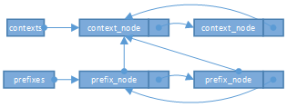

## 属性系统初始化

init进程首先调用`property_init`，随后调用`start_property_service`。这应该就是inti为属性系统初始化做的全部工作了。

### `property_init`

```c++
//  #system/core/init/property_service.cpp
void property_init() {
    if (__system_property_area_init()) {
        exit(1);
    }
}
// #bionic/libc/bionic/system_properties.cpp
int __system_property_area_init() {
  //[1] 清空之前的设置
  free_and_unmap_contexts();
  //[2]
  mkdir(property_filename, S_IRWXU | S_IXGRP | S_IXOTH);
  //[3]
  if (!initialize_properties()) {
    return -1;
  }
  bool open_failed = false;
  bool fsetxattr_failed = false;
  list_foreach(contexts, [&fsetxattr_failed, &open_failed](context_node* l) {
    if (!l->open(true, &fsetxattr_failed)) {
      open_failed = true;
    }
  });
  if (open_failed || !map_system_property_area(true, &fsetxattr_failed)) {
    free_and_unmap_contexts();
    return -1;
  }
  initialized = true;
  return fsetxattr_failed ? -2 : 0;
}
```

`[2]` 处代码创建了一个名为`/dev/__properties__`的文件夹。

```shell
rk3399:/dev/__properties__ # ls                                            
properties_serial                 
u:object_r:audio_prop:s0          
u:object_r:bluetooth_prop:s0      
...
```

`[3]`处代码调用`initialize_properties_from_file`解析`/system/etc/selinux/plat_property_contexts`文件。

```shell
# /system/etc/selinux/plat_property_contexts 内容如下：
hw.                     u:object_r:system_prop:s0
logd.logpersistd        u:object_r:logpersistd_logging_prop:s0
log.tag                 u:object_r:log_tag_prop:s0
log.tag.WifiHAL         u:object_r:wifi_log_prop:s0
log.                    u:object_r:log_prop:s0
...
```

```c++
static bool initialize_properties_from_file(const char* filename) {
  FILE* file = fopen(filename, "re");
  if (!file) {
    return false;
  }

  char* buffer = nullptr;
  size_t line_len;
  char* prop_prefix = nullptr;
  char* context = nullptr;

  while (getline(&buffer, &line_len, file) > 0) {
    //[1]
    int items = read_spec_entries(buffer, 2, &prop_prefix, &context);
      
    //ctl.* properties 用于IPC机制，不保存到内存文件
    if (!strncmp(prop_prefix, "ctl.", 4)) {
      free(prop_prefix);
      free(context);
      continue;
    }

    auto old_context =
        list_find(contexts, [context](context_node* l) { return !strcmp(l->context(), context); });
    if (old_context) {
      list_add_after_len(&prefixes, prop_prefix, old_context);
    } else {
      //[2]
      list_add(&contexts, context, nullptr);
      list_add_after_len(&prefixes, prop_prefix, contexts);
    }
    free(prop_prefix);
    free(context);
  }

  free(buffer);
  fclose(file);

  return true;
}
```

`[1]`处代码`read_spec_entries`用于解析文件中的一行数据。以`log.                    u:object_r:log_prop:s0`为例，解析后，`prop_prefix = log.` `context=u:object_r:log_prop:s0`。

在第一次添加时，`old_context`返回值肯定是`nullptr`。所以，剩下的重点就是了解`[2]`处的链表的结构了。

```c++
static prefix_node* prefixes = nullptr;
static context_node* contexts = nullptr;
```

`contexts`指向一个环状链表的最新插入的`context_node`。`context_node`内部保存一个`prop_area`结构以及上面从文件中解析出来的`context`字符串。

`prefix_node`结构如下：

```c++
struct prefix_node {
  prefix_node(struct prefix_node* next, const char* prefix, context_node* context)
      : prefix(strdup(prefix)), prefix_len(strlen(prefix)), context(context), next(next) {
  }
  char* prefix;
  const size_t prefix_len;
  context_node* context;
  struct prefix_node* next;
};
```

`prefixes`指向一个环状链表的最新插入的`prefix_node`。并且其`context`成员会指向与之相关联的`context_node`。

```c++
static void list_add_after_len(prefix_node** list, const char* prefix, context_node* context) {
  size_t prefix_len = strlen(prefix);

  auto next_list = list;

  while (*next_list) {
    //prefixs始终指向 prefix_len最大的那个。 *号表示匹配对应默认的context
    if ((*next_list)->prefix_len < prefix_len || (*next_list)->prefix[0] == '*') {
      list_add(next_list, prefix, context);
      return;
    }
    next_list = &(*next_list)->next;
  }
  list_add(next_list, prefix, context);
}

template <typename List, typename... Args>
static inline void list_add(List** list, Args... args) {
  *list = new List(*list, args...);
}
```




大概就是这个样子吧，所有的`prefix_node`构成一个环状链表，所有的`context_node`构成一个环状链表。每个`prefix_node`又会指向与之相应的`context_node`。

> 每一个`context_node`都对应`/dev/__properties__`目录下的一个文件。该文件对应一个`prop_area`结构体。
>
> 所有的属性，都会根据key 和 `prefix_node`的对应关系保存到相应的`context_node`关联的文件内。

到这里，`property_init`就结束了。？？？？黑人问号脸，`/system/build.prop`这些属性文件从哪里加载的呢。老哥。

### 加载prop文件并读入内存

init程序中，我们忽略了很重要的一点，就是解析init.rc的时候。

查看init.rc，我们发现了如下一段和系统属性相关的command。

```shell
on post-fs
    load_system_props
    ...
```

其对应的实现如下:

```c++
// #system/core/init/builtins.cpp
static int do_load_system_props(const std::vector<std::string>& args) {
    load_system_props();
    return 0;
}

// #system/core/init/property_service.cpp
void load_system_props() {
    load_properties_from_file("/system/build.prop", NULL);
    load_properties_from_file("/odm/build.prop", NULL);
    load_properties_from_file("/vendor/build.prop", NULL);
    load_properties_from_file("/factory/factory.prop", "ro.*");
    load_recovery_id_prop();
}
```

`load_properties_from_file`的工作就是打开并读取文件内容，然后调用`load_properties`来解析文件。

`load_properties`的实现也比较简单，逐行解析prop文件，遇到`import`关键字就重新调用`load_properties_from_file`解析导入的文件，过滤注释和空行。根据`=`分割出`key`和`value`并调用`property_set`设置属性。

```c++
// #system/core/init/property_service.cpp
uint32_t property_set(const std::string& name, const std::string& value) {
    if (name == "selinux.restorecon_recursive") {
        return PropertySetAsync(name, value, RestoreconRecursiveAsync);
    }

    return PropertySetImpl(name, value);
}

static uint32_t PropertySetImpl(const std::string& name, const std::string& value) {
    size_t valuelen = value.size();

    //[1]
    prop_info* pi = (prop_info*) __system_property_find(name.c_str());
    if (pi != nullptr) {
        // ro.* properties are actually "write-once".
        if (android::base::StartsWith(name, "ro.")) {
            return PROP_ERROR_READ_ONLY_PROPERTY;
        }

        __system_property_update(pi, value.c_str(), valuelen);
    } else {
        //[2]
        int rc = __system_property_add(name.c_str(), name.size(), value.c_str(), valuelen);
        if (rc < 0) {
            return PROP_ERROR_SET_FAILED;
        }
    }

    // Don't write properties to disk until after we have read all default
    // properties to prevent them from being overwritten by default values.
    if (persistent_properties_loaded && android::base::StartsWith(name, "persist.")) {
        write_persistent_property(name.c_str(), value.c_str());
    }
    property_changed(name, value);
    return PROP_SUCCESS;
}
```


oh，我们第一次导入属性文件，`__system_property_find`的返回值为`nullptr`。所以先看`__system_property_add`：

```c++
// #bionic/libc/bionic/system_properties.cpp
int __system_property_add(const char* name, unsigned int namelen, const char* value,
                          unsigned int valuelen) {
  ...
  prop_area* pa = get_prop_area_for_name(name);
  bool ret = pa->add(name, namelen, value, valuelen);
  return 0;
}
```

#### 如何保存属性

`get_prop_area_for_name`该函数根据`name`在`prefixs`链表中找到匹配的`prefix_node`节点，然后找到其相应的`context_node`。之前提过，每一个`context_node`都对应`/dev/__properties__`目录下的一个文件。其会打开这个文件，并调用`mmap`将映射好的地址强转为`prop_area`并返回。

```c++
static prop_area* get_prop_area_for_name(const char* name) {
  //static prefix_node* prefixes = nullptr;
  auto entry = list_find(prefixes, [name](prefix_node* l) {
    return l->prefix[0] == '*' || !strncmp(l->prefix, name, l->prefix_len);
  });
  auto cnode = entry->context;
  if (!cnode->pa()) {
    //prop_area还没有关联的内存区域，open
    cnode->open(false, nullptr);
  }
  return cnode->pa();
}

```

`conde->open`的主要工作就是通过`map_prop_area_rw`打开名为`/dev/__properties__/context_name`的文件。

```c++
static prop_area* map_prop_area_rw(const char* filename, const char* context,
                                   bool* fsetxattr_failed) {
  const int fd = open(filename, O_RDWR | O_CREAT | O_NOFOLLOW | O_CLOEXEC | O_EXCL, 0444);
  if (ftruncate(fd, PA_SIZE) < 0) {
    close(fd);
    return nullptr;
  }

  pa_size = PA_SIZE;
  pa_data_size = pa_size - sizeof(prop_area);

  void* const memory_area = mmap(nullptr, pa_size, PROT_READ | PROT_WRITE, MAP_SHARED, fd, 0);
  if (memory_area == MAP_FAILED) {
    close(fd);
    return nullptr;
  }
 
  prop_area* pa = new (memory_area) prop_area(PROP_AREA_MAGIC, PROP_AREA_VERSION);

  close(fd);
  return pa;
}
```

此后，所有对`prop_area`的操作都会同步到相应的文件内。

#### 如何查找和添加属性

首先了解`prop_area`是如何管理属性的。

在Android中，属性的结构就是`key=value`这种形式，对于`value`，通常是`bool`、`int`和`string`型吧，这些都可以当做字符串来看待的。对于`key`，其形式基本都是`a.b.c`这种以`.`来间隔的字符串。

根据源码中的注释，以`ro.secure=1`为例，其在`prop_area`存储如下:

```c++
+-----+   children    +----+   children    +--------+
|     |-------------->| ro |-------------->| secure |
+-----+               +----+               +--------+
                      /    \                /   |
                left /      \ right   left /    |  prop   +===========+
                    v        v            v     +-------->| ro.secure |
                 +-----+   +-----+     +-----+            +-----------+
                 | net |   | sys |     | com |            |     1     |
                 +-----+   +-----+     +-----+            +===========+
```

实际代码，用`prop_bt`来表示一个节点。用`prop_info`来表示一个属性的具体信息。

```c++
// Represents a node in the trie.
struct prop_bt {
  uint32_t namelen; loads from the
  atomic_uint_least32_t prop; //表示的就是prop_info的偏移地址，基准地址就是 prop_area->data_

  atomic_uint_least32_t left;
  atomic_uint_least32_t right;

  atomic_uint_least32_t children;
  //不需要记录name的长度？
  char name[0];

  prop_bt(const char* name, const uint32_t name_length) {
    this->namelen = name_length;
    memcpy(this->name, name, name_length);
    this->name[name_length] = '\0';
  }
};

struct prop_info {
  atomic_uint_least32_t serial;
  char value[PROP_VALUE_MAX];
  char name[0];
};

```

由属性构成的树，只会由init进程更新，其他线程只会同时读，为了避免竞态，所以使用了`atomic`。

根据那个内存结构图，大致可以了解到如何找到一个节点。首先，从根节点开始，如果匹配，就找其子节点，否则就找其兄弟节点。知道找到我们需要的节点为止，没有找到就返回`nullptr`咯。

```c++
const prop_info* prop_area::find_property(prop_bt* const trie, const char* name, uint32_t namelen,
                                          const char* value, uint32_t valuelen,
                                          bool alloc_if_needed) {
  if (!trie) return nullptr;

  const char* remaining_name = name;
  prop_bt* current = trie;
  while (true) {
    const char* sep = strchr(remaining_name, '.');
    const bool want_subtree = (sep != nullptr);
    const uint32_t substr_size = (want_subtree) ? sep - remaining_name : strlen(remaining_name);

    if (!substr_size) {
      return nullptr;
    }

    prop_bt* root = nullptr;
    uint_least32_t children_offset = atomic_load_explicit(&current->children, memory_order_relaxed);
    if (children_offset != 0) {
      root = to_prop_bt(&current->children);
    } else if (alloc_if_needed) {
      uint_least32_t new_offset;
      root = new_prop_bt(remaining_name, substr_size, &new_offset);
      if (root) {
        atomic_store_explicit(&current->children, new_offset, memory_order_release);
      }
    }

    if (!root) {
      return nullptr;
    }
	//注意这个函数的参数，其通过substr_size来确定当前比对范围
      
    //从root节点开始，逐一查找其兄弟节点，直到找到 prefix想同的节点，返回
    current = find_prop_bt(root, remaining_name, substr_size, alloc_if_needed);
    if (!current) {
      return nullptr;
    }

    if (!want_subtree) break;
	//切换prefix
    remaining_name = sep + 1;
  }
	 
  uint_least32_t prop_offset = atomic_load_explicit(&current->prop, memory_order_relaxed);
  if (prop_offset != 0) {
    //找到了这个节点
    return to_prop_info(&current->prop);
  } else if (alloc_if_needed) {
    //节点不存在，就将其加入到树中，并返回
    uint_least32_t new_offset;
    prop_info* new_info = new_prop_info(name, namelen, value, valuelen, &new_offset);
    if (new_info) {
      atomic_store_explicit(&current->prop, new_offset, memory_order_release);
    }

    return new_info;
  } else {
    return nullptr;
  }
}
```


so，属性的添加和查找都是通过`find_property`来完成，其依照属性约定好的存储顺序，在内存中查找或添加属性。


## 属性服务的启动

在init进程中，通过调用`start_property_service`启动属性服务。

前面那个初始化初始化的什么内容先放一边，先来看看属性服务启动后做了什么。

```c++
// #system/core/init/property_service.cpp
void start_property_service() {
    property_set("ro.property_service.version", "2");
	//创建一个uds
    property_set_fd = CreateSocket(PROP_SERVICE_NAME, SOCK_STREAM | SOCK_CLOEXEC | SOCK_NONBLOCK,
                                   false, 0666, 0, 0, nullptr, sehandle);
	//监听并注册handler
    listen(property_set_fd, 8);
    register_epoll_handler(property_set_fd, handle_property_set_fd);
}
```

额额，似乎就这些东西？ 创建socket并加入到init进程的事件循环中？

看看`handle_property_set_fd`都干了啥？

```c++
static void handle_property_set_fd() {
    static constexpr uint32_t kDefaultSocketTimeout = 2000; /* ms */
    int s = accept4(property_set_fd, nullptr, nullptr, SOCK_CLOEXEC);

    struct ucred cr;
    socklen_t cr_size = sizeof(cr);
    getsockopt(s, SOL_SOCKET, SO_PEERCRED, &cr, &cr_size);

    SocketConnection socket(s, cr);
    uint32_t timeout_ms = kDefaultSocketTimeout;

    uint32_t cmd = 0;
    socket.RecvUint32(&cmd, &timeout_ms;
    switch (cmd) {
    case PROP_MSG_SETPROP: {
        char prop_name[PROP_NAME_MAX];
        char prop_value[PROP_VALUE_MAX];
        socket.RecvChars(prop_name, PROP_NAME_MAX, &timeout_ms);
        socket.RecvChars(prop_value, PROP_VALUE_MAX, &timeout_ms);
        prop_name[PROP_NAME_MAX-1] = 0;
        prop_value[PROP_VALUE_MAX-1] = 0;
        handle_property_set(socket, prop_value, prop_value, true);
        break;
      }

    case PROP_MSG_SETPROP2: {
        std::string name;
        std::string value;
        socket.RecvString(&name, &timeout_ms);
        socket.RecvString(&value, &timeout_ms);
        handle_property_set(socket, name, value, false);
        break;
      }
    }
}

```


看到这里，大概知道这个属性服务是干嘛用的呢，我们之前在action中，有一些关于属性值更改的trigger。这个应该就是用来处理这些东西的。其核心函数就是`handle_property_set`。

```c++
static void handle_property_set(SocketConnection& socket,
                                const std::string& name,
                                const std::string& value,
                                bool legacy_protocol) {
  struct ucred cr = socket.cred();
  char* source_ctx = nullptr;
  getpeercon(socket.socket(), &source_ctx);

  if (android::base::StartsWith(name, "ctl.")) {
    if (check_control_mac_perms(value.c_str(), source_ctx, &cr)) {
      handle_control_message(name.c_str() + 4, value.c_str());
      if (!legacy_protocol) {
        socket.SendUint32(PROP_SUCCESS);
      }
    }
  } else {
    if (check_mac_perms(name, source_ctx, &cr)) {
      uint32_t result = property_set(name, value);
      if (!legacy_protocol) {
        socket.SendUint32(result);
      }
    }
  }
  freecon(source_ctx);
}

```

这里`ctl.`属性用于开头的属性用于控制相关的service。

```c++
// # system/core/init/init.cpp
void handle_control_message(const std::string& msg, const std::string& name) {
    Service* svc = ServiceManager::GetInstance().FindServiceByName(name);
    if (msg == "start") {
        svc->Start();
    } else if (msg == "stop") {
        svc->Stop();
    } else if (msg == "restart") {
        svc->Restart();
    }
}

```

通过`property_set`来完成属性的设置操作，可以猜测，其，应该就是通过操作属性文件映射的内存来完成的，核心代码如下。

```c++
 prop_info* pi = (prop_info*) __system_property_find(name.c_str());
 if (pi) {
       __system_property_update(pi, value.c_str(), valuelen);
 } else {
     __system_property_add(name.c_str(), name.size(), value.c_str(), valuelen);
}

// Don't write properties to disk until after we have read all default
// properties to prevent them from being overwritten by default values.
if (persistent_properties_loaded && android::base::StartsWith(name, "persist.")) {
	write_persistent_property(name.c_str(), value.c_str());
}
property_changed(name, value);
```

这里，通过调用`property_changed`来触发相应的action。

```c++
void property_changed(const std::string& name, const std::string& value) {
    if (property_triggers_enabled)
        ActionManager::GetInstance().QueuePropertyTrigger(name, value);
}
```


## 其他进程如何获取属性信息

在编写native程序时，可以通过引用`libcutils`库来使用属性。有了前面的知识，我们也可以大概知道是如何实现的，还是直接怼代码。

```c++
// # system/core/libcutils/properties.cpp
int property_set(const char *key, const char *value) {
    return __system_property_set(key, value);
}

int property_get(const char *key, char *value, const char *default_value) {
    int len = __system_property_get(key, value);
    if (len > 0) {
        return len;
    }
    if (default_value) {
        len = strnlen(default_value, PROPERTY_VALUE_MAX - 1);
        memcpy(value, default_value, len);
        value[len] = '\0';
    }
    return len;
}
```

最终还是调用到了bionic中的libc库中实现。但是这些实现中并没有完成之前介绍的关于`mmap`等操作，那么其他进程如何使用属性系统的呢。

这里就涉及到编译器相关的知识了，我也不懂，大概就是进程在使用libc库的时候，就会完成属性相应的内存映射。

```c++
//It is called from arch-$ARCH/bionic/crtbegin_static.S which is directly invoked by the kernel when the program is launched.
__noreturn void __libc_init(void* raw_args,
                            void (*onexit)(void) __unused,
                            int (*slingshot)(int, char**, char**),
                            structors_array_t const * const structors) {
    ...
    __libc_init_common(args);
	...
}

void __libc_init_common(KernelArgumentBlock& args) {
    ...
  __system_properties_init(); // Re
}
```

通过调用`__system_properties_init`，完成了和`property_init`一致的操作。根据注释来看就是`__libc_init`会在程序启动的时候被内核直接调用，所以程序启动时就已经完成了属性的初始化操作了。重点就是看看Android如何完成属性的初始化吧。

### 获取属性

```c++
//# system/core/libcutils/properties.cpp
int property_get(const char *key, char *value, const char *default_value) {
    int len = __system_property_get(key, value);
    return len;
}

//# bionic/libc/bionic/system_properties.cpp
int __system_property_get(const char* name, char* value) {
    const prop_info* pi = __system_property_find(name);
    return __system_property_read(pi, nullptr, value);
}

int __system_property_read(const prop_info* pi, char* name, char* value) {
  while (true) {
      uint32_t serial = __system_property_serial(pi);  // acquire semantics
      size_t len = SERIAL_VALUE_LEN(serial);
      memcpy(value, pi->value, len + 1);
      return len;
    }
  }
}
```

看，直接通过访问之前`mmap`好的内存来获取属性值。

### 设置属性

```C++
//# system/core/libcutils/properties.cpp
int property_set(const char *key, const char *value) {
    return __system_property_set(key, value);
}
//# bionic/libc/bionic/system_properties.cpp
int __system_property_set(const char* key, const char* value) {
  if (g_propservice_protocol_version == kProtocolVersion1) {
    // Old protocol does not support long names
    if (strlen(key) >= PROP_NAME_MAX) return -1;

    prop_msg msg;
    memset(&msg, 0, sizeof msg);
    msg.cmd = PROP_MSG_SETPROP;
    strlcpy(msg.name, key, sizeof msg.name);
    strlcpy(msg.value, value, sizeof msg.value);

    return send_prop_msg(&msg);
  } else {
    // Use proper protocol
    PropertyServiceConnection connection;

    SocketWriter writer(&connection);
    if (!writer.WriteUint32(PROP_MSG_SETPROP2).WriteString(key).WriteString(value).Send()) {
      errno = connection.GetLastError();
      return -1;
    }

    int result = -1;
    if (!connection.RecvInt32(&result)) {
      errno = connection.GetLastError();
      return -1;
    }

    if (result != PROP_SUCCESS) {
      return -1;
    }

    return 0;
  }
}

```

进程设置属性时，通过uds连接到属性服务。由属性服务来完成实际的设置操作。了解UDS的，应该知道`PropertyServiceConnection`的大概实现了，就不贴代码了。


## 总结

1. 通过`/system/etc/selinux/plat_property_contexts`文件建立属性名`prefix`和`context`的关联。

    通过属性名的`prefix`找到与`context`关联的`prop_area`。所有`prefix`一致的属性都会保存到这个`prop_area`中。

2. persist相关的属性是保存在`/data/`目录下的，系统启动时，`data`分区挂载时，通过`Vold`触发action去加载这些属性。

3. 属性服务的作用就是创建一个socket用于监听其他进程的连接，其他进程通过连接属性服务来设置属性，通过访问属性文件来获取属性。我们设置的属性变更的action就是通过属性服务来完成触发的。


