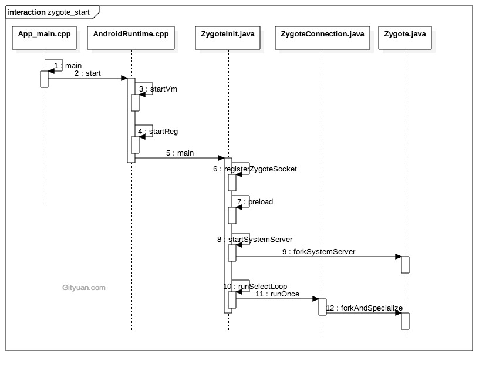

## Zygote Native 启动


`init.rc` 

```shell
#  /init.zygote32.rc
service zygote /system/bin/app_process -Xzygote /system/bin --zygote --start-system-server
    class core
    socket zygote stream 660 root system
    onrestart write /sys/android_power/request_state wake
    onrestart write /sys/power/state on
    onrestart restart media
    onrestart restart netd
    writepid /dev/cpuset/foreground/tasks
```


通过`init`进程启动。

```c++
// #frameworks/base/cmds/app_process/app_main.cpp
int main(int argc, char* const argv[])
{
    //computeArgBlockSize 假定所有的参数都在同一连续的内存空间内。用于计算所有参数
    //占用的内存空间大小。
    AppRuntime runtime(argv[0], computeArgBlockSize(argc, argv));
    // Process command line arguments
    // ignore argv[0]
    argc--;
    argv++;
    
    const char* spaced_commands[] = { "-cp", "-classpath" };
    // Allow "spaced commands" to be succeeded by exactly 1 argument (regardless of -s).
    bool known_command = false;

    //[1] start
    int i;
    for (i = 0; i < argc; i++) {
        if (known_command == true) {
          runtime.addOption(strdup(argv[i]));
          known_command = false;
          continue;
        }

        for (int j = 0;
             j < static_cast<int>(sizeof(spaced_commands) / sizeof(spaced_commands[0]));
             ++j) {
          if (strcmp(argv[i], spaced_commands[j]) == 0) {
            known_command = true;
          }
        }

        //遇到参数不是以 - 开头的时，直接break
        if (argv[i][0] != '-') {
            break;
        }
        if (argv[i][1] == '-' && argv[i][2] == 0) {
            ++i; // Skip --.
            break;
        }
        runtime.addOption(strdup(argv[i]));
    }
    //[1] end

    // Parse runtime arguments.  Stop at first unrecognized option.
    bool zygote = false;
    bool startSystemServer = false;
    bool application = false;
    String8 niceName;
    String8 className;


    //[2] Line258  i 的位置指向/system/bin
    ++i;  // Skip unused "parent dir" argument.
    while (i < argc) {
        const char* arg = argv[i++];
        if (strcmp(arg, "--zygote") == 0) {
            zygote = true;
            niceName = ZYGOTE_NICE_NAME;
        } else if (strcmp(arg, "--start-system-server") == 0) {
            startSystemServer = true;
        } else if (strcmp(arg, "--application") == 0) {
            application = true;
        } else if (strncmp(arg, "--nice-name=", 12) == 0) {
            niceName.setTo(arg + 12);
        } else if (strncmp(arg, "--", 2) != 0) {
            className.setTo(arg);
            break;
        } else {
            --i;
            break;
        }
    }

    Vector<String8> args;
    //empty skip
    if (!className.isEmpty()) {
        // We're not in zygote mode, the only argument we need to pass
        // to RuntimeInit is the application argument.
        //
        // The Remainder of args get passed to startup class main(). Make
        // copies of them before we overwrite them with the process name.
        args.add(application ? String8("application") : String8("tool"));
        runtime.setClassNameAndArgs(className, argc - i, argv + i);

        if (!LOG_NDEBUG) {
          String8 restOfArgs;
          char* const* argv_new = argv + i;
          int argc_new = argc - i;
          for (int k = 0; k < argc_new; ++k) {
            restOfArgs.append("\"");
            restOfArgs.append(argv_new[k]);
            restOfArgs.append("\" ");
          }
          ALOGV("Class name = %s, args = %s", className.string(), restOfArgs.string());
        }
    } else {
        // We're in zygote mode.
        maybeCreateDalvikCache();

        if (startSystemServer) {
            args.add(String8("start-system-server"));
        }

        char prop[PROP_VALUE_MAX];
        if (property_get(ABI_LIST_PROPERTY, prop, NULL) == 0) {
            LOG_ALWAYS_FATAL("app_process: Unable to determine ABI list from property %s.",
                ABI_LIST_PROPERTY);
            return 11;
        }

        String8 abiFlag("--abi-list=");
        abiFlag.append(prop);
        args.add(abiFlag);

        // In zygote mode, pass all remaining arguments to the zygote
        // main() method.
        for (; i < argc; ++i) {
            args.add(String8(argv[i]));
        }
    }

    if (!niceName.isEmpty()) {
        runtime.setArgv0(niceName.string(), true /* setProcName */);
    }
    //启动 zygote
    if (zygote) {
        runtime.start("com.android.internal.os.ZygoteInit", args, zygote);
    } else if (className) {
        //启动其他应用程序
        runtime.start("com.android.internal.os.RuntimeInit", args, zygote);
    } else {
        fprintf(stderr, "Error: no class name or --zygote supplied.\n");
        app_usage();
        LOG_ALWAYS_FATAL("app_process: no class name or --zygote supplied.");
    }
}
```

`[1]`：在`Zygote`的启动参数如下：

`/system/bin/app_process -Xzygote /system/bin --zygote --start-system-server`

其中，`Everything up to '--' or first non '-' arg goes to the vm.`。意思应该是说，第一个`--`或第一个不是以`-`开头的参数之前的所有参数都需要传递到VM吧。

所以`[1]`处的代码片段中

```c++
//1
if (argv[i][0] != '-') {
	break;
}
//2 Skip --

//3 其他参数都会
runtime.addOption(strdup(argv[i]));
```

`[1]`代码结束后，`i`指向parent dir。skip。so `++i`。

后面的`--zygote --start-system-server`就是用于区分接下来是否进入`zygote mode`。很明显，我们这里没有`--application`参数，所以是进入的`zygote mode`。

按照流程，接下来就是调用的`runtime.start("com.android.internal.os.ZygoteInit", args, zygote);`


### Android Runtime

```c++
class AppRuntime : public AndroidRuntime
{
public:
    AppRuntime(char* argBlockStart, const size_t argBlockLength)
        : AndroidRuntime(argBlockStart, argBlockLength)
        , mClass(NULL)
    {
    }

    void setClassNameAndArgs(const String8& className, int argc, char * const *argv) {
        mClassName = className;
        for (int i = 0; i < argc; ++i) {
             mArgs.add(String8(argv[i]));
        }
    }

    virtual void onVmCreated(JNIEnv* env)
    {
        char* slashClassName = toSlashClassName(mClassName.string());
        mClass = env->FindClass(slashClassName);
        free(slashClassName);

        mClass = reinterpret_cast<jclass>(env->NewGlobalRef(mClass));
    }

    virtual void onStarted()
    {
        sp<ProcessState> proc = ProcessState::self();
        proc->startThreadPool();

        AndroidRuntime* ar = AndroidRuntime::getRuntime();
        ar->callMain(mClassName, mClass, mArgs);

        IPCThreadState::self()->stopProcess();
        hardware::IPCThreadState::self()->stopProcess();
    }

    virtual void onZygoteInit()
    {
        sp<ProcessState> proc = ProcessState::self();
        proc->startThreadPool();
    }

    virtual void onExit(int code)
    {
        if (mClassName.isEmpty()) {
            // if zygote
            IPCThreadState::self()->stopProcess();
            hardware::IPCThreadState::self()->stopProcess();
        }

        AndroidRuntime::onExit(code);
    }

    String8 mClassName;
    Vector<String8> mArgs;
    jclass mClass;
};
```

Zygote最终通过`AndroidRuntime.start`来启动`com.android.internal.os.ZygoteInit`。

```c++
void AndroidRuntime::start(const char* className, const Vector<String8>& options, bool zygote)
{
    static const String8 startSystemServer("start-system-server");
    //options 中的内容应该就是 start-system-server
    for (size_t i = 0; i < options.size(); ++i) {
        if (options[i] == startSystemServer) {
           const int LOG_BOOT_PROGRESS_START = 3000;
           LOG_EVENT_LONG(LOG_BOOT_PROGRESS_START,  ns2ms(systemTime(SYSTEM_TIME_MONOTONIC)));
        }
    }

    const char* rootDir = getenv("ANDROID_ROOT");
    
    /* start the virtual machine */
    JniInvocation jni_invocation;
    jni_invocation.Init(NULL);
    JNIEnv* env;

    //[1] 创建虚拟机
    if (startVm(&mJavaVM, &env, zygote) != 0) {
        return;
    }
    onVmCreated(env);

    //[2] 注册JNI函数
    if (startReg(env) < 0) {
        return;
    }

    jclass stringClass;
    jobjectArray strArray;
    jstring classNameStr;

    stringClass = env->FindClass("java/lang/String");
    assert(stringClass != NULL);
    strArray = env->NewObjectArray(options.size() + 1, stringClass, NULL);
    assert(strArray != NULL);
    classNameStr = env->NewStringUTF(className);
    assert(classNameStr != NULL);
    env->SetObjectArrayElement(strArray, 0, classNameStr);

    for (size_t i = 0; i < options.size(); ++i) {
        jstring optionsStr = env->NewStringUTF(options.itemAt(i).string());
        env->SetObjectArrayElement(strArray, i + 1, optionsStr);
    }

    char* slashClassName = toSlashClassName(className != NULL ? className : "");
    jclass startClass = env->FindClass(slashClassName);
	jmethodID startMeth = env->GetStaticMethodID(startClass, "main",
            "([Ljava/lang/String;)V");
    //[3]
    env->CallStaticVoidMethod(startClass, startMeth, strArray);
    free(slashClassName);

    ALOGD("Shutting down VM\n");
    if (mJavaVM->DetachCurrentThread() != JNI_OK)
        ALOGW("Warning: unable to detach main thread\n");
    if (mJavaVM->DestroyJavaVM() != 0)
        ALOGW("Warning: VM did not shut down cleanly\n");
}
```

`start`函数的主要工作又可以分为以下三点。

1. 创建虚拟机
2. 注册JNI函数
3. 调用Java的main函数

#### 创建虚拟机

在完成Java VM的一系列参数配置后，通过`JNI_CreateJavaVM`来完成虚拟机的创建工作。

```c++
int AndroidRuntime::startVm(JavaVM** pJavaVM, JNIEnv** pEnv, bool zygote)
{    
    JavaVMInitArgs initArgs;
    
    //一系列的参数配置，适当调整这些参数可提升系统性能
    
    initArgs.version = JNI_VERSION_1_4;
    initArgs.options = mOptions.editArray();
    initArgs.nOptions = mOptions.size();
    initArgs.ignoreUnrecognized = JNI_FALSE;

    /*
     * Initialize the VM.
     *
     * The JavaVM* is essentially per-process, and the JNIEnv* is per-thread.
     * If this call succeeds, the VM is ready, and we can start issuing
     * JNI calls.
     */
    if (JNI_CreateJavaVM(pJavaVM, pEnv, &initArgs) < 0) {
        ALOGE("JNI_CreateJavaVM failed\n");
        return -1;
    }

    return 0;
}
```


#### 注册JNI函数

·通过`startReg`函数来注册native函数。

```c++
//#frameworks/base/core/jni/AndroidRuntime.cpp
int AndroidRuntime::startReg(JNIEnv* env)
{
    androidSetCreateThreadFunc((android_create_thread_fn) javaCreateThreadEtc);
    
    //[1]
    env->PushLocalFrame(200);

    if (register_jni_procs(gRegJNI, NELEM(gRegJNI), env) < 0) {
        env->PopLocalFrame(NULL);
        return -1;
    }
    env->PopLocalFrame(NULL);
    return 0;
}

static int register_jni_procs(const RegJNIRec array[], size_t count, JNIEnv* env)
{
    for (size_t i = 0; i < count; i++) {
        if (array[i].mProc(env) < 0) {
            return -1;
        }
    }
    return 0;
}


static const RegJNIRec gRegJNI[] = {
    REG_JNI(register_com_android_internal_os_RuntimeInit),
    REG_JNI(register_com_android_internal_os_ZygoteInit_nativeZygoteInit),
    ...
};

/*
 * JNI registration.
 */
int register_com_android_internal_os_RuntimeInit(JNIEnv* env)
{
    const JNINativeMethod methods[] = {
        { "nativeFinishInit", "()V",
            (void*) com_android_internal_os_RuntimeInit_nativeFinishInit },
        { "nativeSetExitWithoutCleanup", "(Z)V",
            (void*) com_android_internal_os_RuntimeInit_nativeSetExitWithoutCleanup },
    };
    return jniRegisterNativeMethods(env, "com/android/internal/os/RuntimeInit",
        methods, NELEM(methods));
}
```

在VM创建后，立即加载Android Java程序运行所需要的那些JNI函数。

> `[1]`处，由于每个`register`函数内部实现都有可能创建 LocalReference，例如调用了`FindClass`。此时，因为，VM还没有真正的启动，这些局部引用都存放在base frame中并且不会得到release。所以使用PushLocalFrame和PopLocalFrame来管理这些局部引用。

#### 调用Java Main函数

首先通过JNI来创建一个`String[]`对象，并将`options`中的参数都拷贝进入，随后调用`env->CallStaticVoidMethod`来启动相应的java类的main函数。

到这里，Zygote进入到了Java世界。


## Zygote Java

Native层创建完java虚拟机后，就可以进入到Java世界了。Zygote的java世界都做了些什么了，总结一下就是：

1. 预加载java类以及资源
2. 创建System Server进程
3. loop，处理其他进程消息

### 预加载

```java
//frameworks/base/core/java/com/android/internal/os/ZygoteInit.java
static void preload(TimingsTraceLog bootTimingsTraceLog) {
    //预加载/system/etc/preloaded-classes中指定的类。通过Class.forName加载
    preloadClasses();
    //加载定义在frameworks/base/core/res/res/values/arrays.xml 中的几个资源
    preloadResources();
    nativePreloadAppProcessHALs();
    preloadOpenGL();
    //加载共享库
    preloadSharedLibraries();
    preloadTextResources();
    WebViewFactory.prepareWebViewInZygote();
    warmUpJcaProviders();
    sPreloadComplete = true;
}
```

其余的看不懂，，，


### 创建SystemServer进程

```java
//frameworks/base/core/java/com/android/internal/os/ZygoteInit.java
if (startSystemServer) {
	Runnable r = forkSystemServer(abiList, socketName, zygoteServer);
	// {@code r == null} in the parent (zygote) process, and {@code r != null} in the
	// child (system_server) process.
	if (r != null) {
        //实际上这里就是在执行SystemServer进程了。
		r.run();
		return;
	}
 }
```

`r == null`表示在zygote进程，`r != null`表示在system_server进程中。

zygote通过调用`forkSystemServer`来创建System Server。

```java
//frameworks/base/core/java/com/android/internal/os/ZygoteInit.java
private static Runnable forkSystemServer(String abiList, String socketName,
            ZygoteServer zygoteServer) {
	int pid = Zygote.forkSystemServer(
                    parsedArgs.uid, parsedArgs.gid,
                    parsedArgs.gids,
                    parsedArgs.debugFlags,
                    null,
                    parsedArgs.permittedCapabilities,
                    parsedArgs.effectiveCapabilities);
    

	/* For child process */
	if (pid == 0) {
        //systemServer进程
		if (hasSecondZygote(abiList)) {
			waitForSecondaryZygote(socketName);
		}
		zygoteServer.closeServerSocket();
        //完成system_server的剩余工作
		return handleSystemServerProcess(parsedArgs);
	}
	return null;
}
```


### runSelectLoop

```java
Runnable runSelectLoop(String abiList) {
	ArrayList<FileDescriptor> fds = new ArrayList<FileDescriptor>();
	ArrayList<ZygoteConnection> peers = new ArrayList<ZygoteConnection>();

	fds.add(mServerSocket.getFileDescriptor());
	peers.add(null);

	while (true) {
		StructPollfd[] pollFds = new StructPollfd[fds.size()];
		for (int i = 0; i < pollFds.length; ++i) {
			pollFds[i] = new StructPollfd();
			pollFds[i].fd = fds.get(i);
			pollFds[i].events = (short) POLLIN;
		}
		Os.poll(pollFds, -1);
		for (int i = pollFds.length - 1; i >= 0; --i) {
			if ((pollFds[i].revents & POLLIN) == 0) {
				continue;
			}

			if (i == 0) {
				ZygoteConnection newPeer = acceptCommandPeer(abiList);
				peers.add(newPeer);
				fds.add(newPeer.getFileDesciptor());
			} else {
				try {
					ZygoteConnection connection = peers.get(i);
					final Runnable command = connection.processOneCommand(this);
					if (mIsForkChild) {
						if (command == null) {
							throw new IllegalStateException("command == null");
						}
						return command;
					} else {
						if (command != null) {
							throw new IllegalStateException("command != null");
						}
						if (connection.isClosedByPeer()) {
							connection.closeSocket();
							peers.remove(i);
							fds.remove(i);
						}
					}
				} catch (Exception e) {
					if (!mIsForkChild) {
						ZygoteConnection conn = peers.remove(i);
						conn.closeSocket();
						fds.remove(i);
					} else {
						throw e;
					}
				}
			}
		}
	}
}

```

Zygote采用高效的I/O多路复用机制，保证在没有客户端连接请求或数据处理时休眠，否则响应客户端的请求。

## 旁枝末节

### 如何创建Java 虚拟机

Android5.0以后，默认选择ART作为Java虚拟机。那么Zygote中是如何创建Java虚拟机的呢，除了直接调用`JNI_CreateJavaVM`，前面还有一个`JniInvocation`。这个又是做什么用的呢。

```c++
 /* start the virtual machine */
JniInvocation jni_invocation;
jni_invocation.Init(NULL);
JNIEnv* env;
//创建虚拟机
if (startVm(&mJavaVM, &env, zygote) != 0) {
	return;
}
onVmCreated(env);
```

其实，其作用就是加载`libart.so`库，并获取到一些关键函数的指针。`JNI_CreateJavaVM`最终，也是走到了`libart.so`库中。

```c++
bool JniInvocation::Init(const char* library) {
  //[1]
  library = GetLibrary(library, buffer);
  // Load with RTLD_NODELETE in order to ensure that libart.so is not unmapped when it is closed.
  // This is due to the fact that it is possible that some threads might have yet to finish
  // exiting even after JNI_DeleteJavaVM returns, which can lead to segfaults if the library is
  // unloaded.
  const int kDlopenFlags = RTLD_NOW | RTLD_NODELETE;
  handle_ = dlopen(library, kDlopenFlags);
 
  //[2]
  if (!FindSymbol(reinterpret_cast<void**>(&JNI_GetDefaultJavaVMInitArgs_),
                  "JNI_GetDefaultJavaVMInitArgs")) {
    return false;
  }
  if (!FindSymbol(reinterpret_cast<void**>(&JNI_CreateJavaVM_),
                  "JNI_CreateJavaVM")) {
    return false;
  }
  if (!FindSymbol(reinterpret_cast<void**>(&JNI_GetCreatedJavaVMs_),
                  "JNI_GetCreatedJavaVMs")) {
    return false;
  }
  return true;
}
```

`[1]`处代码通过属性`persist.sys.dalvik.vm.lib.2`来获取需要加载的虚拟机实现库，这里是`libart.so`。

`[2]`处的代码获取三个关机函数的地址，并保存。

```c++
// #libnativehelper/include_jni/jni.h
/*
 * VM initialization functions.
 *
 * Note these are the only symbols exported for JNI by the VM.
 */
jint JNI_GetDefaultJavaVMInitArgs(void*);
jint JNI_CreateJavaVM(JavaVM**, JNIEnv**, void*);
jint JNI_GetCreatedJavaVMs(JavaVM**, jsize, jsize*);


class JniInvocation {
  jint (*JNI_GetDefaultJavaVMInitArgs_)(void*);
  jint (*JNI_CreateJavaVM_)(JavaVM**, JNIEnv**, void*);
  jint (*JNI_GetCreatedJavaVMs_)(JavaVM**, jsize, jsize*);

  friend jint JNI_GetDefaultJavaVMInitArgs(void* vm_args);
  friend jint JNI_CreateJavaVM(JavaVM** p_vm, JNIEnv** p_env, void* vm_args);
  friend jint JNI_GetCreatedJavaVMs(JavaVM** vms, jsize size, jsize* vm_count);
};

extern "C" jint JNI_GetDefaultJavaVMInitArgs(void* vm_args) {
  return JniInvocation::GetJniInvocation().JNI_GetDefaultJavaVMInitArgs(vm_args);
}

extern "C" jint JNI_CreateJavaVM(JavaVM** p_vm, JNIEnv** p_env, void* vm_args) {
  return JniInvocation::GetJniInvocation().JNI_CreateJavaVM(p_vm, p_env, vm_args);
}

extern "C" jint JNI_GetCreatedJavaVMs(JavaVM** vms, jsize size, jsize* vm_count) {
  return JniInvocation::GetJniInvocation().JNI_GetCreatedJavaVMs(vms, size, vm_count);
}
```

通过`JniInvocation`实现了`jni.h`之中的那个几个函数。所以`startVm::JNI_CreateJavaVM`最终还是调用了`JniInvocation::JNI_CreateJavaVM`。

关于ART的更多细节，有时间再看。


## 总结

Zygote启动的流程图，懒得绘制了，从网上copy了一份，适用于Android 6。



1. 解析`init.zygote.r`c中的参数，创建`AppRuntime`并调用`AppRuntime.start()`方法；
2. 调用`AndroidRuntime`的`startVM()`方法创建虚拟机，再调用`startReg()`注册JNI函数；
3. 通过JNI方式调用`ZygoteInit.main()`，第一次进入Java世界；
4. `registerZygoteSocket()`建立socket通道，zygote作为通信的服务端，用于响应客户端请求；
5. `preload()`预加载通用类、drawable和color资源、openGL以及共享库以及WebView，用于提高app启动效率；
6. zygote完毕大部分工作，接下来再通过`startSystemServer()`，fork得力帮手system_server进程，也是上层framework的运行载体。
7. zygote功成身退，调用`runSelectLoop()`，随时待命，当接收到请求创建新进程请求时立即唤醒并执行相应工作。

