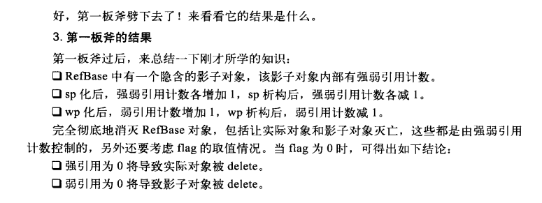

## 

## 简介

`sp<>` 和 `wp<>` 是Android中实现的智能指针，和std中的`std::shared_ptr`和 `std::weak_ptr`类似。要使用android中的智能指针，就需要实现智能指针需要的接口，这一点，和标准库中的智能指针不同。就是说， 标准库中的智能指针支持任何对象，而android的智能指针支持的对象需要实现特定的接口。

`RefBase`的作用就是实现这些接口使得所有继承至他的子类，都能够支持智能指针。


几个点：

1. 通常情况下，Strong Pointer 引用变为0，那么其引用的内存就应该被free，但是，有些情况下，其引用的内存会等到相应的 Weak Pointer 全部释放才会free。
2. weak pointer 可以通过调用 `promotion`函数晋升为 Strong Pointer， 该函数是safe的，但是需要判断其返回值。当实际的对象已经destroyed时，返回`nullptr`。


## Strong Pointer 和 Weak Pointer


### 增加强引用

首先，来看`sp`的构造。通常，我们这样使用`sp`。

```c++
sp<A> spA = new A();
```

可以猜测到，`sp`应该有一个这样的构造函数。

```c++
T* m_ptr;

template<typename T>
template<typename U>
sp<T>::sp(U* other) : m_ptr(other) {
    if (other)
        (static_cast<T*>(other))->incStrong(this);
}
```

如前面说的，`T`这个类需要实现特定的接口，在这里，`T`属于`RefBase`的子类。那看看`RefBase::incStrong`的实现。

```c++
void RefBase::incStrong(const void* id) const
{
    weakref_impl* const refs = mRefs;
    refs->incWeak(id);
    //用于调试
    refs->addStrongRef(id);
    const int32_t c = refs->mStrong.fetch_add(1, std::memory_order_relaxed);
    //不是第一次强引用，直接return
    if (c != INITIAL_STRONG_VALUE)  {
        return;
    }

    //第一次初始化时，refs->mStrongd的值为  INITIAL_STRONG_VALUE + 1
    //这里将其值减去 INITIAL_STRONG_VALUE ，让其值为1
    int32_t old = refs->mStrong.fetch_sub(INITIAL_STRONG_VALUE,
            std::memory_order_relaxed);
    // A decStrong() must still happen after us.
    ALOG_ASSERT(old > INITIAL_STRONG_VALUE, "0x%x too small", old);
    //我们可以重写onFirstRef来实现我们需要的逻辑
    refs->mBase->onFirstRef();
}
```

关于`weakref_impl`后面再说，这里只需要知道 其持有 强弱引用计数，并实现了操作了弱引用计数的接口即可。


### 减少强引用

`sp`构造时，增加强引用，那么其析构时，就会减少强引用。

```c++
template<typename T>
sp<T>::~sp() {
    if (m_ptr)
        m_ptr->decStrong(this);
}
```

```c++
void RefBase::decStrong(const void* id) const
{
    weakref_impl* const refs = mRefs;
    //减少强引用计数
    const int32_t c = refs->mStrong.fetch_sub(1, std::memory_order_release);
    //oh， Strong Ref count == 0
    if (c == 1) {
        std::atomic_thread_fence(std::memory_order_acquire);
        refs->mBase->onLastStrongRef(id);
        int32_t flags = refs->mFlags.load(std::memory_order_relaxed);
        if ((flags&OBJECT_LIFETIME_MASK) == OBJECT_LIFETIME_STRONG) {
            //调用我们对象的析构函数 ~RefBase
            delete this;
        }
    }
    //[1]
    refs->decWeak(id);
}


RefBase::~RefBase()
{
    int32_t flags = mRefs->mFlags.load(std::memory_order_relaxed);
    if ((flags & OBJECT_LIFETIME_MASK) == OBJECT_LIFETIME_WEAK) {
        if (mRefs->mWeak.load(std::memory_order_relaxed) == 0) {
            delete mRefs;
        }
    } else if (mRefs->mStrong.load(std::memory_order_relaxed)
            == INITIAL_STRONG_VALUE) {
        // We never acquired a strong reference on this object.
        LOG_ALWAYS_FATAL_IF(mRefs->mWeak.load() != 0,
                "RefBase: Explicit destruction with non-zero weak "
                "reference count");
        // TODO: Always report if we get here. Currently MediaMetadataRetriever
        // C++ objects are inconsistently managed and sometimes get here.
        // There may be other cases, but we believe they should all be fixed.
        delete mRefs;
    }
    // For debugging purposes, clear mRefs.  Ineffective against outstanding wp's.
    const_cast<weakref_impl*&>(mRefs) = NULL;
}
```


这些代码中，多次出现了`mRefs->mFlags`，这个参数用于控制`RefBase`的生命周期类型。后面再介绍。

在强引用为0后，如果`mRefs->mFlags & OBJECT_LIFETIME_STRONG != 0`，就会调用`~RefBase`来删除引用的对象。

`RefBase`析构函数中，有两个分支。

1. `OBJECT_LIFETIME_WEAK`，表示`RefBase`的生命周期受到弱引用的控制，即使所引用的`RefBase`已经不服存在，但是`weakref_impl`依旧存在，直到弱引用计数变为0。

2. 当前对象从未被强引用过。，怎么理解呢，就是:

    ```c++
    // A 继承至 RefBase
    A *a = new A();
    delete a;
    ```

     我们是通过`sp`的构造函数来调用`incStrong`的。

注意`[1]`处代码，在可能执行了`delete RefBase`后，此时的`weakref`可能并不为0，所以还需要调用`refs->decWeak(id)`来减少`weakref`，此后，`RefBase`将不复存在。那么，`refs->decWeak(id)`后面做了什么呢？


### weakref_impl 和 weakref_type

这两者的关系，也是父子关系吧，`weakref_impl `集成并实现了`weakref_type`。

```c++
class RefBase::weakref_impl : public RefBase::weakref_type
{
public:
    std::atomic<int32_t>    mStrong;
    std::atomic<int32_t>    mWeak;
    RefBase* const          mBase;
    std::atomic<int32_t>    mFlags;

    explicit weakref_impl(RefBase* base)
        : mStrong(INITIAL_STRONG_VALUE)
        , mWeak(0)
        , mBase(base)
        , mFlags(0)
    {
    }

    void addStrongRef(const void* /*id*/) { }
    void removeStrongRef(const void* /*id*/) { }
    void renameStrongRefId(const void* /*old_id*/, const void* /*new_id*/) { }
    void addWeakRef(const void* /*id*/) { }
    void removeWeakRef(const void* /*id*/) { }
    void renameWeakRefId(const void* /*old_id*/, const void* /*new_id*/) { }
    void printRefs() const { }
    void trackMe(bool, bool) { }
}

class weakref_type
{
public:
	RefBase*            refBase() const;
	//两个核心函数
	void                incWeak(const void* id);
	void                decWeak(const void* id);
	bool                attemptIncStrong(const void* id);
	bool                attemptIncWeak(const void* id);
	int32_t             getWeakCount() const;
	void                printRefs() const;
	void                trackMe(bool enable, bool retain);
};
```

#### incWeak

```c++
void RefBase::weakref_type::incWeak(const void* id)
{
    weakref_impl* const impl = static_cast<weakref_impl*>(this);
    impl->addWeakRef(id); //do nothing for release
    //弱引用计数 +1
    const int32_t c __unused = impl->mWeak.fetch_add(1,
            std::memory_order_relaxed);
}
```

#### decweak

```c++
void RefBase::weakref_type::decWeak(const void* id)
{
    weakref_impl* const impl = static_cast<weakref_impl*>(this);
    //DEBUG
    impl->removeWeakRef(id);
    //减少weak ref
    const int32_t c = impl->mWeak.fetch_sub(1, std::memory_order_release);
    LOG_ALWAYS_FATAL_IF(BAD_WEAK(c), "decWeak called on %p too many times",
            this);
    if (c != 1) return;
    // c == 1，说明没有weak poniter 引用和这个对象，也没有 Strong pointer 引用，
    atomic_thread_fence(std::memory_order_acquire);

    int32_t flags = impl->mFlags.load(std::memory_order_relaxed);
    if ((flags&OBJECT_LIFETIME_MASK) == OBJECT_LIFETIME_STRONG) {
        //在前面就已经知道了，到了这里，强引用计数肯定已经变成0了，那么RefBase肯定以经析构，
        //所以这里还需要析构impl，即RefBase::mRefs;
        if (impl->mStrong.load(std::memory_order_relaxed)
                == INITIAL_STRONG_VALUE) {
            ALOGW("RefBase: Object at %p lost last weak reference "
                    "before it had a strong reference", impl->mBase);
        } else {
            delete impl;
        }
    } else {
        //到这里，说明对象的生命周期收到弱引用计数管理，这里，弱引用计数为0，删除相应
        //的RefBase。 ~RefBase中的第一个if分支，就是delete mRefs。
        impl->mBase->onLastWeakRef(id);
        delete impl->mBase;
    }
}
```

###  Flag

```c++
enum {
        OBJECT_LIFETIME_STRONG  = 0x0000,
        OBJECT_LIFETIME_WEAK    = 0x0001,
        OBJECT_LIFETIME_MASK    = 0x0001
    };
```

`OBJECT_LIFETIME_STRONG`表示强引用为0时，删除`RefBase`。

`OBJECT_LIFETIME_WEAK`表示弱引用为0时，删除`RefBase`。


`sp`的构造和析构看完了，看看`wp`的构造和析构。


### wp的构造和析构

```c++
template<typename T>
wp<T>::wp(const sp<T>& other)
    : m_ptr(other.m_ptr)
{
    if (m_ptr) {
        m_refs = m_ptr->createWeak(this);
    }
}

RefBase::weakref_type* RefBase::createWeak(const void* id) const
{
    mRefs->incWeak(id);
    return mRefs;
}
```

就是简单的增加弱引用计数。。。。

`wp`中有一个`m_refs`成员指向`RefBase::mRefs`。

析构函数

```c++
template<typename T>
wp<T>::~wp()
{
    if (m_ptr) m_refs->decWeak(this);
}
```

也是调用`weakref_type::decWeak`来减少弱引用计数。。。。





## 弱引用变成强应用

在实际使用中，我们使用弱引用时，可能其引用的对象已经不复存在，所以，需要将它提升为强引用。

```c++
int main() {
    A *pA = new A();
    wp<A> wpa(pA);
    sp<A> spA = wpa.promote();
}

template<typename T>
sp<T> wp<T>::promote() const
{
    sp<T> result;
    if (m_ptr && m_refs->attemptIncStrong(&result)) {
        result.set_pointer(m_ptr);
    }
    return result;
}
```

创建`wp`后，弱引用计数为1， 强引用计数为初始值`0x1000000`。

这个过程的关键函数就是`attemptIncStrong`了。看看它是怎么做到去验证引用对象是否还活着的。

```c++
bool RefBase::weakref_type::attemptIncStrong(const void* id)
{
    //增加弱引用计数
    incWeak(id);
    
    weakref_impl* const impl = static_cast<weakref_impl*>(this);
    int32_t curCount = impl->mStrong.load(std::memory_order_relaxed);
    //直接inc strong
    while (curCount > 0 && curCount != INITIAL_STRONG_VALUE) {
        if (impl->mStrong.compare_exchange_weak(curCount, curCount+1,
                std::memory_order_relaxed)) {
            break;
        }r
    }
    
    if (curCount <= 0 || curCount == INITIAL_STRONG_VALUE) {
        int32_t flags = impl->mFlags.load(std::memory_order_relaxed);
        if ((flags&OBJECT_LIFETIME_MASK) == OBJECT_LIFETIME_STRONG) {
            if (curCount <= 0) {
                decWeak(id);
                return false;
            }

            while (curCount > 0) {
                //当 mStrong == curCount 时， 将 mStrong+1，返回true。
                //当 mStrong != curCount时， 将curCount修改为 mStrong， 返回 false。
                if (impl->mStrong.compare_exchange_weak(curCount, curCount+1,
                        std::memory_order_relaxed)) {
                    break;
                }
            }

            if (curCount <= 0) {
                decWeak(id);
                return false;
            }
        } else {
            //[1]
            if (!impl->mBase->onIncStrongAttempted(FIRST_INC_STRONG, id)) {
                // it didn't so give-up.
                decWeak(id);
                return false;
            }
            curCount = impl->mStrong.fetch_add(1, std::memory_order_relaxed);
            if (curCount != 0 && curCount != INITIAL_STRONG_VALUE) {
                impl->mBase->onLastStrongRef(id);
            }
        }
    }
    
    impl->addStrongRef(id);
   
    if (curCount == INITIAL_STRONG_VALUE) {
        impl->mStrong.fetch_sub(INITIAL_STRONG_VALUE,
                std::memory_order_relaxed);
    }

    return true;
}
```

`[1]` 处代码，将是否能提升交由子类实现。

```c++
// # system/libhwbinder/Binder.cpp
bool BpHwRefBase::onIncStrongAttempted(uint32_t /*flags*/, const void* /*id*/)
{
    return mRemote ? mRefs->attemptIncStrong(this) : false;
}
```

提升成功后，强引用计数为1，弱引用计数为2。


