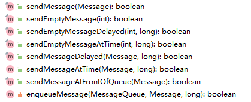
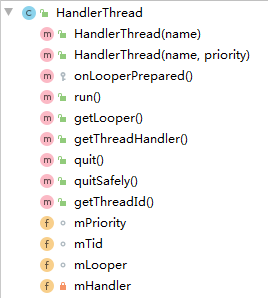

最开始使用`Handler`就是用于在子线程中通知主线程更新UI。示例如下:

```c++
// main thread
private static final Handler mHandler = new Handler(new Callback() {
	@Override
   	public boolean handleMessage(@NonNull Message msg) {
		Log.i(TAG, "Handler.Callback.handleMessage: 0x01");
		return true;
	}
});

//child thread
mHandler.sendMessage(msg);
```

UI主线程中有一个`Looper`用于处理消息队列中的消息。子线程通过`sendMessage`将消息放入到主线程的消息队列中。当UI主线程处理到这个消息时，就会调用`Handler`相应的`handleMessage`来处理，我们需要根据`Message.what`来区分消息的类型。


> 问题

1. `Looper`是如何处理`Message`的。
2. 当`Looper`和`Handler`存在1对多的关系时，`Looper`如何做到精准分发。
3. `HandlerThread`的实现以及使用方式。

带着这几个问题，来看看`Handler`、`Looper`的原理及实现。


## Looper

> Class used to run a message loop for a thread.  Threads by default do not have a message loop associated with them; to create one, call `prepare` in the thread that is to run the loop, and then `loop` to have it process messages until the `loop` is stopped.


how to use?

```java
Looper.prepare();
//enter loop
Looper.loop();
```


如前面所说，一个线程只能关联一个`Looper`。如何做到的呢？答案就是`ThreadLocal<?>`。

### prepare

```java
private static void prepare(boolean quitAllowed) {
	if (sThreadLocal.get() != null) {
		throw new RuntimeException("Only one Looper may be created per thread");
	}
	sThreadLocal.set(new Looper(quitAllowed));
}

private Looper(boolean quitAllowed) {
	mQueue = new MessageQueue(quitAllowed);
	mThread = Thread.currentThread();
}
```

so easy ? 创建一个 `Looper`对象，并将其设置到`ThreadLocal`中。注意， 当前线程的`MessageQueue`就是在`Looper`的构造函数中初始化的。关于`MessageQueue`又可以单独写一篇了，这里不做介绍了。


### loop

```java
public static void loop() {
	final Looper me = myLooper();
	if (me == null) {
		throw new RuntimeException("No Looper; Looper.prepare() wasn't called on this thread.");
	}
	final MessageQueue queue = me.mQueue;

	for (;;) {
		Message msg = queue.next();  // might block
		if (msg == null) {
			return;
		}
		final long slowDispatchThresholdMs = me.mSlowDispatchThresholdMs;
		final long start = (slowDispatchThresholdMs == 0) ? 0 : SystemClock.uptimeMillis();
		final long end;
		
        msg.target.dispatchMessage(msg);
		end = (slowDispatchThresholdMs == 0) ? 0 : SystemClock.uptimeMillis();
		
		if (slowDispatchThresholdMs > 0) {
			final long time = end - start;
			if (time > slowDispatchThresholdMs) {
				Slog.w(TAG, "Dispatch took " + time + "ms on "
						+ Thread.currentThread().getName() + ", h=" +
						msg.target + " cb=" + msg.callback + " msg=" + msg.what);
			}
		}
		msg.recycleUnchecked();
	}
}

```

核心大概就2行吧。

```java
Message msg = queue.next(); // might block
msg.target.dispatchMessage(msg);
```

从消息队列取出`Message`，然后通过处理消息。


## Handler

> A Handler allows you to send and process `Message` and `Runnable` objects associated with a thread's `MessageQueue`.  Each `Handler`  instance is associated with a single thread and that thread's message queue. 


### Handler如何处理消息

在`Looper.loop`中，通过调用`msg.target.dispatchMessage(msg)`来处理消息，实际上，就是调用的`Handler.dispatchMessage(msg)`。

```java
public void dispatchMessage(Message msg) {
    //[1]
	if (msg.callback != null) {
		handleCallback(msg);
	} else {
        //[2]
		if (mCallback != null) {
			if (mCallback.handleMessage(msg)) {
				return;
			}
		}
         //[3]
		handleMessage(msg);
	}
}
```

从这段代码我们得出一个结论， `Handler`中，处理`Message`的方式有三种。

1. 为`Message`设置一个指定的`Runnable`。通过：

    ```java
    public static Message obtain(Handler h, Runnable callback) {
    	Message m = obtain();
    	m.target = h;    
    	m.callback = callback;
    	return m;
    }
    ```

    这样，在`dispatchMessage` `[1]`中，`Message.callback`的优先级是最高的。

2. 为`Handler`指定一个`Callback`。通过其构造函数传入：

    ```java
    public Handler(Looper looper, Callback callback, boolean async) {
    	mLooper = looper;
    	mQueue = looper.mQueue;
    	mCallback = callback;
    	mAsynchronous = async;
    }
    
    public class Handler {
        public interface Callback {
            /**
             * @param msg A {@link android.os.Message Message} object
             * @return True if no further handling is desired
             */
            public boolean handleMessage(Message msg);
        }
    }
    ```

    `Callback.handleMessage`的返回值又决定了是否会调用到`Handler.handleMessage`。

3. 重写`Handler.handlMessage`。

    这个优先级是最低的，需要`msg.callback == null` 并且`Callback.handleMessage`返回`false`才会调用到。


### Handler如何发送消息

`Handler`中。我们只关注4个成员变量。

```java
final Looper mLooper;		//Looper
final MessageQueue mQueue;	//消息队列，
final Callback mCallback;   //Handler的回调
final boolean mAsynchronous;
```

其中,`mLooper = Looper.myLooper();` `mQueue = mLooper.mQueue;`。

所以，可以想象，`Handler`发送的消息，其本质都是将其放入到`Looper.myLooper().mQueue`中去。



发送消息的函数有这么多，最终都是调用的`enqueueMessage`。

```java
private boolean enqueueMessage(MessageQueue queue, Message msg, long uptimeMillis) {
    //回想Looper.loop中，就是通过这个target来调用Handler.dispatchMessage
	msg.target = this;
	if (mAsynchronous) {
		msg.setAsynchronous(true);
	}
	return queue.enqueueMessage(msg, uptimeMillis);
}
```

是滴，其本质都是将消息放入到当前线程Looper的消息队列中去。


## 同时使用Handler和Looper

在子线程中，我们可能需要同时使用`Looper`和`Handler`。按照上文的介绍，我们知道大致过程是这样的。

```java
Looper looper = Looper.myLooper();
//在进入循环前，创建 handler。
Handler handler = new Handler(looper);
looper.loop();
```

但是，如果我们需要在其他线程中获取`Looper`实例并创建Handler呢？我们就需要考虑同步了（确保其他线程能够获取到`Looper`对象）。

好在Android已经把这些操作都替我们封装好了。so，介绍一下`HandlerThread`类。




比较重要的函数就是`run`、`getLooper`和`getThreadHandler()`了。

```java
public class HandlerThread extends Thread {
...
}
```


### `getLooper`

```java
public Looper getLooper() {
	if (!isAlive()) {
		return null;
	}
	// If the thread has been started, wait until the looper has been created.
	synchronized (this) {
        while (isAlive() && mLooper == null) {
            try {
                wait();
            } catch (InterruptedException e) {
            }
        }
	}
	return mLooper;
}
```

我们需要保证，获取到的`Looper`对象不为空，所以需要使用锁以及条件变量来保证。


### `run()`

```java
public void run() {
	mTid = Process.myTid();
	Looper.prepare();
	synchronized (this) {
		mLooper = Looper.myLooper();
		notifyAll();
	}
	Process.setThreadPriority(mPriority);
	onLooperPrepared();
	Looper.loop();
	mTid = -1;
}

```

在进入`loop`后，当前线程就不能通过`Looper.myLooper();`来获取到`Looper`对象了，所以需要在这之前保存`Looper`对象。另外其他线程可能也需要获取`Looper`对象，通过`getLooper`。第4-7行代码就保证了`getLooper`返回值不会为空。


### getThreadHandler

```java
public Handler getThreadHandler() {
	if (mHandler == null) {
		mHandler = new Handler(getLooper());
	}
	return mHandler;
}
```

创建一个和当前线程`Looper`相关联的`Handler`对象。其他线程可以通过这个`Handler`实例来往当前线程的`MessageQueue`中放入`Message`。


## 总结

`Looper.loop`从消息队列中取出消息并处理它。

`Handler`负责将消息放入到消息队列中。其构造时，通过`Looper.myLooper().mQueue`来获取消息队列实例。

对于`Message`的回调优先级如下：

`Message.callback` > `Handler.callback` > `Handler.handleMessage`

```java
public void dispatchMessage(Message msg) {
	if (msg.callback != null) {
		handleCallback(msg);
	} else {
		if (mCallback != null) {
            //Handler.callback的返回值决定了是否会调用到Handler.handleMessage
			if (mCallback.handleMessage(msg)) {
				return;
			}
		}
		handleMessage(msg);
	}
}
```

