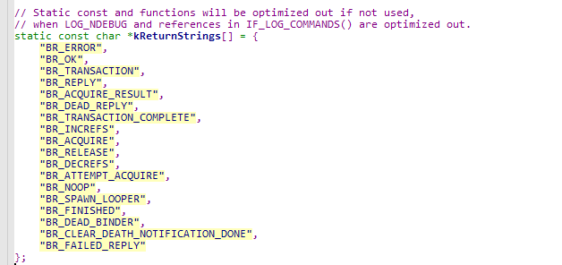
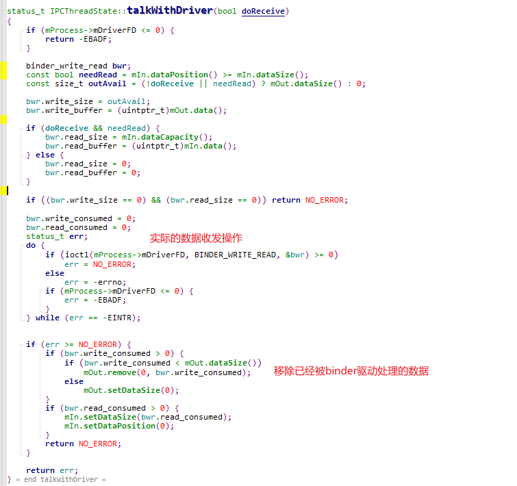

# IPCThreadState

在Android中，每个参与Binder通信的线程都会有一个`IPCThreadState`实例与之关联。我最开始接触到这个类是在`BpBinder::transact`方法中。

## transact

其就是调用的`IPCThreadState::transact`来完成的数据传输工作，其工作可以分为两步：

1. 发送数据

   实际上，`writeTransactionData`只是将数据转换成`binder_transaction_data`结构并重新写入到`IPCThreadState::mOut`中。

   并没有真正的将数据发送出去。实际的发送操作是在`waitForResponse`中完成的。

2. 接收数据

   `TF_ONE_WAY`表示的是单向通信，不需要对端回复。所以这里接收数据就多了几个判断分支。区别就是参数不一样。该函数必定需要被执行的，因为数据要发出去啊。。。

### writeTransactionData

我们创建一个Service，通过`addService`注册到`ServiceManager`时，就涉及到了传输一个`IBinder`对象的问题。libbinder将`IBinder`对象转换成一个`flat_binder_object`结构，虽然将该结构写入到`Parcel`中，最终在转换成`binder_transaction_data`。

### waitForResponse

`waitForResponse`实际上又是通过调用`IPCThreadState::talkWithDriver`方法来完成数据接发工作。随后再处理我们接收到的数据。

我们需要处理如下这些cmd：

处理CMD的函数就是`waitForResponse`和`executeCommand`。这里就不贴代码了。

### talkWithDriver

很容易理解，我们前面通过`writeTransactionData`,已经把数据写入到了`binder_transaction_data`中。`talkWithDriver`就是调用`ioctl(BINDER_WRITE_READ)`完成真正的数据接发。

## 

## 其他

> 待补充