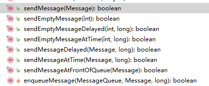

自顶向下看吧。故事还得从`Looper.loop`讲起。

```java
Message msg = queue.next(); // might block
msg.target.dispatchMessage(msg);
```

其核心就是这样，从`MessageQueue`中取出`Message`并调用其回调函数完成消息分发。这篇文章的重点就是`MessageQueue`的实现。

其实现分为Native和Java层两部分。

Native层实现主要在`Looper.cpp`和`android_os_MessageQueue.cpp`。Java层实现主要在`MessageQueue.java`文件中。

Java层与Native层通过JNI调用。

## Java层实现


通常，我们并不会直接使用到`MessageQueue`，但是，其是`Handler`和`Looper`中的核心类。我们通过调用`queue.next()`方法，从`MessageQueue`中取出一个`Message`。

在介绍`MessageQueue`前，我们先看一下`Message`类的定义。

### Message

这里只展示核心的数据成员。

```java
class Message {
    Message next;
	private static final Object sPoolSync = new Object();
    private static Message sPool;
    private static int sPoolSize = 0;
    private static final int MAX_POOL_SIZE = 50;
    private static boolean gCheckRecycle = true;
}
```

同一个进程中的所有`Message`使用单链表来管理。`sPool`是链表头，`next`指向下一个`Message`对象，这个链表用于表示当前空闲的`Message`对象，其作用在于避免频繁的`new`一个`Message`对象。通常，我们并不会直接`new`一个`Message`，而是通过`Message.obtain()`来获取一个`Message`对象。

```java
public static Message obtain() {
	synchronized (sPoolSync) {
		if (sPool != null) {
			Message m = sPool;
             sPool = m.next;
             m.next = null;
             m.flags = 0; // clear in-use flag
             sPoolSize--;
             return m;
		}
     }
     return new Message();
}
```

当`sPool`为空时，表示当前已经没有空闲的已分配的`Message`对象了，所以直接返回一个新的`Message`对象。相应的，看看`Message`对象是如何被回收的。

```java
    public void recycle() {
        if (isInUse()) {
            return;
        }
        recycleUnchecked();
    }
    void recycleUnchecked() {
        
        flags = FLAG_IN_USE;
        what = 0;
        arg1 = 0;
        arg2 = 0;
        obj = null;
        replyTo = null;
        sendingUid = -1;
        when = 0;
        target = null;
        callback = null;
        data = null;

        synchronized (sPoolSync) {
            //回收咯，
            if (sPoolSize < MAX_POOL_SIZE) {
                next = sPool;
                sPool = this;
                sPoolSize++;
            }
        }
    }
```

回收算法比较简单，`sPool`始终指向最新的回收的那个`Message`对象。


### MessageQueue

#### Message如何入队

通常，我们通过如下代码来发送消息。

```java
Handler mHandler = new Handler(new Handler.Callback() {
    //处理消息
    boolean handleMessage(Message msg) {
        ...
        return true;
    }
});
Message msg;
...
mHandler.sendMessae(msg);
```

`Handler`中提供的发送消息的函数大概有如下几个：



这几个函数最终都是调用的`enqueueMessage`，进而调用到`MessageQueue.enqueueMessage()`

```java
private boolean enqueueMessage(MessageQueue queue, Message msg, long uptimeMillis) {
    msg.target = this;
    if (mAsynchronous) {
        msg.setAsynchronous(true);
    }    
    return queue.enqueueMessage(msg, uptimeMillis);  
}

boolean enqueueMessage(Message msg, long when)  {    
    synchronized (this) {
        if (mQuitting) {
            return false;
        }

        msg.markInUse();
        msg.when = when;
        Message p = mMessages; //mMessages表示当前消息队列中的消息
        boolean needWake;
        if (p == null || when == 0 || when < p.when) { //当前消息需要立即执行
             // New head, wake up the event queue if blocked.
             msg.next = p;
             Messages = msg;
             needWake = mBlocked;
         } else {
            //为当前消息找到合适的位置插入
            // Inserted within the middle of the queue.  Usually we don't have to wake
            // up the event queue unless there is a barrier at the head of the queue
            // and the message is the earliest asynchronous message in the queue.
            needWake = mBlocked && p.target == null && msg.isAsynchronous();
            Message prev;
            //遍历所有节点，在根据when来找到合适的节点插入。
            for (;;) {
                prev = p;
                p = p.next;
                if (p == null || when < p.when) {
                    break;
                }
                if (needWake && p.isAsynchronous()) {
                    needWake = false;
                }
            }
            msg.next = p; // invariant: p == prev.next
            prev.next = msg;
        }
        // We can assume mPtr != 0 because mQuitting is false.
        if (needWake) {
            //唤醒Native层的Looper
            nativeWake(mPtr);
        }
    }   
    return true;
}
```


#### Message什么时候被发送

正如前面所言，在使用`Looper`时，需要调用`Looper.loop`,该函数是一个死循环，其通过调用`mQueue.next`来获取一个可用的`Message`对象，并且通过将其传递给`Message.target`来执行相应的处理函数。

那么，`next()`函数是如何返回一个可用的`Message`对象的呢？

```java
Message next() {
    // Return here if the message loop has already quit and been disposed.
    // This can happen if the application tries to restart a looper after quit
    // which is not supported.
    //这个mPtr就是Native层MessageQueue的指针。
    final long ptr = mPtr;
    if (ptr == 0) {
        return null;
    }

    int pendingIdleHandlerCount = -1; // -1 only during first iteration
    int nextPollTimeoutMillis = 0;
    for (;;) {
        if (nextPollTimeoutMillis != 0) {
            Binder.flushPendingCommands();
        }
        //调用底层的pollOnce，其作用主要是处理传入的文件描述符的事件，和我们java层的
        //Message并无直接关系。
        nativePollOnce(ptr, nextPollTimeoutMillis);

        synchronized (this) {
            // Try to retrieve the next message.  Return if found.
            final long now = SystemClock.uptimeMillis();
            Message prevMsg = null;
            Message msg = mMessages;
            //????
            if (msg != null && msg.target == null) {
                // Stalled by a barrier.  Find the next asynchronous message in the queue.
                do {
                    prevMsg = msg;
                    msg = msg.next;
                } while (msg != null && !msg.isAsynchronous());
               
            }
            
            //开始，
            if (msg != null) {
                //还没有到达触发时间，
                if (now < msg.when) {
                	//重新计算下一次poll的超时时间
                    // Next message is not ready.  Set a timeout to wake up when it is ready.
                    nextPollTimeoutMillis = (int) Math.min(msg.when - now, Integer.MAX_VALUE);
                } else {
                    // Got a message.
                    mBlocked = false;
                    //当前消息从mMessages链表中断开。
                    if (prevMsg != null) {
                        prevMsg.next = msg.next;
                    } else {
                        mMessages = msg.next;
                    }
                    msg.next = null;
                    msg.markInUse();
                    //返回
                    return msg;
                }
            } else {
                // No more messages.
                nextPollTimeoutMillis = -1;
            }
            //用于退出循环
            if (mQuitting) {
                dispose();
                return null;
            }
            // If first time idle, then get the number of idlers to run.
            // Idle handles only run if the queue is empty or if the first message
            // in the queue (possibly a barrier) is due to be handled in the future.
            if (pendingIdleHandlerCount < 0 && (mMessages == null || now < mMessages.when)) {
                pendingIdleHandlerCount = mIdleHandlers.size();
            }
                
            if (pendingIdleHandlerCount <= 0) {
                // No idle handlers to run.  Loop and wait some more.
                mBlocked = true;
                continue;
            }
            if (mPendingIdleHandlers == null) {
                mPendingIdleHandlers = new IdleHandler[Math.max(pendingIdleHandlerCount, 4)];
            }
            mPendingIdleHandlers = mIdleHandlers.toArray(mPendingIdleHandlers);
        }
         
        // Run the idle handlers.
        // We only ever reach this code block during the first iteration.
        for (int i = 0; i < pendingIdleHandlerCount; i++) {
            final IdleHandler idler = mPendingIdleHandlers[i];
            mPendingIdleHandlers[i] = null; // release the reference to the handler
            boolean keep = false;
            try {
                keep = idler.queueIdle();
            } catch (Throwable t) {
                Log.wtf(TAG, "IdleHandler threw exception", t);
            }
            if (!keep) {
                synchronized (this) {
                    mIdleHandlers.remove(idler);
                }
            }
        }
        pendingIdleHandlerCount = 0;
        nextPollTimeoutMillis = 0;
    }
}
```

`next`函数的处理逻辑就是：

1. `MessageQueue`中有可用`Message`就返回`msg.when <= now`的那个`Message`。
2. `MessageQueue`中无可用`Message`，进入`loop`，并执行相应的`IDLE Handler`。


## Native 层实现

底层实现就是基于`epoll`来完成的。主要内容和`Looper.loop`类似，这里就不做多的分析了。

主要代码都在`system/core/libutils/Looper.cpp`中。


## 总结

1. MessageQueue中，`nativeWake`的什么时候会被调用?

    插入新的消息时。

2. 异步消息和同步屏障是什么？