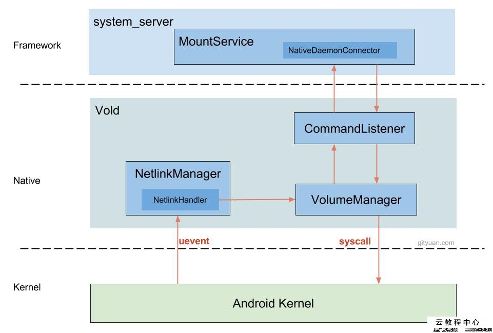

## 基本类

1. `SocketClient`

   封装了向网络文件描述符发送数据的一些操作。

   支持发送二进制数据以及以`\0`结尾的字符串数据。

   所有的数据最终都通过`sendDataLockedv`发送，其内部调用`writev`来发送数据。

2. `SocketListener`

   封装了对服务端socket的监听操作。当有新连接进入时，将其构造成一个`SocketClient`对象，并放置到内部的`mClients`链表中。通过这个类，我们可以向建立连接的client 发送广播消息等类似的批量操作。

   该类是一个抽象类，我们要继承该类并重写其纯虚函数。

   ```c++
    virtual bool onDataAvailable(SocketClient *c) = 0;
   ```

   其意义是， `SocketClient`当前有数据可读。

   `SocketListener`和系统调用`listen`还是有区别的，后者基本用于服务端socket的监听，前者则表示其支持的是对socket的事件监听。`server socket`传入，则用于接收连接，并将接受的连接放入到`mClients`中，`client socket`传入，则直接放入到`mClients`中。最终，通过`select` 监听`mClinets`中所有文件描述符以及`mCtrlPipe[0]`和`mSocket`（server socekt)的所有事件。

3. `SocketClientCommand`

   在指定的`SocketClient`上，执行一条命令。我们需要继承并实现该类的纯虚函数。其在`SocketListener::runOnEachSocket`中被使用。

   ```c++
   class SocketClientCommand {
   public:
       virtual ~SocketClientCommand() { }
       virtual void runSocketCommand(SocketClient *client) = 0;
   };
   ```

   说白了，就是类似Java中的一个接口。


## 概述

Vold： Volume Daemon，用于管理和控制Android 平台外部存储设备的后台进程。包括SD卡的拔插事件检测、SD卡挂载、卸载以及格式化。




