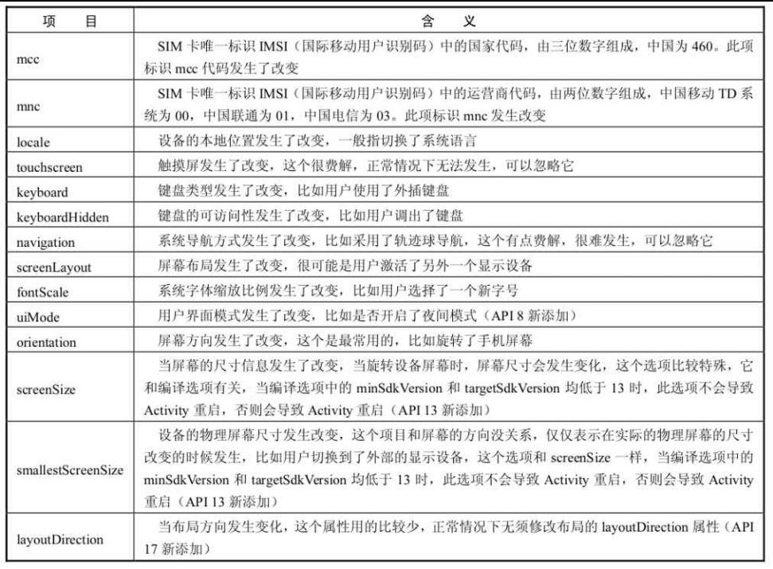

## Activity的生命周期


### 通常情况下的生命周期


`onCreate`: 完成初始化操作。

`onStart`:此时Activity已经可见，但还没有出现在前台，无法和用户交互。这个时候其实可以理解为Activity已经显示出来了，但是我们还看不到。

`onResume`: 表示Activity已经可见了，并且出现在前台并开始活动。要注意这个和onStart的对比，onStart和onResume都表示Activity已经可见，但是onStart的时候Activity还在后台，onResume的时候Activity才显示到前台。

`onPause`: Activity正在停止。此时可以做一些存储数据、停止动画等工作，但是注意不能太耗时，因为这会影响到新Activity的显示，onPause必须先执行完，新Activity的onResume才会执行。

`onStop`: :yellow_heart: 也不能执行太耗时的操作。

`onDestroy`：表示Activity即将被销毁，这是Activity生命周期中的最后一个回调，在这里，我们可以做一些回收工作和最终的资源释放。

`onRestart`：表示Activity正在重新启动。一般情况下，当当前Activity从不可见重新变为可见状态时，onRestart就会被调用。这种情形一般是用户行为所导致的，比如用户按Home键切换到桌面或者用户打开了一个新的Activity，这时当前的Activity就会暂停，也就是onPause和onStop被执行了，接着用户又回到了这个Activity，就会出现这种情况。


### 异常情况下的生命周期

#### 资源相关的系统配置导致Activity重启

以屏幕旋转为例，其会导致Activity被销毁并重新创建。此时，`onPause`、`onStop`和`onDestory`均会被调用。此外，系统还会调用一个`onSaveInstanceState`的函数来保存Activity的状态。其调用在`onStop`之后 `onDestory`之前。

通过配置`AndroidMainfest.xml`中给`activity`添加`android:configChanges="orientation"`属性，可以阻止activity被销毁。




使用方式:

```xml
<activity
        android:name="com.ryg.chapter_1.MainActivity"
        android:configChanges="orientation|screenSize"
        android:label="@string/app_name" >
        <intent-filter>
                <action android:name="android.intent.action.MAIN" />
                <category android:name="android.intent.category.LAUNCHER" />
        </intent-filter>
    </activity>
```


#### 资源内存不足导致低优先级的Activity被杀死

Activity的优先级如下：

1. 前台Activity

   正在和用户交互的Activity，优先级最高。

2. 可见但非前台Activity

   比如Activity中弹出了一个对话框，导致Activity可见但是位于后台无法和用户直接交互。

3. 后台Activity

   已经被暂停的Activity，比如执行了onStop，优先级最低。


## Acitvity的启动模式


Android提供了4种启动模式。

1. Standard

   默认模式，每次启动时创建一个新的实例，无论当前Activity是否已存在多个实例。standard模式的Activity默认会进入启动它的Activity所属的任务栈中，但是由于非Activity类型的Context（如ApplicationContext）并没有所谓的任务栈，所以这就有问题了。解决这个问题的方法是为待启动Activity指定FLAG_ACTIVITY_NEW_TASK标记位，这样启动的时候就会为它创建一个新的任务栈，这个时候待启动Activity实际上是以singleTask模式启动的。

2. SingleTop

   栈顶复用模式。如果新的Activity已经有一个实例位于栈顶，就不在重新创建。此外，`onCreate`、`onStart`不会被调用， 但是会依次调用`onNewIntent`、`onResume`。
   
3. SingleTask

   栈内复用模式。只要栈中有一个相同的Activity存在，就不会再创建新的实例。

   如果Activity栈中，新创建的Activity有其他实例存在非栈顶，那么就不会创建新的Activity实例，而是将其他的Activity实例出栈直到Activity位于栈顶。

4. SingleInstance

   单实例模式。加强版SingleTask，系统会为该Activity创建单独的任务栈。


## IntentFilter

Activity的启动分为隐式和显式两种。

显式启动代码如下：

```java
Intent intent = new Intent(this MyActivity.class);
startActivity(intent);
```

隐式启动代码如下：

```java
Intent intent = new Intent("com.github.liutimo.MAIN");
startActivity(intent);
```

使用隐式启动时，我们需要在`<activity></activity>`中添加一个`<intent-filter></intent-filter>`。

```xml
<activity
	android:name=".MainActivity">
    <intent-filter>
        <action android:name="android.intent.action.MAIN" />
        <category android:name="android.intent.category.LAUNCHER" />
    </intent-filter>
</activity>
```


**android如何匹配intent中的信息**

`IntentFilter`中支持的过滤信息有`data`、`action`和`categoty`。通过`Intent`隐式启动Activity时，需要同时匹配`data`、`action`和`categoty`才能成功启动Activity（如果三个中有一个不存在，则无需匹配）。


### action的匹配规则

`Intent`的匹配需满足如下要求：

1. 必须存在一个action
2. 区分大小写
3. 和`intent-filter`中的一个匹配即可。


> 一个Intent 只能通过 setAction指定一个 action

### category的匹配规则

`Intent`的匹配需满足如下条件。

1. `intent-filter`中不是必须存在`category`的
2. 如果我们`Intent`没有指定category，会自动为`Intent`添加android.intent.category.DEFAULT`,所以`intent-filter`必须添加`android.intent.category.DEFAULT`
3. 如果存在多个`category`，每个都要在`intent-filter`中找到匹配的。

>  第二点的例外情况是，`intent-filter`中指定了：`android.intent.category.MAIN`和`android.intent.category.LAUNCHER`


### data的匹配规则

`data`的语法如下：

```xml
<data android:scheme="string"
      android:host="string"
      android:port="string"
      android:path="string"
      android:pathPattern="string"
      android:pathPrefix="string"
      android:mimeType="string" />
```


data由两部分组成， `mineType`进而 `Uri`。前置表示媒体类型，`Uri的组成如下`：

`<scheme>://<host>:<port>/[<path>|<pathPrefix>|<pathPattern>]`

1. scheme

   其可以为`content`、`http`、`file`，但是不能不指定，否则，URI就是无效的。

2. host
  URI的主机名，同样，必须要要指定，否则URI无效

3. Port

  端口号。同时指定了scheme和host时有意义

4. Path、pathPattern、pathPrefix

   ：这三个参数表述路径信息，其中path表示完整的路径信息；pathPattern也表示完整的路径信息，但是它里面可以包含通配符“*”，“*”表示0个或多个任意字符，需要注意的是，由于正则表达式的规范，如果想表示真实的字符串，那么“*”要写成“\\*”，“\”要写成“\\\\”；pathPrefix表示路径的前缀信息。


