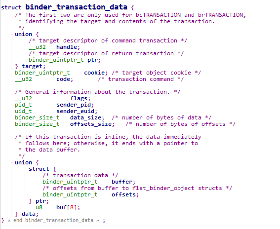
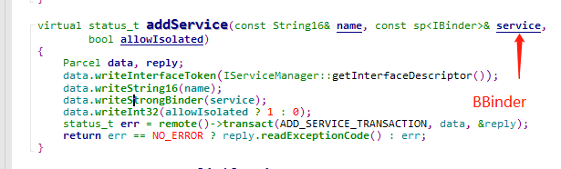
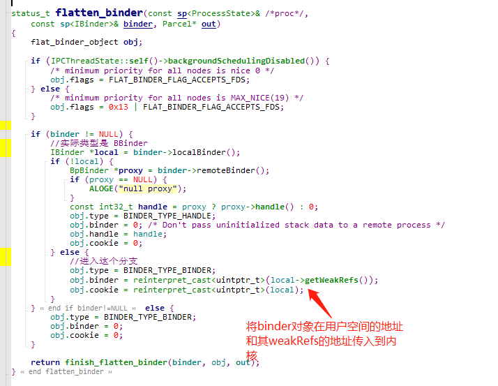
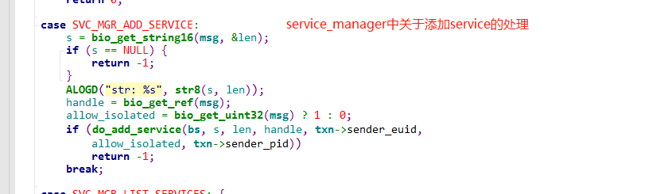
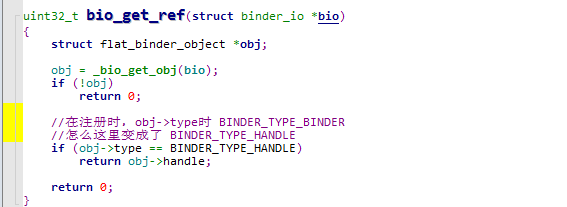
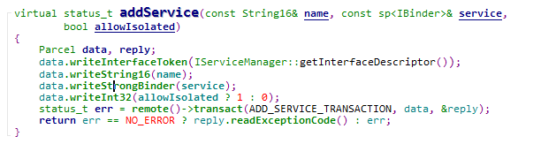
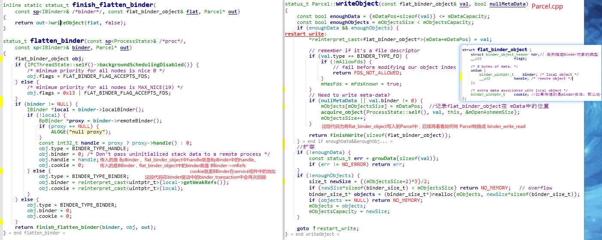
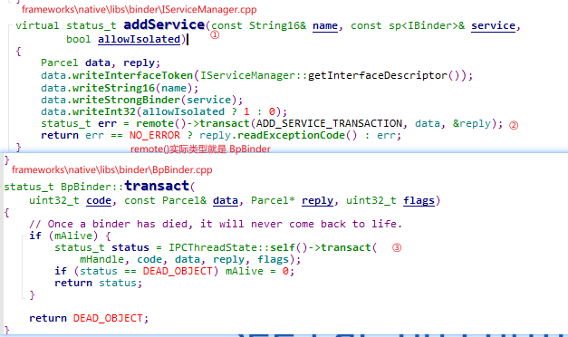
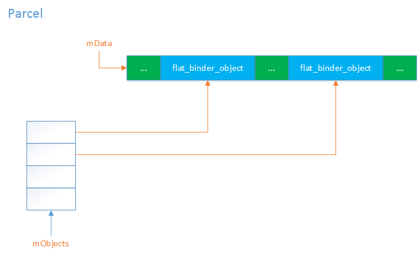

前面看libbinder的实现的时候还是有一些问题的，`BpBinder`通过一个`handle`就能完成数据通信，这个`handle`的本质是啥？


**1. 用户空间程序通过 `struct binder_write_read` 结构体完成同binder驱动的数据交换**

```c++
struct binder_write_read {
	binder_size_t		write_size;		/* bytes to write */
	binder_size_t		write_consumed;	/* bytes consumed by driver */
	binder_uintptr_t	write_buffer;	/* buffer */
	binder_size_t		read_size;		/* bytes to read */
	binder_size_t		read_consumed;	/* bytes consumed by driver */
	binder_uintptr_t	read_buffer;     /* buffer */
};
```

2. **binder驱动如何解析来自用户空间程序的数据**

   在`binder_write_read->write_buffer`中，数据的组成通常一般都是`cmd + extra`(重复)。

   下表记录常用的`cmd`与其对应的`extra`数据。

   | CMD              | 附加数据                         |
   | ---------------- | -------------------------------- |
   | `BC_FREE_BUFFER` | `binder_uintptr_t`  指针         |
   | `BC_REPLY`       | `struct binder_transaction_data` |
   | `BC_TRANSACTION` | `struct binder_transaction_data` |
   |                  |                                  |
   
   


3. 数据在binder驱动中是如何传递的。

   传输数据所使用的`CMD`是`BC_TRANSACTION`。

   相应的，要理解数据如何在binder驱动中传递，就要理解数据是如何保存在`struct binder_transaction_data`结构体中的。

   

   

   

   

   

   

   在线程中，在libbinder中我们知道数据传输数据是通过`IPCThreadState::transact(...)`传递。

   

   


## 问题列表


### 为什么通过handle就能和我们需要的service通信

#### 将进程注册到service_manager

```c++
defaultServiceManager()->addService(String16(CALC_SERVICE), new MyService);
```

这行代码做了什么？核心内容应该是 `addService`做了什么？

首先，作为service， 我们需要继承`BBinder`。其`localBinder`返回的是`this`指针。



这里，将`IBinder`对象写入到了`Parcel`中？？？




我们最终会进入到图中所示的那个分支，这个用`flat_binder_object`结构记录了Binder的类型，我们的service在用户空间的地址以及其weakRefs在用户空间的地址。

然后将`flat_binder_object`结构写入到`out`所指示的`Parcel`对象中。

额，再回到`addService`，其直接就把`Parcel`对象通过`BpBinder->transact()`发送给了`service_manager`。所以我们就先看看`service_mananger`做了什么。


#### service_manager如何处理ADD_SERVICE_TRANSACTION命令字





如上，注册service过程中，传输到`service_mananger`的数据在传输过程中发生了更改。这个更改是怎么导致的？？


#### 数据传输过程中 binder 驱动做了什么？

接着第一点的 注册service到ServiceMananger来看。

```c++
cmd == BC_TRANSACTION
```

```shell
-- binder_ioctl
	-- 获取调用线程关联的 binder_thread
	-- binder_ioctl_write_read
		-- 将 binder_write_read从用户空间拷贝到内核空间
		-- binder_thread_write
			-- 读取 cmd;cmd == BC_TRANSACTION
			-- 将 binder_transaction_data 从用户空间拷贝到内核空间
			-- binder_transaction(reply == false)
				-- target_node == context->binder_context_mgr_node;
				-- target_proc == service_manager target_thread == nullptr
				-- 创建一个 binder_transaction 和一个 binder_work
				-- 在target_proc->alloc上创建一个 binder_buffer(就是binder_transaction->buffer)
				-- 将数据从用户空间拷贝到 binder_buffer中。(这里就是 binder 传输数据时的唯一一次内存拷贝)
				-- 处理传输的binder对象
					-- type == BINDER_TYPE_BINDER
					-- binder_translate_binder
						-- 为传输的bidner对象创建一个binder_node 并挂载到调用进程的红黑树中
						-- 更改binder_transaction中的一些属性， 由本地binder向remote binder转换
				-- binder_proc_transaction (传输数据到target_proc)
					简单的说就是将binder_transaction挂载到target_proc或target_thread的todo链表中，并且唤醒其等待队列上的进程。
	-- 将数据拷贝会用户空间
```


1. 将需要发送的数据写入到`Parcel`。

      

	这段代码中需要理解的就是`writeStrongBinder`做了什么。我们现忽略所有关于对象生命周期的东西。

      
      
        	
      
      从这段代码可以看到，`IBinder`被转换成为了一个`flat_binder_object`对象，写入到`Parcel`中。
      
      对于`remote binder` 我们通过`flat_binder_object`来表示。
      
      对于`local binder`我们通过`flat_binder_object->cookie`和`flat_binder_object->binder`来表示。
      
      > ？？？？ 既然已经有了BBinder实例，为啥还要单独获取一个mRefs，他不就是 BBinder中的一个成员变量吗？？

 


  2. 将需要发送的数据传输到binder驱动

      通过`ioctl`传输数据到驱动层通过`BINDER_WRITE_READ` 控制字，其参数类型是`struct binder_write_read`。那么`Parcel`是如何转换成`struct binder_write_read`结构的？

     我们知道,`remote()->transact()`方法最终执行到的就是`IPCThreadState::transact()`方法。同样以`addService`为例。

     其函数调用流程如下：

     

     `IPCThreadState::transact()`最终调用`IPCThreadState::writeTransactionData()`将传入的`data`转换成`binder_write_read`并将其写入到`IPCThreadState::mOut`中。

     在`Parcel`中，大概的对象布局如下：

     

     