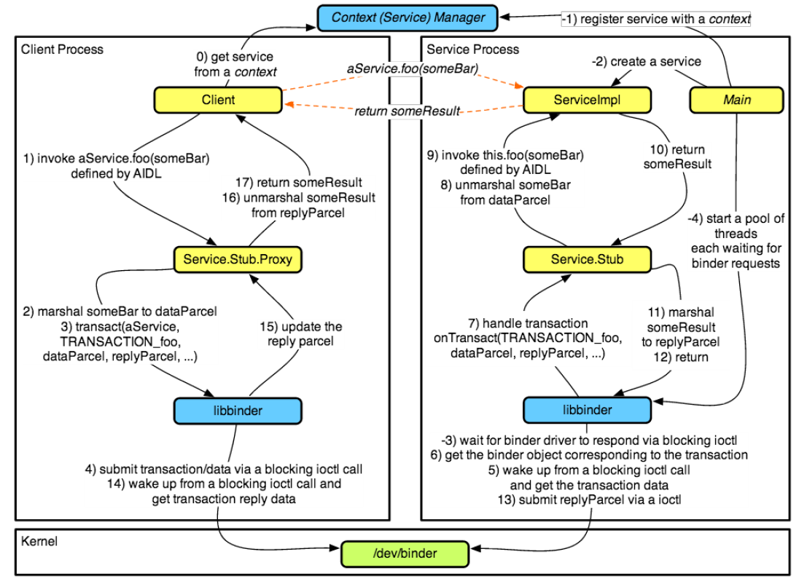
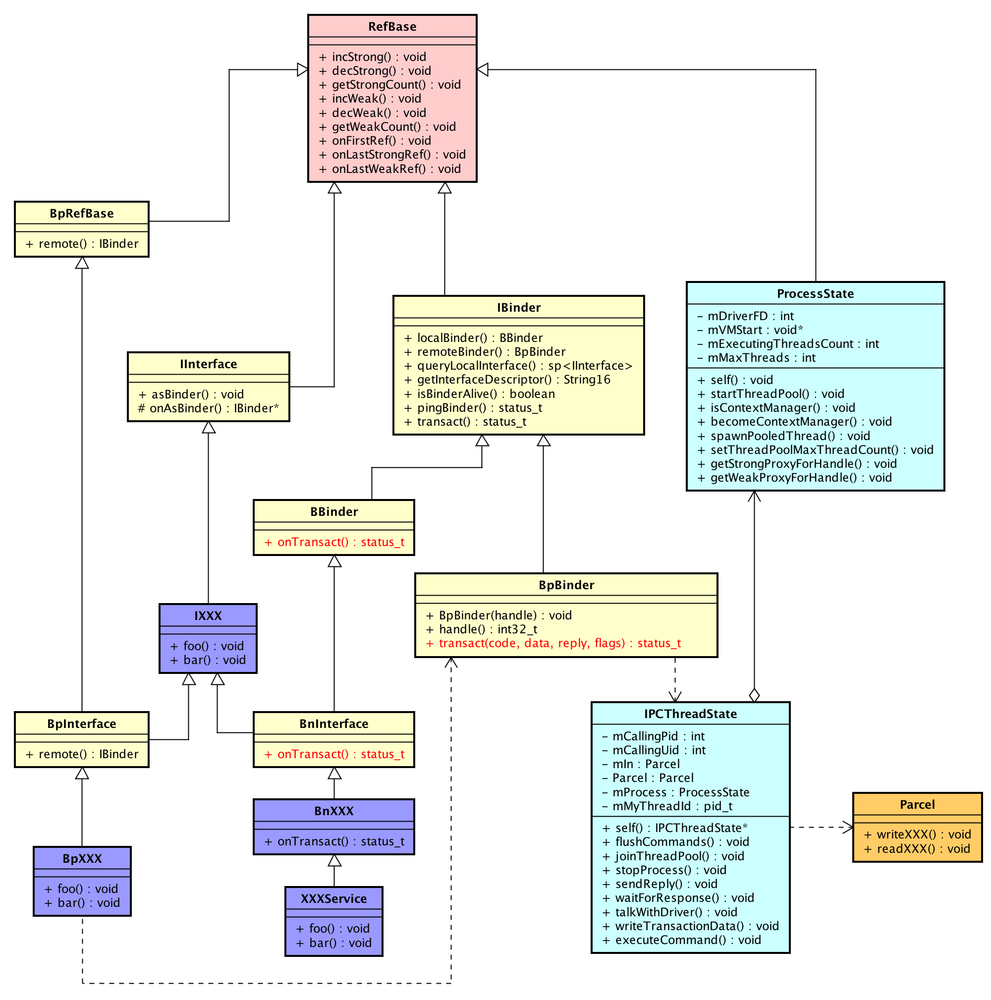

## libbinder 类图




## IBinder

**`frameworks/native/libs/binder/include/binder/IBinder.h`**

Base class and low-level protocol (底层协议) for a remotable object. You can derive from this class to create an object for which other processes can hold references to it. 

Communication between processes (method calls, property get and set) is down through a low-level protocol implemented on top of the transact() API.

通过实现 `transact()` 完成进程通信(属性设置、获取或方法调用)。


### IBinder中的枚举值

```c++
enum
{
    //这两个用于定义 一个code我们自定义的code。transact()方法的第一个参数
    FIRST_CALL_TRANSACTION = 0x00000001,
    LAST_CALL_TRANSACTION = 0x00ffffff,
	
    //默认的一些code。
    PING_TRANSACTION = B_PACK_CHARS('_', 'P', 'N', 'G'),
    DUMP_TRANSACTION = B_PACK_CHARS('_', 'D', 'M', 'P'),
    SHELL_COMMAND_TRANSACTION = B_PACK_CHARS('_', 'C', 'M', 'D'),
    INTERFACE_TRANSACTION = B_PACK_CHARS('_', 'N', 'T', 'F'),
    SYSPROPS_TRANSACTION = B_PACK_CHARS('_', 'S', 'P', 'R'),

    // Corresponds to TF_ONE_WAY -- an asynchronous call.
    FLAG_ONEWAY = 0x00000001
};
```


### 函数

`IBinder`中大部分函数都需要子类(`BBinder` or `BpBinder`)来实现。其中比较重要的就是 `transact` 方法。

```c++
//后面在BpBinder中会看到他的实现。
virtual status_t transact(uint32_t code,         	
                          const Parcel &data,
                          Parcel *reply,
                          uint32_t flags = 0) = 0;
```


### DeathRecipient

接收死亡通知信号。

```c++
//IBinder 内部类
class DeathRecipient : public virtual RefBase
{
public:
    virtual void binderDied(const wp<IBinder> &who) = 0;
};

//IBinder 成员方法
virtual status_t linkToDeath(const sp<DeathRecipient> &recipient,
                             void *cookie = NULL,
                             uint32_t flags = 0) = 0;

virtual status_t unlinkToDeath(const wp<DeathRecipient> &recipient,
                               void *cookie = NULL,
                               uint32_t flags = 0,
                               wp<DeathRecipient> *outRecipient = NULL) = 0;
```


## BBinder

**`frameworks/native/libs/binder/include/binder/Binder.h`**

在Binder通信中，涉及到两个对端，一个Server端，一个Client端。而BBinder就是用表示Server端的一个Binder对象，它对外提供相关服务。所以，在IPC过程中，他不会主动发起数据传输，只会响应Client的请求。所以，相比`IBinder`，其内部多了一个名为`onTransact`的函数。该函数用于处理来自Client的请求。


### BBinder::onTransact

`BBinder`的`onTransact`实现中完成了对IBinder中已经声明的code的默认处理。

```c++
status_t BBinder::onTransact(
    uint32_t code, const Parcel& data, Parcel* reply, uint32_t /*flags*/)
{
    switch (code) {
        case INTERFACE_TRANSACTION: {
            ...
        }

        case DUMP_TRANSACTION: {
            ...
        }

        case SHELL_COMMAND_TRANSACTION: {
            ...
        }
        case SYSPROPS_TRANSACTION: {
            ...
        }
        default:
            return UNKNOWN_TRANSACTION;
    }
}
```


如上，`IBinder::transact`是一个纯虚函数，在`BBinder`中是如何实现的？


### BBinder::transact

```c++
status_t BBinder::transact(
    uint32_t code, const Parcel& data, Parcel* reply, uint32_t flags)
{
    data.setDataPosition(0);

    status_t err = NO_ERROR;
    switch (code) {
        case PING_TRANSACTION:
            reply->writeInt32(pingBinder());
            break;
        default:
            err = onTransact(code, data, reply, flags);
            break;
    }

    if (reply != NULL) {
        reply->setDataPosition(0);
    }

    return err;
}
```

​	额，巨简单。对于除`PING_TRANSACTION`的所有code，都调用`onTransact`来处理。


> Tips: IBinder::transact会在 IPCThreadState中被调用。


### BBinder::linkToDeath 和 BBinder::unlinkToDeath

```c++
status_t BBinder::linkToDeath(
    const sp<DeathRecipient>& /*recipient*/, void* /*cookie*/,
    uint32_t /*flags*/)
{
    return INVALID_OPERATION;
}

status_t BBinder::unlinkToDeath(
    const wp<DeathRecipient>& /*recipient*/, void* /*cookie*/,
    uint32_t /*flags*/, wp<DeathRecipient>* /*outRecipient*/)
{
    return INVALID_OPERATION;
}
```

直接返回`INVALID_OPERATION`。额，大概就是说， 当`BBinder`挂了时，会通知`BpBinder`，而`BBinder`不需要关心其他`Binder`对象的死活。


## BpBinder

继承制`IBinder`，但是多了一个成员变量 `mHandle`。`BpBinder`表示的是一个`Proxy Binder`，被代理的对象就是`BBinder`。`BpBinder`和`BBinder`通常不会出现在同一个进程。所以，`mHandle`的作用就是binder驱动能够通过它找到其引用的`BBinder`对象。具体需要看一哈`binder`驱动的实现。

同理，先看一哈`BpBinder`是如何重写`IBinder::transact`的。


### BpBinder::transact

```C++
status_t BpBinder::transact(
    uint32_t code, const Parcel& data, Parcel* reply, uint32_t flags)
{
    // Once a binder has died, it will never come back to life.
    if (mAlive) {
        status_t status = IPCThreadState::self()->transact(
            mHandle, code, data, reply, flags);
        if (status == DEAD_OBJECT) mAlive = 0;
        return status;
    }

    return DEAD_OBJECT;
}
```

嗯，直接调用`IPCThreadState::transact`。


### BpBinder::linkToDeath 和 BpBinder::unlinkToDeath

```c++
status_t BpBinder::linkToDeath(
    const sp<DeathRecipient>& recipient, void* cookie, uint32_t flags)
{
    Obituary ob;
    ob.recipient = recipient;
    ob.cookie = cookie;
    ob.flags = flags;

    LOG_ALWAYS_FATAL_IF(recipient == NULL,
                        "linkToDeath(): recipient must be non-NULL");

    {
        AutoMutex _l(mLock);

        if (!mObitsSent) {
            if (!mObituaries) {
                mObituaries = new Vector<Obituary>;
                if (!mObituaries) {
                    return NO_MEMORY;
                }
                ALOGV("Requesting death notification: %p handle %d\n", this, mHandle);
                getWeakRefs()->incWeak(this);
                IPCThreadState* self = IPCThreadState::self();
                self->requestDeathNotification(mHandle, this);
                self->flushCommands();
            }
            ssize_t res = mObituaries->add(ob);
            return res >= (ssize_t)NO_ERROR ? (status_t)NO_ERROR : res;
        }
    }

    return DEAD_OBJECT;
}

status_t BpBinder::unlinkToDeath(
    const wp<DeathRecipient>& recipient, void* cookie, uint32_t flags,
    wp<DeathRecipient>* outRecipient)
{
    AutoMutex _l(mLock);

    if (mObitsSent) {
        return DEAD_OBJECT;
    }

    const size_t N = mObituaries ? mObituaries->size() : 0;
    for (size_t i=0; i<N; i++) {
        const Obituary& obit = mObituaries->itemAt(i);
        if ((obit.recipient == recipient
                    || (recipient == NULL && obit.cookie == cookie))
                && obit.flags == flags) {
            if (outRecipient != NULL) {
                *outRecipient = mObituaries->itemAt(i).recipient;
            }
            mObituaries->removeAt(i);
            if (mObituaries->size() == 0) {
                ALOGV("Clearing death notification: %p handle %d\n", this, mHandle);
                IPCThreadState* self = IPCThreadState::self();
                self->clearDeathNotification(mHandle, this);
                self->flushCommands();
                delete mObituaries;
                mObituaries = NULL;
            }
            return NO_ERROR;
        }
    }

    return NAME_NOT_FOUND;
}
```

> 这里暂时不分析，后面看到了Binder的死亡通知机制时再回头补充。


## 如何使用libbinder

我们创建一个server 用于完成加减法运算。 然后client通过binder来调用server提供的加减法服务。


### Common

首先，Server和Client是可以有一部分通用的。

1. 继承`IInterface`，并实现我们的一些接口。

   ```c++
   class ICalcService : public IInterface {
   public:
   
       //通过宏来声明一堆interface的通用接口。{构造函数、析构函数、asInterface、和 getInterfaceDescriptior}
       DECLARE_META_INTERFACE(CalcService);
   
       //完成加法运算
       virtual int32_t add(int a, int b) = 0;
   
       //完成减法运算
       virtual int32_t sub(int a, int b) = 0;
   };
   ```

2. 定义 code。 code的值从 `IBinder::FIRST_CALL_TRANSACTION`开始。

   ```c++
   //用来定义命令字，很重要的， Server端和Client端必须保持一致
   enum {
       ADD = IBinder::FIRST_CALL_TRANSACTION,
       SUB
   };
   ```

3.  继承`BpInterface`

   ```c++
   class BpCalcService : public BpInterface<ICalcService> {
   public:
       BpCalcService(const sp<IBinder> &impl) : BpInterface<ICalcService>(impl) {}
   
   
   public:
       
       //完成加法运算
       int32_t add(int a, int b) override {
           Parcel data;
           data.writeInterfaceToken(ICalcService::getInterfaceDescriptor());
           data.writeInt32(a);
           data.writeInt32(b);
   
   
           Parcel reply;
           //remote()实际上就是 BpBinder
           remote()->transact(ADD, data, &reply);
   
           int32_t val = reply.readInt32();
           return val;
       }
   
       //完成减法运算
       int32_t sub(int a, int b) override {
           Parcel data;
           data.writeInterfaceToken(ICalcService::getInterfaceDescriptor());
           data.writeInt32(a);
           data.writeInt32(b);
   
           Parcel reply;
           remote()->transact(SUB, data, &reply);
           
           return reply.readInt32();
       }
   };
   ```

4. 使用`IMPLEMENT_META_INTERFACE`宏

   ```c++
   //BpInterface的实现必选在 该宏之前
   IMPLEMENT_META_INTERFACE(CalcService, "com.github.liutimo.CalcService")
   ```

   这里需要注意的是 该宏必须写在`BpCalcService`之后，否则可能会出现找不到`BpCalcService`的编译错误。

5. 继承`BnInterface`

   ```c++
   class BnCalcService : public BnInterface<ICalcService> {
   public:
       status_t onTransact(uint32_t code,
                           const Parcel& data,
                           Parcel* reply,
                           uint32_t flags = 0) override;
   } ;
   status_t BnCalcService::onTransact(uint32_t code,
                                      const Parcel& data,
                                      Parcel* reply,
                                      uint32_t flags) {
       switch (code) {
           case ADD: {
                   CHECK_INTERFACE(ICalcService, data, reply);
                   int32_t a = data.readInt32();
                   int32_t b = data.readInt32();
                   int32_t sum = add(a, b);
                   reply->writeInt32(sum);
               }
               return NO_ERROR;
           case SUB: {
                   CHECK_INTERFACE(ICalcService, data, reply);
                   int32_t a = data.readInt32();
                   int32_t b = data.readInt32();
                   int32_t difference = sub(a, b);
                   reply->writeInt32(difference);
               }
               return NO_ERROR;
           default:
               return BBinder::onTransact(code, data, reply, flags);
       }
   }
   ```

   

### Server的实现

2. 实现我们的加减逻辑并注册到Service Manager

   ```c++
   class CalcService : public BnCalcService
   {
   public:
       CalcService()
       {
       }
   
       virtual ~CalcService()
       {
       }
   
   public:
       static void init()
       {
           //注册
           defaultServiceManager()->addService(String16(CALC_SERVICE), new CalcService);
       }
   
   protected:
       int32_t add(int a, int b) override
       {
           return a + b;
       }
   
       int32_t sub(int a, int b) override
       {
           return a - b;
       }
   };
   ```

   第一二步其实可以合并。

3. 启动Server

   ```c++
   int main(int argc, char *agrv[])
   {
       //注册到Service Manger
       CalcService::init();
   	//[1]创建一个子线程
       ProcessState::self()->startThreadPool();
       //[2]阻塞主线程
       IPCThreadState::self()->joinThreadPool();
       return 0;
   }
   ```

   `[1]` ` [2]`处的代码，具体是哪个线程来完成binder通信的数据处理？

   

### Client端的实现

​	Server注册到Service Manager，client就能直接获取到其服务了。

```C++
int main(int argc, char *argv[]) {
    sp<IBinder> server = defaultServiceManager()->getService(String16(CALC_SERVICE));
    if (server == nullptr) {
        std::cout << "获取Calc Service失败" << std::endl;
        return 0;
    }    
    sp<ICalcService> calcSerive = ICalcService::asInterface(server);
    if (calcSerive == nullptr) {
        std::cout << "asInterface失败" << std::endl;
        return 0;
    }

    if (argc < 4) {
        return 0;
    }

    int a = atoi(argv[1]);
    char op = argv[2][0];
    int b = atoi(argv[3]);

    if (op == '+') {
        std::cout << calcSerive->add(a, b) << std::endl;
    } else if (op == '-') {
        std::cout << calcSerive->sub(a, b) << std::endl;
    }

    return 0;
}
```


### 问题点

1. `ICalcService::asInterface`是如何将`defaultServiceManager()->getService()`返回的`IBinder`转换成`ICalcService`的。
2. `BpBinder::mHandle`在哪被赋值？其值是如何获取到的。

要理解这几个问题，就需要看一哈 `IInterface`、`BpInterface`和`BnInterface`的实现。

其中比较重要的就是`IInterface`了，毕竟`asInterface`就是在这里实现的。


## IInterface

定义比较简单，重点就是`DECLARE_META_INTERFACE` 和 `IMPLEMENT_META_INTERFACE`两个宏。

### `DECLARE_META_INTERFACE` 

```c++
#define DECLARE_META_INTERFACE(INTERFACE)                               \
    static const ::android::String16 descriptor;                        \
    static ::android::sp<I##INTERFACE> asInterface(                     \
            const ::android::sp<::android::IBinder>& obj);              \
    virtual const ::android::String16& getInterfaceDescriptor() const;  \
    I##INTERFACE();                                                     \
    virtual ~I##INTERFACE();                                            \
```

### `IMPLEMENT_META_INTERFACE`

```c++

#define IMPLEMENT_META_INTERFACE(INTERFACE, NAME)                       \
    const ::android::String16 I##INTERFACE::descriptor(NAME);           \
    const ::android::String16&                                          \
            I##INTERFACE::getInterfaceDescriptor() const {              \
        return I##INTERFACE::descriptor;                                \
    }                                                                   \
    ::android::sp<I##INTERFACE> I##INTERFACE::asInterface(              \
            const ::android::sp<::android::IBinder>& obj)               \
    {                                                                   \
        ::android::sp<I##INTERFACE> intr;                               \
        if (obj != NULL) {                                              \
            intr = static_cast<I##INTERFACE*>(                          \
                obj->queryLocalInterface(                               \
                        I##INTERFACE::descriptor).get());               \
            if (intr == NULL) {                                         \
                intr = new Bp##INTERFACE(obj);                          \
            }                                                           \
        }                                                               \
        return intr;                                                    \
    }                                                                   \
    I##INTERFACE::I##INTERFACE() { }                                    \
    I##INTERFACE::~I##INTERFACE() { }                                   \
```

这个宏我们只看`asInterface`的实现，按照之前的`CalcService`，其展开后如下：

```c++
  ::android::sp<ICalcService> ICalcService::asInterface(            
            const ::android::sp<::android::IBinder>& obj)            
    {                                                                   
        ::android::sp<ICalcService> intr;                             
        if (obj != NULL) {      
            //[1]
            intr = static_cast<ICalcService*>(                          
                obj->queryLocalInterface(                               
                        ICalcService::descriptor).get());               
            if (intr == NULL) {                                         
                intr = new BpCalcService(obj);                          
            }                                                           
        }                                                               
        return intr;                                                    
    }                                                                   
```

首先，我们传入就是一个`BpBinder`对象（为什么是一个`BpBinder`呢？看`ServiceManager`）。

`[1]`处的 `queryLocalInterface`我现在只在`IBinder`中看到了一个恒返回`NULL`的定义，暂时忽略它吧。

所以`asInterface`的本质就是将`BpBinder`转换成一个`BpInterface`对象。

而`BpInterface`集成至`BpRefBase`，继而持有一个`BpBinder`对象，通过`remote()`我们就可以获取到这个`BpBinder`对象。通过`BpBinder::transact`就可以完成数据的传输咯（`remote()->transact(...)`）。


## BpRefBase  -- Binder代理对象

```c++
class BpRefBase : public virtual RefBase
{
protected:
    explicit                BpRefBase(const sp<IBinder>& o);
    virtual                 ~BpRefBase();
    virtual void            onFirstRef();
    virtual void            onLastStrongRef(const void* id);
    virtual bool            onIncStrongAttempted(uint32_t flags, const void* id);

    inline  IBinder*        remote()                { return mRemote; }
    inline  IBinder*        remote() const          { return mRemote; }

private:
                            BpRefBase(const BpRefBase& o);
    BpRefBase&              operator=(const BpRefBase& o);

    IBinder* const          mRemote;
    RefBase::weakref_type*  mRefs;
    std::atomic<int32_t>    mState;
};
```

继承至`RefBase`，内部持有一个`BpBinder`对象。

```c++
BpRefBase::BpRefBase(const sp<IBinder>& o)
    : mRemote(o.get()), mRefs(NULL), mState(0)
{
    extendObjectLifetime(OBJECT_LIFETIME_WEAK);

    if (mRemote) {
        mRemote->incStrong(this);           // Removed on first IncStrong().
        mRefs = mRemote->createWeak(this);  // Held for our entire lifetime.
    }
}
```

构造函数同事增加了`BpBinder`的强弱引用计数。还不是很能够理解为什么强弱引用计数要同时加1。

```c++
enum {
    // This is used to transfer(转移) ownership of the remote binder from
    // the BpRefBase object holding it (when it is constructed), to（到） the
    // owner of the BpRefBase object when it first acquires that BpRefBase.
    kRemoteAcquired = 0x00000001
};

void BpRefBase::onFirstRef()
{
    //执行 or 操作，  mState == 1
    mState.fetch_or(kRemoteAcquired, std::memory_order_relaxed);
}
BpRefBase::~BpRefBase()
{
    if (mRemote) {
        if (!(mState.load(std::memory_order_relaxed)&kRemoteAcquired)) {
        	//[1]
            mRemote->decStrong(this);
        }
        mRefs->decWeak(this);
    }
}
```

析构函数就不是很懂了。`onFirstRef`执行后， `mState == 1`， `[1]`处代码就不会被执行。从`kRemoteAcquired`的注释中可以大致了解到，`BpBinder`的所有权被转移到了持有`BpRefBase`的对象了。这个对象是谁呢？

#### 问题  BpRefBase持有的BpBinder的所有权在onFirstRef调用后归属谁？

要解答这个问题，先看`BpInterface`干嘛的。


## BpInterface

```c++
template<typename INTERFACE>
class BpInterface : public INTERFACE, public BpRefBase
{
public:
    explicit                    BpInterface(const sp<IBinder>& remote);

protected:
    virtual IBinder*            onAsBinder();
};
```

一脸懵逼啊啊啊啊啊， 多重继承，`IInterface`继承了`RefBase`,`BpRefBase`也继承了`RefBase`。那么`BpInterface`的内存模型是什么样的呢？see 《深度探索C++对象模型》。

如前面的小例子，这里模板类`INTERFACE`通常是指我们继承`IInterface`实现的子类（该类内部实现一些接口，Server端和Client端都需要用到)。`BpRefBase`则持有我们需要的服务的代理对象`BpBinder`（通过 `IServiceManager::getService`赋值）。

为什么继承`BpRefBase`而不直接继承`BpBinder` ？ 这估计就是设计模式吧，我现在没理解。为了管理Binder的生命周期，框架设计得我有点难以理解。

前面提到的，`BpRefBase`会在`onFirstRef`后转移`BpBinder`的所属权|？？？？？？转移到哪里去了？？？


## BnInterface


