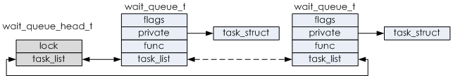

## 等待队列


1. 等待对列头

   ```c++
   struct __wait_queue_head {
   	spinlock_t		lock;
   	struct list_head	task_list;
   };
   typedef struct __wait_queue_head wait_queue_head_t;
   ```

2. 队列Item

   ```c++
   struct __wait_queue {
   	unsigned int		flags;
   	void			*private;
   	wait_queue_func_t	func;
   	struct list_head	task_list;
   };
   typedef struct __wait_queue wait_queue_t;
   ```

这两者的关系如下：



### 初始化

```c++
/*
 * Macros for declaration and initialisaton of the datatypes
 */

#define __WAITQUEUE_INITIALIZER(name, tsk) {				\
	.private	= tsk,						\
	.func		= default_wake_function,			\
	.task_list	= { NULL, NULL } }

//创建并初始化一个 等待队列的Item
#define DECLARE_WAITQUEUE(name, tsk)					\
	wait_queue_t name = __WAITQUEUE_INITIALIZER(name, tsk)

#define __WAIT_QUEUE_HEAD_INITIALIZER(name) {				\
	.lock		= __SPIN_LOCK_UNLOCKED(name.lock),		\
	.task_list	= { &(name).task_list, &(name).task_list } }

//创建初始化一个等待队列
#define DECLARE_WAIT_QUEUE_HEAD(name) \
	wait_queue_head_t name = __WAIT_QUEUE_HEAD_INITIALIZER(name)
```


### 添加移除

```c++
extern void add_wait_queue(wait_queue_head_t *q, wait_queue_t *wait);
extern void add_wait_queue_exclusive(wait_queue_head_t *q, wait_queue_t *wait);
extern void remove_wait_queue(wait_queue_head_t *q, wait_queue_t *wait);
```

在等待队列的自旋锁`spinlock_t`的保护下，添加移除操作的本质就是对`task_list`的操作(`list_add`和`list_del`)。


### 休眠过程

以常用的`wait_event_interruptible`为例：

```c++
#define wait_event_interruptible(wq, condition)				\
({									\
	int __ret = 0;							\
	might_sleep();							\
	if (!(condition))						\
		__ret = __wait_event_interruptible(wq, condition);	\
	__ret;								\
})
```

1. `might_sleep`。

   ```c++
   /**
    * might_sleep - annotation for functions that can sleep
    *
    * this macro will print a stack trace if it is executed in an atomic
    * context (spinlock, irq-handler, ...).
    *
    * This is a useful debugging help to be able to catch problems early and not
    * be bitten later when the calling function happens to sleep when it is not
    * supposed to.
    */
   # define might_sleep() \
   	do { __might_sleep(__FILE__, __LINE__, 0); might_resched(); } while (0)
   ```

2. `__wait_event_interruptible`

   ```c++
   #define __wait_event_interruptible(wq, condition)			\
   	___wait_event(wq, condition, TASK_INTERRUPTIBLE, 0, 0,		\
   		      schedule())
   
   #define ___wait_event(wq, condition, state, exclusive, ret, cmd)	\
   ({									\
   	__label__ __out;						\
   	wait_queue_t __wait;						\	//创建一个等待队列Item
   	long __ret = ret;	/* explicit shadow */			\
   									\
   	INIT_LIST_HEAD(&__wait.task_list);				\  
   	if (exclusive)							\
   		__wait.flags = WQ_FLAG_EXCLUSIVE;			\
   	else								\
   		__wait.flags = 0;					\
   									\
   	for (;;) {							\
   		long __int = prepare_to_wait_event(&wq, &__wait, state);\
   									\
   		if (condition)						\
   			break;						\
   									\
   		if (___wait_is_interruptible(state) && __int) {		\
   			__ret = __int;					\
   			if (exclusive) {				\
   				abort_exclusive_wait(&wq, &__wait,	\
   						     state, NULL);	\
   				goto __out;				\
   			}						\
   			break;						\
   		}							\
   									\
   		cmd;							\	// schedule() 重新调度
   	}								\
   	finish_wait(&wq, &__wait);					\
   __out:	__ret;								\
   })
       
   long prepare_to_wait_event(wait_queue_head_t *q, wait_queue_t *wait, int state)
   {
   	unsigned long flags;
   	
       //当前有信号需要处理
   	if (signal_pending_state(state, current))
   		return -ERESTARTSYS; //返回ERESTARTSYS， libc库会重新调用相关联的系统调用函数
   
       //初始化等待队列Item
   	wait->private = current;
   	wait->func = autoremove_wake_function;	//默认的唤醒函数
   
       //将wait_queue_t 添加到等待队列中去
   	spin_lock_irqsave(&q->lock, flags);
       //判断wait_queue_t是否初始化！ 是否有必要？
       //有有必要， __wait_event中有一个循环会多次调用本函数，这里可以避免重复添加
   	if (list_empty(&wait->task_list)) {
   		if (wait->flags & WQ_FLAG_EXCLUSIVE)
   			__add_wait_queue_tail(q, wait);
   		else
   			__add_wait_queue(q, wait);
   	}
       //state = TASK_INTERRUPTIBLE
   	set_current_state(state);
   	spin_unlock_irqrestore(&q->lock, flags);
   
   	return 0;
   }
   
   
   /**
    * finish_wait - clean up after waiting in a queue
    * @q: waitqueue waited on
    * @wait: wait descriptor
    *
    * Sets current thread back to running state and removes
    * the wait descriptor from the given waitqueue if still
    * queued.
    */
   void finish_wait(wait_queue_head_t *q, wait_queue_t *wait)
   {
   	unsigned long flags;
   
       //设置当前进程状态为 RUNNING
   	__set_current_state(TASK_RUNNING);
   	/*
   	 * We can check for list emptiness outside the lock
   	 * IFF:
   	 *  - we use the "careful" check that verifies both
   	 *    the next and prev pointers, so that there cannot
   	 *    be any half-pending updates in progress on other
   	 *    CPU's that we haven't seen yet (and that might
   	 *    still change the stack area.
   	 * and
   	 *  - all other users take the lock (ie we can only
   	 *    have _one_ other CPU that looks at or modifies
   	 *    the list).
   	 */
   	if (!list_empty_careful(&wait->task_list)) {
   		spin_lock_irqsave(&q->lock, flags);
   		list_del_init(&wait->task_list);
   		spin_unlock_irqrestore(&q->lock, flags);
   	}
   }
   ```

   

   - `prepare_to_wait_event`

     首先，创建一个`wait_queue_t`，并将其加入到`wait_queue_head_t`中。然后将进程状态设置为`TASK_INTERRUPTIBLE`。

   - `schedule`

     调用`schedule()`来重新调度进程。

   - 重新执行上述步骤，直到条件满足，然后退出循环。

   - `finish_wait`

     由于退出循环是在第1、2步骤的中间，所以`prepare_to_wait_event`会比`schedule`多执行一次，而`finish_wait`的作用就是将当前进程的运行状态设置为`TASK_RUNNING`

### 唤醒过程

以常用的`wake_up_interruptible`为例

```c++
#define wake_up_interruptible(x)	__wake_up(x, TASK_INTERRUPTIBLE, 1, NULL)

/**
 * __wake_up - wake up threads blocked on a waitqueue.
 * @q: the waitqueue
 * @mode: which threads
 * @nr_exclusive: how many wake-one or wake-many threads to wake up
 * @key: is directly passed to the wakeup function
 *
 * It may be assumed that this function implies a write memory barrier before
 * changing the task state if and only if any tasks are woken up.
 */
void __wake_up(wait_queue_head_t *q, unsigned int mode,
			int nr_exclusive, void *key)
{
	unsigned long flags;

	spin_lock_irqsave(&q->lock, flags);
	__wake_up_common(q, mode, nr_exclusive, 0, key);
	spin_unlock_irqrestore(&q->lock, flags);
}
/*
 * The core wakeup function. Non-exclusive wakeups (nr_exclusive == 0) just
 * wake everything up. If it's an exclusive wakeup (nr_exclusive == small +ve
 * number) then we wake all the non-exclusive tasks and one exclusive task.
 *
 * There are circumstances in which we can try to wake a task which has already
 * started to run but is not in state TASK_RUNNING. try_to_wake_up() returns
 * zero in this (rare) case, and we handle it by continuing to scan the queue.
 */
static void __wake_up_common(wait_queue_head_t *q, unsigned int mode,
			int nr_exclusive, int wake_flags, void *key)
{
	wait_queue_t *curr, *next;

	list_for_each_entry_safe(curr, next, &q->task_list, task_list) {
		unsigned flags = curr->flags;

		if (curr->func(curr, mode, wake_flags, key) &&
				(flags & WQ_FLAG_EXCLUSIVE) && !--nr_exclusive)
			break;
	}
}
```

可见，最终，还是会调用我们之前在`prepare_to_wait_event`中设置的`autoremove_wake_function`函数来唤醒进程。

```c++
int autoremove_wake_function(wait_queue_t *wait, unsigned mode, int sync, void *key)
{
    //唤醒休眠进程
	int ret = default_wake_function(wait, mode, sync, key);
	//从等待队列中删除
	if (ret)
		list_del_init(&wait->task_list);
	return ret;
}

int default_wake_function(wait_queue_t *curr, unsigned mode, int wake_flags,
			  void *key)
{
    //和schedule类似，调用该函数来完成实际的唤醒工作
	return try_to_wake_up(curr->private, mode, wake_flags, 1);
}
```


Over!!

