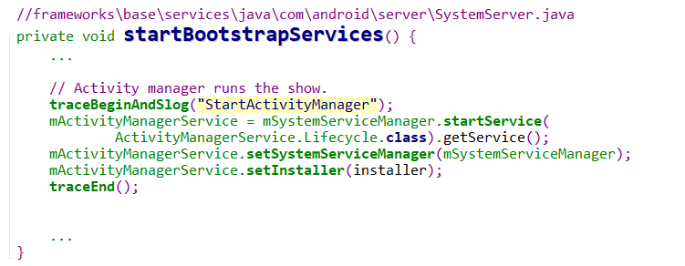
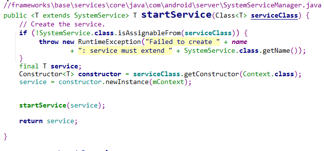
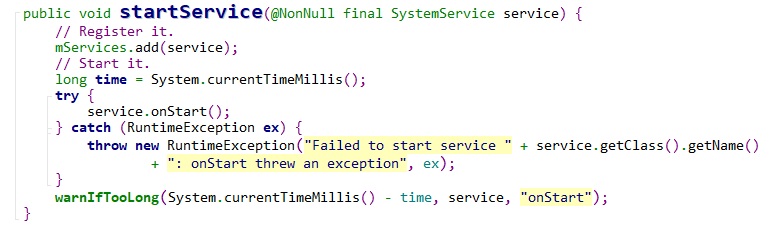
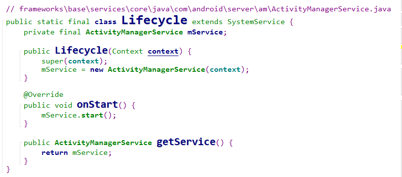
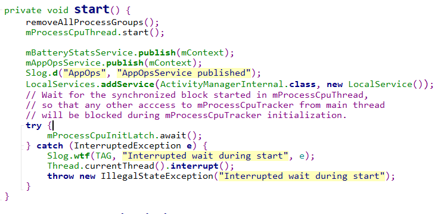
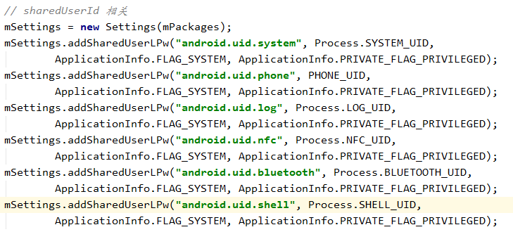
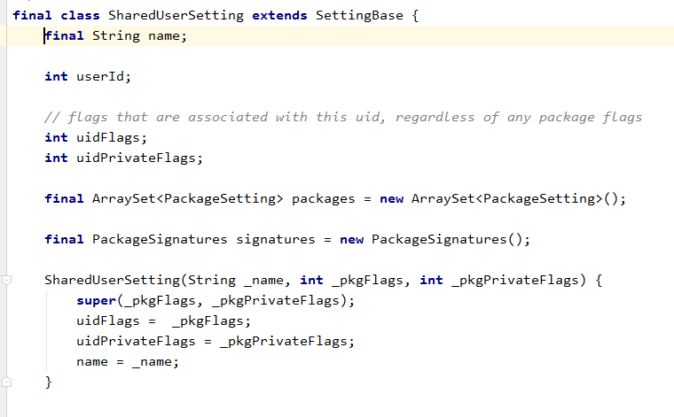
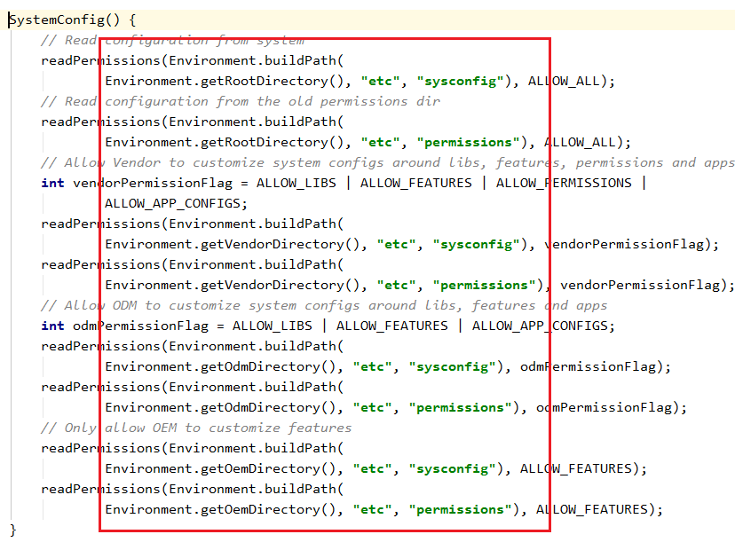
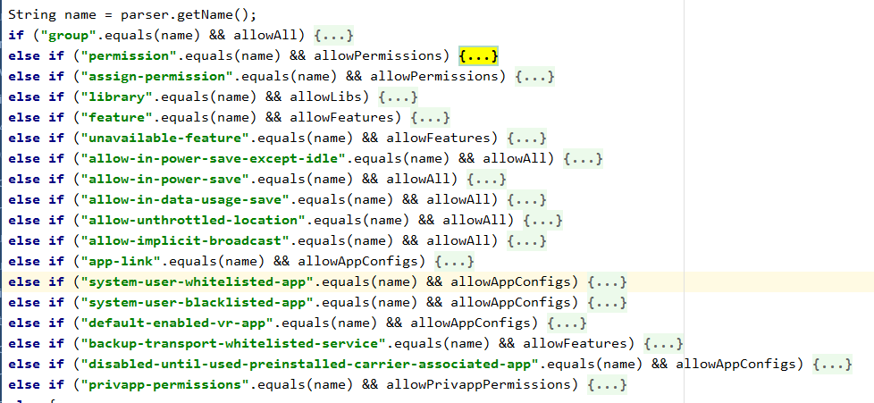

# AMS的启动


## SystemServer

AMS在`SystemServer`中启动！启动流程如下：

`SystemServer::run()` => `SystemServer::startBootstrapServices()`



这里通过`SystemServiceManager`来启动`AMS`。

## SystemServiceManager



这里可以看到，要通过`SystemServiceManager`来启动`Service`，`Service`就必须继承`SystemService`类。

启动`AMS`时，首选就校验其是否是`SystemService`的子类，随后通过反射来获取构造一个对象。

这个对象就是`ActivityManangerService.Lifecycle`。

`startService`的作用就是将其添加到一个`service`数组`SystemServiceManager::mServices`中。随后调用`SystemService::onStart()`方法：




## ActivityManagerService::Lifecycle

​	

这是什么设计模式？？`Lifecycle`作为`ActivityManangerService`的内部类。

上面的服务启动过程就可以理解为创建一个`ActivityManagerService`对象并调用其`start`方法。

## ActivityManagerService::start

]

`publish`作为`service`的成员函数，其内部实现相当于：

```java
 ServiceManager.addService(Context.APP_OPS_SERVICE, asBinder());
```

拥有该函数的`service`都继承至`Stub`。所以`publish`的作用就是注册服务。

这里注册了`BatteryStatsService`、`AppOpsService`。


## PackageManagerService

> PMS 负责系统中的 Package管理。包括：
>
> 应用程序的安装、卸载和信息查询


对应的上下文是 `SystemContext`, 在`SystemServer@createSystemContext`中创建。实际实现`ContextImpl@createSystemContext`。


### sharedUserId 

1. apk的`sharedUserId`相同时可以共享彼此的数据，并且运行在同一个进程中
2. 通过声明特定的`sharedUserId`可以使apk所在进程使用指定的uid运行。
   例如`android.uid.system`可以让使用该`sharedUserId`的进程获取到`system`用户的权限。（签名也需要一致）。


PKMS启动时会添加几个默认的 `sharedUserId`。



在我们编程中，使用得最多的应该就是`android.uid.system`了吧。


PMS中

通过`ArrayMap<String, SharedUserSetting>`保存普通进程的`SharedUserSettings`。

通过`SparseArray<Object>` 保存系统进程的`SharedUserSettings`。




### Systemconfig

通过`SystemConfig` 来解析 如下目录的中 `xml`文件。



解析代码这里不贴了。贴一下`/system/etc/platform.xml`的格式。

```xml
<?xml version="1.0" encoding="utf-8"?>
<permissions>

    <!-- The following tags are associating low-level group IDs with
         permission names.  By specifying such a mapping, you are saying
         that any application process granted the given permission will
         also be running with the given group ID attached to its process,
         so it can perform any filesystem (read, write, execute) operations
         allowed for that group. -->

    <permission name="android.permission.BLUETOOTH_ADMIN" >
        <group gid="net_bt_admin" />
    </permission>

    <!-- These are permissions that were mapped to gids but we need
         to keep them here until an upgrade from L to the current
         version is to be supported. These permissions are built-in
         and in L were not stored in packages.xml as a result if they
         are not defined here while parsing packages.xml we would
         ignore these permissions being granted to apps and not
         propagate the granted state. From N we are storing the
         built-in permissions in packages.xml as the saved storage
         is negligible (one tag with the permission) compared to
         the fragility as one can remove a built-in permission which
         no longer needs to be mapped to gids and break grant propagation. -->
    <permission name="android.permission.READ_EXTERNAL_STORAGE" />
    <permission name="android.permission.WRITE_EXTERNAL_STORAGE" />

   
    <!-- The following tags are assigning high-level permissions to specific
         user IDs.  These are used to allow specific core system users to
         perform the given operations with the higher-level framework.  For
         example, we give a wide variety of permissions to the shell user
         since that is the user the adb shell runs under and developers and
         others should have a fairly open environment in which to
         interact with the system. -->

    
    <assign-permission name="android.permission.ACCESS_SURFACE_FLINGER" uid="graphics" />

    <!-- This is a list of all the libraries available for application
         code to link against. -->

    <library name="android.test.mock"
            file="/system/framework/android.test.mock.jar" />
   
    <!-- These are the standard packages that are white-listed to always have internet
         access while in power save mode, even if they aren't in the foreground. -->
    <allow-in-power-save package="com.android.providers.downloads" />

    <!-- These are the standard packages that are white-listed to always have internet
         access while in data mode, even if they aren't in the foreground. -->
    <allow-in-data-usage-save package="com.android.providers.downloads" />

    <!-- This is a core platform component that needs to freely run in the background -->
    <allow-in-power-save package="com.android.cellbroadcastreceiver" />
    
    <!-- These are the packages that are white-listed to be able to run as system user -->
    <system-user-whitelisted-app package="com.android.settings" />
    <system-user-whitelisted-app package="com.DeviceTest" />
    <system-user-whitelisted-app package="com.cghs.stresstest" />
    <system-user-whitelisted-app package="android.rockchip.update.service" />

    <!-- Some customer may use these aosp app, adapt to api 26 -->
    <system-user-whitelisted-app package="com.android.gallery3d" />
    <system-user-whitelisted-app package="com.android.music" />
    <system-user-whitelisted-app package="android.rk.RockVideoPlayer" />

    <!-- These are the packages that shouldn't run as system user -->
    <system-user-blacklisted-app package="com.android.wallpaper.livepicker" />
</permissions>
```


1. `permission`   建立权限名和 拥有该权限的用户组ID之间的关联。

   > any application process granted the given permission will also be running with the given group ID attached to its process, so it can perform any filesystem (read, write, execute) operations allowed for that group

   

   ```xml
   <permission name="android.permission.BLUETOOTH_ADMIN" >
   	<group gid="net_bt_admin" />
   </permission>
   ```

   通过`mPermissions`保存。

   ```java
   // These are the permission -> gid mappings that were read from the
   // system configuration files.
   final ArrayMap<String, PermissionEntry> mPermissions = new ArrayMap<>();
   public static final class PermissionEntry {
   	public final String name;
   	public int[] gids;				//对应 xml中的 group::gid中的组ID
   	public boolean perUser;
   	PermissionEntry(String name, boolean perUser) {
   		this.name = name;
   		this.perUser = perUser;
   	}
   }
   ```

2. `assign-permission` 将权限分配给指定的用户。

   > assigning high-level permissions to specific  user IDs

   ```xml
   <assign-permission name="android.permission.MODIFY_AUDIO_SETTINGS" uid="media" />
   <assign-permission name="android.permission.ACCESS_SURFACE_FLINGER" uid="media" />
   <assign-permission name="android.permission.WAKE_LOCK" uid="media" />
   <assign-permission name="android.permission.UPDATE_DEVICE_STATS" uid="media" />
   <assign-permission name="android.permission.UPDATE_APP_OPS_STATS" uid="media" />
   <assign-permission name="android.permission.GET_PROCESS_STATE_AND_OOM_SCORE" uid="media" />
   ```

   使用`mSystemPermissions`保存。

   ```java
   //稀疏数组， 类似于 hash， uid 对应 数组下标
   final SparseArray<ArraySet<String>> mSystemPermissions = new SparseArray<>(); 
   ```

3. `library`  可供应用程序连接的所有 库

   > This is a list of all the libraries available for application code to link against

   ```xml
   <library name="android.test.mock"
               file="/system/framework/android.test.mock.jar" />
   <library name="android.test.runner"
               file="/system/framework/android.test.runner.jar" />
   <library name="javax.obex"
               file="/system/framework/javax.obex.jar" />
   <library name="org.apache.http.legacy"
               file="/system/framework/org.apache.http.legacy.jar" />
   ```

   通过`mSharedLibraries`保存。

   ```java
   // Keys are the library names; strings are the paths to the libraries.
   final ArrayMap<String, String> mSharedLibraries  = new ArrayMap<>();
   ```

   

4. `allow-in-power-save` 允许在省电模式下运行在后台的应用

   ```xml
   <allow-in-power-save package="com.android.providers.downloads" />
   ```
   
   通过`mAllowInPowerSave`保存
   
   ```java
   // These are the packages that are white-listed to be able to run in the
   // background while in power save mode, as read from the configuration files.
   final ArraySet<String> mAllowInPowerSave = new ArraySet<>();
   ```
   
5. `allow-in-data-usage-save` 即使开了省流量模式也能访问数据连接的应用

   ```xml
   <!-- These are the standard packages that are white-listed to always have internet
            access while in data mode, even if they aren't in the foreground. -->
   <allow-in-data-usage-save package="com.android.providers.downloads" />
   ```

   通过`mAllowInDataUsageSave`保存

   ```java
   // These are the packages that are white-listed to be able to run in the
   // background while in power save mode, as read from the configuration files.
   final ArraySet<String> mAllowInPowerSave = new ArraySet<>();
   ```

6. `system-user-whitelisted-app` 能够以`system`用户运行的app

   ```xml
   <!-- These are the packages that are white-listed to be able to run as system user -->
   <system-user-whitelisted-app package="com.android.settings" />
   <system-user-whitelisted-app package="com.DeviceTest" />
   <system-user-whitelisted-app package="com.cghs.stresstest" />
   <system-user-whitelisted-app package="android.rockchip.update.service" />
   ```

   通过`mSystemUserWhitelistedApps`保存

   ```java
   // These are the packages that are whitelisted to be able to run as system user
   final ArraySet<String> mSystemUserWhitelistedApps = new ArraySet<>();
   ```

关于权限的大概有以下这么多。。。。



这些是PKMS启动时从配置文件解析得到的。


## ActivityManager

代理类，持有对`activity` service的引用。封装了对`IActivityManager`的函数调用。


## SystemServer

启动： `SystemServer::main -> run()`

1. 创建looper

2. 创建`SystemContext`

   1. 创建ActivityThread

3. 启动服务


# ActivityManagerService

在`SystemServer@startBootstrapServices`中创建。通过`SystemServiceManager`以及`AMS@Lifecycle`创建`AMS`对象后调用其`start`方法。

随后，`SystemServer`调用`AMS@setSystemProcess`方法。改方法会注册`AMS`到`ServiceManager`（还有一些其他的service如`meminfo`、`dfxinfo`等）。


## AMS中的handler

这些`Handler`都对应一个单独的线程

1. `MainHandler` 优先级 `THREAD_PRIORITY_FOREGROUND`
2. `UiHandler ` 优先级 `THREAD_PRIORITY_FOREGROUND`
3. `KillHandler `  优先级 `THREAD_PRIORITY_BACKGROUND`


## ContentObserver

一个`ActivityManagerConstants`


## BroadcastQueue

两个`BroadcastQueue`

```java
mFgBroadcastQueue = new BroadcastQueue(this, mHandler,
                "foreground", BROADCAST_FG_TIMEOUT, false);
mBgBroadcastQueue = new BroadcastQueue(this, mHandler,
                "background", BROADCAST_BG_TIMEOUT, true);
```


## ActiveServices


## ProviderMap


