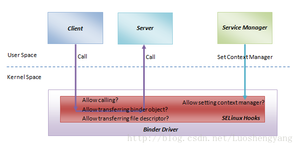
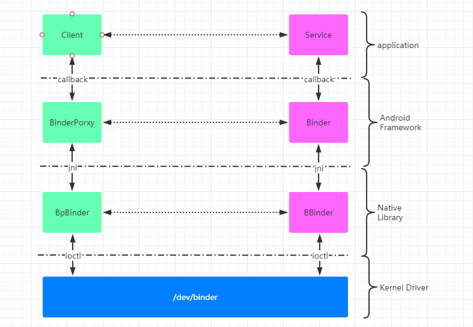

# Binder简介

Binder是Android系统中最常用的一种IPC机制，其贯穿了整个Android系统。Android系统组件之间的通信基本都是通过Binder完成的。。。

> Android系统是基于linux内核创建建立的，linux自身提供了多种IPC机制：socket、管道、共享内存和signal等。为什么Android还要煞费苦心的创建Binder机制？？

1. 性能

   linux传统的IPC机制，传输数据基本都需要两次的内存拷贝。（用户空间到内核空间再从内核空间到用户空间）。而binder只需要一次内存拷贝(**为什么Binder只需要一次内存拷贝，其原理是啥**)。

2. 安全

   APK安装时，Android会为其制定一个uid，这个uid和linux中的uid没有啥区别。通过这个uid，我们就能限制apk的权限范围。

   我们在编写app时，需要在`manifest.xml`中声明我们需要的权限，比如我们申请蓝牙权限，那么这个app就会拥有蓝牙的用户组权限，这样就能对蓝牙设备进行操作了。

   Binder在驱动层次来实现安全保护（通过selinux）

   

   如果使用linux传统的IPC机制，就需要使用复杂的用户空间协议来保证传输的安全性。

# 如何使用Binder

协议简单的demo，获取Binder Service端的进程ID。

首先，我们需要继承`IInterface`接口，在里面实现我们需要提供的功能。

这个类是Client和Server端都需要被使用的。

先看 Server端的实现。。。

然后是 Client端的实现。。。

创建一个Binder实体对象并注册到 ServiceManager

client从 ServiceMananger 获取 我们之前注册的Service并完成IPC调用。

# AIDL 是什么

同样的功能，通过AIDL来实现。。

现在清楚AIDL的原理了吧，， 就是就是替我们省略大量与业务逻辑不相关的代码。。。

# Binder的整体架构

  

自顶向下看， 我们已经知道了application层如何获取和使用Binder了，现在看看Android Framework层做了什么。。其实

# Android 进程是如何完成Binder通信的

## Java Binder

1. 基础类类图

   TODO @ 绘制类图

 	讲解`BinderProxy::transact`的实现

​	讲解 ``

## Native Binder

1. BpBinder
2. BBinder
3. IPCThreadState
4. ProcessState

> Android进程在哪里打开的binder驱动节点？

> Binder传输数据的限制是多少 ？

## 

# 从Binder驱动看Binder的一些实现细节

##  Binder 只需要进行一次内存拷贝？

## Binder通信最大传输的数量是多少？

