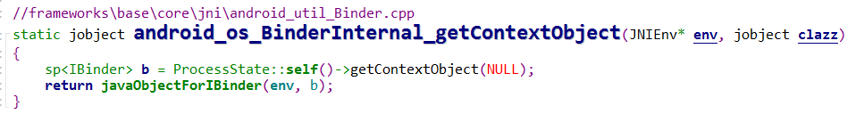

先看一下Java Binder的继承体系。

以《[Android Binder -- AIDL 原理](https://blog.csdn.net/liuzhengzlh/article/details/108521567)》为例，我们创建了一个自定义的`BnCustomService`并将其注册到`ServiceManager`中。这个注册过程中Android Binder机制都做了什么？

## ServiceManager.addService

两步走。第一步是`getIServiceManager()`，第二步是`addService()`

### getIServiceMananger()

对照Native层的`IServiceMananger`：

这里同样分为两步：

1. `BinderInternal.getContextObejct()`

   这里本质上就是`ProcessState::getContextObject(NULL)`。这里返回的实际上就是一个`handle == 0`的`BpBinder`对象。

   > handle == 0 表示的时 context object 也就是 service manager
   >
   > 普通的BpBinder的handle都是从1开始的。这一点可以在binder驱动中看到：
   >
   > 
   
   那么`BpBinder`是如何转换到Java层的`IBinder`的？`IBinder`的实际类型又是啥?
   
   
   
   
   
   这里，我们首先通过`ProcessState::self()->getContextObject(NULL)`获取到`Service Manager`的代理对象`BpBinder`。然后创建一个`ProxyBinder`对象，将其`mObject`成员设置为`BpBinder`的地址（就是这样将`BpBinder`转换成`ProxyBinder`了），并返回这个`ProxyBinder`对象。
   
   所以，`IBinder`对象的实际类型就是`ProxyBinder`。
   
2. `ServiceManagerNative.asInterface()`

   很明显，还函数的作用就是将我们的`ProxyBinder`转换成`IServiceManager`。

   

   ①处代码，这行到这里，说明`obj`的实际类型是`Binder`。实际上，在`IServiceManager`中是不会执行到这里的，因为`ServiceManager`没有对应的`Binder`实体对象。

   > 如果我们自己创建的Binder service，并且会出现在同一进程中通过binder使用，就需要在Binder或者其子类的构造函数中添加 `attachInterface`方法的实现。否则在执行到①处的代码时就会出现错误。
   >
   > 
   >
   > 

   ②处代码，这行到这里，`obj`的实际类型是`ProxyBinder`。用其构造一个`ServiceManangerProxy`对象，这样`ServiceManangerProxy`就能通过这个`ProxyBinder`对象进行Binder通信了。

### addService()

那么我们是怎么通过`ProxyBinder`完成Binder通信的？？

先来看一下`addService`做了什么...

从前面我们知道，`addService`返回的实际类型是`ServiceManagerProxy`。看看它是怎么实现`addService`的？

①处代码将一个`IBinder`对象写入到了`Parcel`中，该`Binder`对象最终会被序列化为`flat_binder_object`，binder驱动会根据这个结构在内核创建一个`binder_node`结构用于表示应用层的binder实体对象。说多了，有兴趣的可以看一下具体实现。

②处代码`mRemote`的实际类型是`ProxyBinder`，其`transact`方法最终调用的就是native方法`android_os_BinderProxy_transact`。

