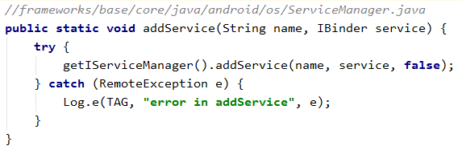
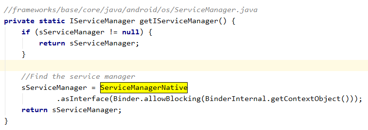
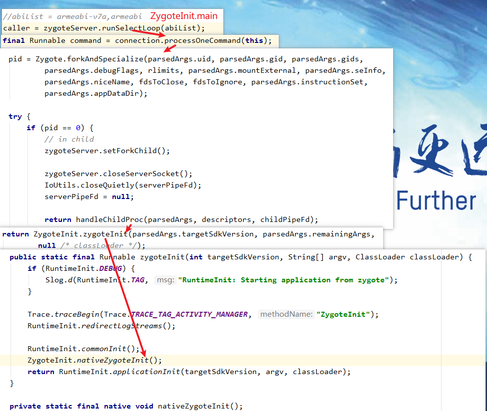

先看一下Java Binder的继承体系。


> 前置阅读
>
> binder 驱动的实现
>
> libbinder的实现
>
> Zygote如何孵化Android进程

以《[Android Binder -- AIDL 原理](https://blog.csdn.net/liuzhengzlh/article/details/108521567)》为例，我们创建了一个自定义的`BnCustomService`并将其注册到`ServiceManager`中。这个注册过程中Android Binder机制都做了什么？


## 添加服务到Service Mananger



两步走。第一步是`getIServiceManager()`，第二步是`addService()`


### getIServiceMananger()



对照Native层的`IServiceMananger`：


这里同样分为两步：

1. `BinderInternal.getContextObejct()`

   这里本质上就是`ProcessState::getContextObject(NULL)`。这里返回的实际上就是一个`handle == 0`的`BpBinder`对象。

   > handle == 0 表示的时 context object 也就是 service manager
   >
   > 普通的BpBinder的handle都是从1开始的。这一点可以在binder驱动中看到：
   >
   > 
   
   那么`BpBinder`是如何转换到Java层的`IBinder`的？`IBinder`的实际类型又是啥?
   
   
   
   
   
   这里，我们首先通过`ProcessState::self()->getContextObject(NULL)`获取到`Service Manager`的代理对象`BpBinder`。然后创建一个`BinderProxy`对象，将其`mObject`成员设置为`BpBinder`的地址（就是这样将`BpBinder`转换成`BinderProxy`了），并返回这个`BinderProxy`对象。
   
   所以，`IBinder`对象的实际类型就是`BinderProxy`。
   
2. `ServiceManagerNative.asInterface()`

   很明显，还函数的作用就是将我们的`BinderProxy`转换成`IServiceManager`。

   

   ①处代码，这行到这里，说明`obj`的实际类型是`Binder`。实际上，在`IServiceManager`中是不会执行到这里的，因为`ServiceManager`没有对应的`Binder`实体对象。

   > 如果我们自己创建的Binder service，并且会出现在同一进程中通过binder使用，就需要在Binder或者其子类的构造函数中添加 `attachInterface`方法的实现。否则在执行到①处的代码时就会出现错误。
   >
   > 
   >
   > 

   ②处代码，这行到这里，`obj`的实际类型是`BinderProxy`。用其构造一个`ServiceManangerProxy`对象，这样`ServiceManangerProxy`就能通过这个`BinderProxy`对象进行Binder通信了。


### addService()

那么我们是怎么通过`BinderProxy`完成Binder通信的？？

先来看一下`addService`做了什么...

从前面我们知道，`addService`返回的实际类型是`ServiceManagerProxy`。看看它是怎么实现`addService`的？


①处代码将一个`IBinder`对象写入到了`Parcel`中，该`Binder`对象最终会被序列化为`flat_binder_object`，binder驱动会根据这个结构在内核创建一个`binder_node`结构用于表示应用层的binder实体对象。说多了，有兴趣的可以看一下具体实现。

②处代码`mRemote`的实际类型是`BinderProxy`，其`transact`方法最终调用的就是native方法`android_os_BinderProxy_transact`。


​	①处代码，还记得我们在前面的`android_os_BinderInternal_getContextObject`中，通过`Process::getContextObject(NULL)`获取到了service manager的代理binder对象 `BpBinder`，然后将其地址写入到了`BinderProxy.mObject`中。这里拿到的就是就这个`BpBinder`

​	②处代码，就是调用`BpBinder::transact`完成数据的接收和发送咯。。。。 实际上就是通过`IPCThreadState::transact`方法完成的。。。

到这里，`addService`的流程就完成了，剩余的工作就是驱动和`service_manager`去做的。

> `service_manager`通过`<name: handle>`的形式保存Binder实体对象的引用。当我们请求一个service时，只需要通过`getService`将service name 给到service mananger， ServiceManager 就会返回一个handle，这个handle在native层对应`BpBinder`，在java层对应`BinderProxy`。这里的handle类似于文件描述符，每个进程的handle都是从1开始(service mananger除外)。驱动会将 service mananger保存的handle转换成请求服务的进程能够使用的handle。。关于驱动的细节见 《[预留Binder驱动实现]()》


## 服务如何响应请求

我们将service注册到service manager后，当别的进程调用`ServiceManager.getService`获取到service的代理对象时，就能开始获取service提供的功能了。

`service`时刻能够响应客户端的请求，必然就会有一个loop 来不停地和驱动进行数据交换。`addService`后，哪里会创建这个loop呢？

Android在启动进程的时候肯定是需要使用`Binder`通信的，所以，这个loop一定在进程创建之初就创建好了。

我们知道android进程都是由zygote孵化的，当android需要创建新的进程时，就会通过`socket`和`ZygoteServer`通信，此时，Zygote就会创建一个新的进程。



`nativeZygoteInit`实现如下:

```c++
// frameworks/base/core/jni/AndroidRuntime.cpp
static void com_android_internal_os_ZygoteInit_nativeZygoteInit(JNIEnv* env, jobject clazz)
{
    gCurRuntime->onZygoteInit();
}
// gCurRuntime 对应的是 AppRunTime

virtual void onZygoteInit()
{
	sp<ProcessState> proc = ProcessState::self();
	proc->startThreadPool();
}
```

soga！ 到这里就很清晰了。`ProcessState::self()`会打开binder驱动并完成`mmap`。

`startThreadPool`会创建一个子线程，该线程会开启一个loop不同的和binder驱动交换数据。


### IPCThreadState::self()->joinThreadPool(true); 


这里的核心函数就是`getAndExecuteCommand`。


通过`talkWithDriver`我们就完成了和驱动的数据交换(将`mOut`中的数据发送出去，接收到的数据放入到`mIn`)。


对于service而言，接收到client的请求对应的`cmd`是`BR_TRANSACTION`，我们就看看`executeCommand`如何处理这个`cmd`的。


这里最终就会调用`BBInder::transact`方法。

对于Java 的Binder对象，在Native层都对应一个`JavaBBinder`对象，该`JavaBBinder`对象在`addService-> writeStrongBinder`中创建。


​	最终就会执行到`JavaBinder::onTransact`方法。


在这里就会回调java层的`Binder.execTransact`方法。


在这个函数中就会调用到`onTransact`方法，我们需要继承并实现该方法完成我们自己的逻辑处理，然后处理完后，结果写入到`reply`中，函数返回，最后又会回到`talkWithDriver`中，再讲`reply`中的数据发送到`client`。

