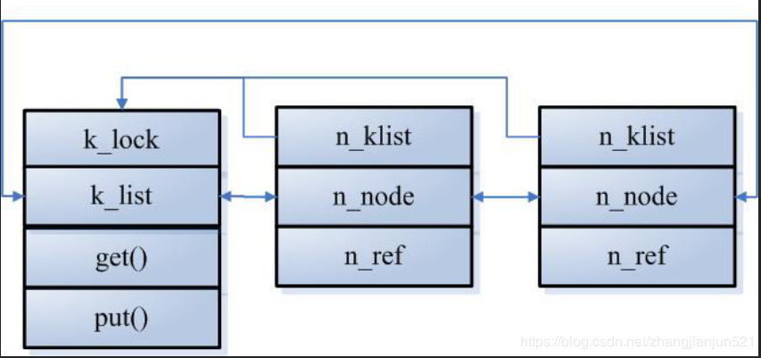

## list

```c
struct list_head {
	struct list_head *next, *prev;
};
```

list就是一个简单的双向链表咯，`struct list`通常嵌入在其他数据结构中，结合`container_of`使用。

内核提供了一系列的工具函数来操作`list`

1. `static inline void INIT_LIST_HEAD(struct list_head *list)`

    初始化一个`list_head` 节点

2. `void list_add(struct list_head *new, struct list_head *head)`

    在`head`之后添加`new`

3. `void list_add_tail(struct list_head *new, struct list_head *head)`

    将`new`添加到`head`的前面，即链表的尾部。`head->prev`就是链表的最后一个元素。

4. `list_del(struct list_head *entry)`

    从链表中删除`entry`

5. `#define list_entry(ptr, type, member) container_of(ptr, type, member)`

    get the struct for this entry


还有一堆工具函数，都定义在`include/linux/list.h`文件中。用的时候查阅即可。


## `klist`

`list`的线程安全版本。`klist`通过自旋锁来保护`list`。

```c
struct klist_node;
struct klist {
	spinlock_t		k_lock; //保护链表
	struct list_head	k_list; //双向链表头
	//get put用于操作链表中的节点接口。
	void			(*get)(struct klist_node *); 
	void			(*put)(struct klist_node *);
} __attribute__ ((aligned (sizeof(void *))));  //4 - 8字节对齐

struct klist_node {
	void			*n_klist;   //指向klist的首地址
	struct list_head	n_node; //用于挂入klist中
	struct kref		n_ref;    //节点引用次数
};
```


关系如图所示:



和`list_head`不同的是`klist_node`增加了一个`kref`成员，该成员用于记录当前节点的引用计数。当引用计数为0时，才会从`klist`中移除。

```c
static void klist_put(struct klist_node *n, bool kill)
{
	struct klist *k = knode_klist(n);
	void (*put)(struct klist_node *) = k->put;

	spin_lock(&k->k_lock);
	if (kill)
		knode_kill(n); //*(unsigned long *)&knode->n_klist |= KNODE_DEAD;
	if (!klist_dec_and_del(n)) // kref_put(&n->n_ref, klist_release);
		put = NULL;
	spin_unlock(&k->k_lock);
	if (put)
		put(n);
}
```

在上面的code中，`knode_kill`将`node`标志为`KNODE_DEAD`(`n_klist`中的值 或 `KNODE_DEAD`)，该标志的意义是：当一个线程调用`klist_put`后，将标志该节点已经失效，但由于引用技术的存在，节点并不会立即从链表中移除，而是需要等待其他线程释放已存在的引用。需要注意的时，被`KNODE_DEAD`标志的节点，其引用计数只会减少，不会增加。

当节点的引用计数到0时，就会调用`klist_release`函数。

```c
static void klist_release(struct kref *kref)
{
	struct klist_waiter *waiter, *tmp;
	struct klist_node *n = container_of(kref, struct klist_node, n_ref);

	WARN_ON(!knode_dead(n));
	list_del(&n->n_node); //删除节点
	spin_lock(&klist_remove_lock); //保护klist_remove_waiters
	list_for_each_entry_safe(waiter, tmp, &klist_remove_waiters, list) {
		if (waiter->node != n)
			continue;
		//找到与n相关联的waiter，从保护klist_remove_waiters中删除
		list_del(&waiter->list);
		waiter->woken = 1;
		mb();
        //唤醒等待进程
		wake_up_process(waiter->process);
	}
	spin_unlock(&klist_remove_lock);
	knode_set_klist(n, NULL);
}

struct klist_waiter {
	struct list_head list;
	struct klist_node *node;
	struct task_struct *process;
	int woken;
};
```

`klist_waiter`： 当一个进程需要删除`klist_node`时，该进程会被阻塞直到`klist_node`引用计数为0。具体代码可看`klist_remove`。

```c
void klist_remove(struct klist_node *n)
{
	struct klist_waiter waiter;

    //将waiter放入klist_remove_waiters中
	waiter.node = n;
	waiter.process = current;
	waiter.woken = 0;
	spin_lock(&klist_remove_lock);
	list_add(&waiter.list, &klist_remove_waiters);
	spin_unlock(&klist_remove_lock);

    //删除节点n
	klist_del(n);

    //设置进程状态为
	for (;;) {
		set_current_state(TASK_UNINTERRUPTIBLE); //等待状态，不可被中断唤醒。
		if (waiter.woken)
			break;
		schedule();
	}
    //重新设置为运行态，等待调度。
	__set_current_state(TASK_RUNNING);
}
```

