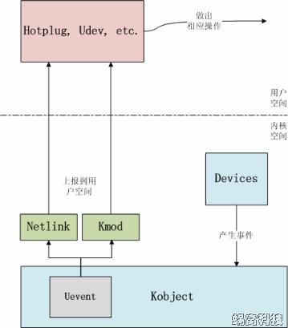

## 简述

Uevent是`kobject`的一部分，用于在`kobject`状态(ADD, REMOVE)发生改变后，通知用户控件程序。用户控件程序在收到这样的事件后，做出相应的处理。

该机制通常是用来实现热插拔设备的。例如U盘插入后，USB相关的驱动软件会动态创建用于表示该U盘的device结构（相应的也包括其中的`kobject`），并告知用户空间程序，为该U盘动态的创建`/dev/`目录下的设备节点，更进一步，可以通知其它的应用程序，将该U盘设备`mount`到系统中，从而动态的支持该设备。


## `uevent`层次结构



由上图可知，`uevent`是内嵌在`kobject`中的，当事件发生时，可通过`Netlink`和`kmod`上报到用户空间。

`kobject`结构体中和`uevent`有关的字段如下:

```c
//为1表示add或remove事件已经sent
unsigned int state_add_uevent_sent:1;	
unsigned int state_remove_uevent_sent:1;	
//为1表示该kobject的uevent事件不上报
unsigned int uevent_suppress:1;
```

`kobject`并没有定义任何和`uevent`相关的操作函数。为啥呢，可能是因为属于同一个`kset`的`kobject`的`uevent`事件具有一定的共性，所以，`uevent`相关操作函数就放入了`kset`中。

```c
struct kset {
	//...
	const struct kset_uevent_ops *uevent_ops;	//任何一个kobject上报uevent时，都要调用其所属kset的uevent操作函数集中的函数。
};
```

```c
struct kset_uevent_ops {
	int (* const filter)(struct kset *kset, struct kobject *kobj);
	const char *(* const name)(struct kset *kset, struct kobject *kobj);
	int (* const uevent)(struct kset *kset, struct kobject *kobj,
		      struct kobj_uevent_env *env);
};
```

`filter`:用于过滤`kobject`上报的`uevent`，返回值为0，不上报`uevent`事件。

`name`:返回subsystem的name，如果返回值为空，则不上报`uevent`事件。

`uevent`:任何Kobject需要上报uevent时，它所属的kset可以通过该接口统一为这些event添加环境变量。因为很多时候上报uevent时的环境变量都是相同的，因此可以由kset统一处理，就不需要让每个Kobject独自添加了


## `kobject`和`uevent`相关数据结构

1. uevent action

    ```c
    enum kobject_action {
    	KOBJ_ADD,
    	KOBJ_REMOVE,
    	KOBJ_CHANGE,
    	KOBJ_MOVE,
    	KOBJ_ONLINE,
    	KOBJ_OFFLINE,
    	KOBJ_MAX
    };
    ```

2.  `kobj_uevent_env` 保存环境变量

    ```c
    struct kobj_uevent_env {
    	char *envp[UEVENT_NUM_ENVP];
    	int envp_idx;
    	char buf[UEVENT_BUFFER_SIZE];
    	int buflen;
    };
    ```

3. `kobject_uevent`：notify userspace by sending an uevent

    ```c
    int kobject_uevent(struct kobject *kobj, enum kobject_action action)
    {
    	return kobject_uevent_env(kobj, action, NULL);
    }
    ```

    ```c
    int kobject_uevent_env(struct kobject *kobj, enum kobject_action action,
    		       char *envp_ext[])
    {
    	struct kobj_uevent_env *env;
    	const char *action_string = kobject_actions[action];
    	const char *devpath = NULL;
    	const char *subsystem;
    	struct kobject *top_kobj;
    	struct kset *kset;
    	const struct kset_uevent_ops *uevent_ops;
    	int i = 0;
    	int retval = 0;
    #ifdef CONFIG_NET
    	struct uevent_sock *ue_sk;
    #endif
    
    	pr_debug("kobject: '%s' (%p): %s\n",
    		 kobject_name(kobj), kobj, __func__);
    
    	/* search the kset we belong to */
    	top_kobj = kobj;
        //向上搜寻第一个kset不为空的parent节点。
    	while (!top_kobj->kset && top_kobj->parent)
    		top_kobj = top_kobj->parent;
    	if (!top_kobj->kset) {
    		return -EINVAL;
    	}
    
    	kset = top_kobj->kset;
    	uevent_ops = kset->uevent_ops;
    
    	/* skip the event, if uevent_suppress is set*/
    	if (kobj->uevent_suppress) {
    		return 0;
    	}
    	/* skip the event, if the filter returns zero. */
    	if (uevent_ops && uevent_ops->filter)
    		if (!uevent_ops->filter(kset, kobj)) {
    			return 0;
    		}
    
    	/* originating subsystem */
    	if (uevent_ops && uevent_ops->name)
    		subsystem = uevent_ops->name(kset, kobj);
    	else
    		subsystem = kobject_name(&kset->kobj);
    	if (!subsystem) {
    		return 0;
    	}
    
    	/* environment buffer */
    	env = kzalloc(sizeof(struct kobj_uevent_env), GFP_KERNEL);
    	if (!env)
    		return -ENOMEM;
    
    	/* complete object path */
    	devpath = kobject_get_path(kobj, GFP_KERNEL);
    	if (!devpath) {
    		retval = -ENOENT;
    		goto exit;
    	}
    	/* default keys */
    	retval = add_uevent_var(env, "ACTION=%s", action_string);
    	if (retval)
    		goto exit;
    	retval = add_uevent_var(env, "DEVPATH=%s", devpath);
    	if (retval)
    		goto exit;
    	retval = add_uevent_var(env, "SUBSYSTEM=%s", subsystem);
    	if (retval)
    		goto exit;
    
    	/* keys passed in from the caller */
    	if (envp_ext) {
    		for (i = 0; envp_ext[i]; i++) {
    			retval = add_uevent_var(env, "%s", envp_ext[i]);
    			if (retval)
    				goto exit;
    		}
    	}
    
    	/* let the kset specific function add its stuff */
    	if (uevent_ops && uevent_ops->uevent) {
    		retval = uevent_ops->uevent(kset, kobj, env);
    		if (retval) {
    			goto exit;
    		}
    	}
    
    	/*
    	 * Mark "add" and "remove" events in the object to ensure proper
    	 * events to userspace during automatic cleanup. If the object did
    	 * send an "add" event, "remove" will automatically generated by
    	 * the core, if not already done by the caller.
    	 */
    	if (action == KOBJ_ADD)
    		kobj->state_add_uevent_sent = 1;
    	else if (action == KOBJ_REMOVE)
    		kobj->state_remove_uevent_sent = 1;
    
    	mutex_lock(&uevent_sock_mutex);
    	/* we will send an event, so request a new sequence number */
    	retval = add_uevent_var(env, "SEQNUM=%llu", (unsigned long long)++uevent_seqnum);
    	if (retval) {
    		mutex_unlock(&uevent_sock_mutex);
    		goto exit;
    	}
    
    	mutex_unlock(&uevent_sock_mutex);
    	
    	/* call uevent_helper, usually only enabled during early boot */
    	if (uevent_helper[0] && !kobj_usermode_filter(kobj)) {
    		char *argv [3];
    		//设置环境变量
    		argv [0] = uevent_helper; //要启动的程序path
    		argv [1] = (char *)subsystem;
    		argv [2] = NULL;
    		retval = add_uevent_var(env, "HOME=/");
    		if (retval)
    			goto exit;
    		retval = add_uevent_var(env,
    					"PATH=/sbin:/bin:/usr/sbin:/usr/bin");
    		if (retval)
    			goto exit;
    	
            //调用用户空间程序
    		retval = call_usermodehelper(argv[0], argv,
    					     env->envp, UMH_WAIT_EXEC);
    	}
    
    exit:
    	kfree(devpath);
    	kfree(env);
    	return retval;
    }
    ```


## `Kmod` 和 `Netlink`

