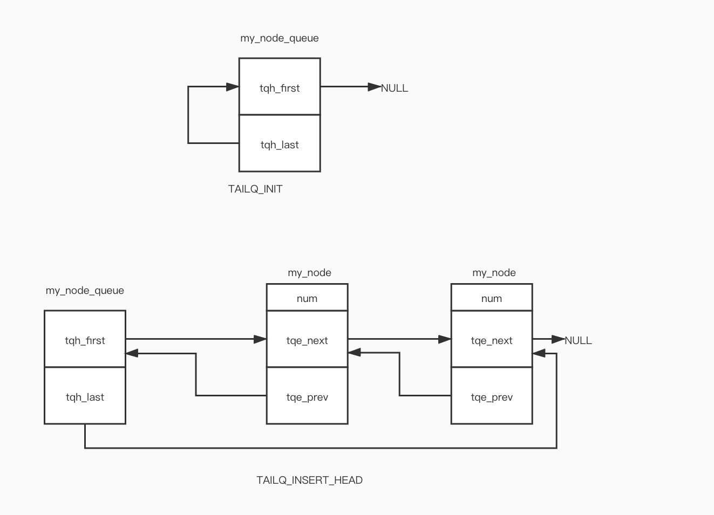

# TAILQ

## 结点

1. `TAILQ_ENTRY` 表示一个结点

   ```c++
   #define TAILQ_ENTRY(type)						\
   struct {								\
   	struct type *tqe_next;	/* 下一个结点 */			\
   	struct type **tqe_prev;	/* 指向前一个结点的tqe_next*/	\
   }
   
   //示例
   struct my_node {
     int number;
     TAILQ_ENTRY(my_node) node;
   };
   
   //等价于
   struct my_node {
     int number;
     struct {
     	struct my_node *tqe_next;
       struct my_node **tqe_prev;
     } node;
   }
   ```

2. `TAILQ_HEAD` 表示头节点

   ```c++
   #define TAILQ_HEAD(name, type)						\
   struct name {								\
   	struct type *tqh_first;	/* 第一个元素 */			\
   	struct type **tqh_last;	/* 指向最后一个元素的tqe_next*/		\
   }
   
//示例
   TAILQ_HEAD(my_node_head, my_node);
   
   //等价于
   struct my_node_head {
     struct my_node *tqh_first;
     struct my_node **tqh_last;
   };
   ```
   

## utility function

1. `TAILQ_INIT`  大概就是初始化一个头结点吧

   ```c++
   #define	TAILQ_INIT(head) do {						\
   	(head)->tqh_first = NULL;					\
   	(head)->tqh_last = &(head)->tqh_first;				\
   } while (0)
   
   /*示例*/
   //[1] 创建队列
   struct my_node_head my_node_queue;
   
   //初始化
   TAILQ_INIT(&my_node_queue);
   
   //等价于
   do {
     my_node_queue->tqh_first = nullptr;
     my_node_queue->tqh_last = &my_node_queue->tqh_first;
   }while(0);
   ```

2. `TAILQ_INSERT_HEAD` 在头部插入一个结点

   ```c++
   #define TAILQ_INSERT_HEAD(head, elm, field) do {			\
   	if (((elm)->field.tqe_next = (head)->tqh_first) != NULL)	\
   		(head)->tqh_first->field.tqe_prev =			\
   		    &(elm)->field.tqe_next;				\
   	else								\
   		(head)->tqh_last = &(elm)->field.tqe_next;		\
   	(head)->tqh_first = (elm);					\
   	(elm)->field.tqe_prev = &(head)->tqh_first;			\
   } while (0)
   
   //嗯，好复杂的感觉。
   //head:头结点咯， 对应 my_node_queue
   //elm: 是啥呢，应该就是my_node吧
   //field: 那就是 my_node中的node字段。通俗点说就是TAILQ_ENTRY(name) filed;
   
   TAILQ_INSERT_HEAD(&my_node_queue, &my_node, node);
   
   //等价于
   do {
     if ((my_node->node.tqe_next = my_node_queue->tqh_first) != NULL)
       //不是第一个结点
       my_node_queue->tqh_first->node.tqe_prev = &my_node->field.tqe_next;
     else 
       my_node_queue->tqh_last = &my_node->node.tqe_next;
     my_node_queue->tqh_first = my_node;
     my_node->node.tqe_prev = &my_node_queue->tqh_first;
   }while(0);
   ```

   


这里就不介绍了，知道了其各个指针的含义，就行了，当嵌入到其他结构体中时，理解起来似乎更吃力。多读多写，，